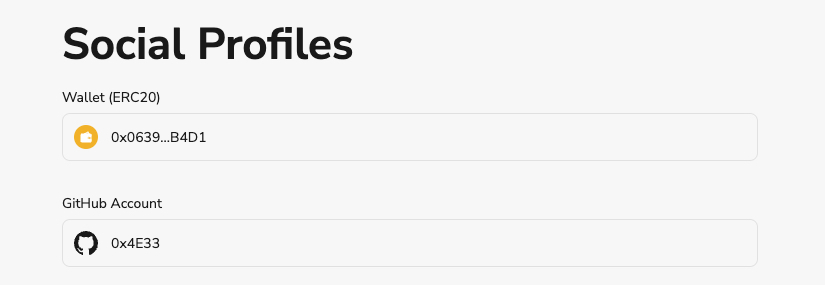

# Task2 Blockchain Basic

本任务分为简答题、分析题和选择题，以此为模板，在下方填写你的答案即可。

选择题，请在你选中的项目中，将 `[ ]` 改为 `[x]` 即可

## [单选题] 如果你莫名奇妙收到了一个 NFT，那么

- [ ] 天上掉米，我应该马上点开他的链接
- [x] 这可能是在对我进行诈骗！

## [单选题] 群里大哥给我发的网站，说能赚大米，我应该

- [ ] 赶紧冲啊，待会米被人抢了
- [x] 谨慎判断，不在不信任的网站链接钱包

## [单选题] 下列说法正确的是

- [ ] 一个私钥对应一个地址
- [x] 一个私钥对应多个地址
- [ ] 多个私钥对应一个地址
- [ ] 多个私钥对应多个地址

## [单选题] 下列哪个是以太坊虚拟机的简称

- [ ] CLR
- [x] EVM
- [ ] JVM

## [单选题] 以下哪个是以太坊上正确的地址格式？

- [ ] 1A4BHoT2sXFuHsyL6bnTcD1m6AP9C5uyT1
- [ ] TEEuMMSc6zPJD36gfjBAR2GmqT6Tu1Rcut
- [ ] 0x997fd71a4cf5d214009619808176b947aec122890a7fcee02e78e329596c94ba
- [x] 0xf39Fd6e51aad88F6F4ce6aB8827279cffFb92266

## [多选题] 有一天某个大哥说要按市场价的 80% 出油给你，有可能

- [x] 他在洗米
- [ ] 他良心发现
- [x] 要给我黒米
- [x] 给我下套呢

## [多选题] 以下哪些是以太坊的二层扩容方案？

- [ ] Lightning Network（闪电网络）
- [x] Optimsitic Rollup
- [x] Zk Rollup

## [简答题] 简述区块链的网络结构

```
区块链的网络结构是一个链结构，由运行在全世界的若干个节点构成。彼此之间相互广播数据，同时通过共识算法在自身验证数据判断正确性，不正确的数据不会被承认.
```

## [简答题] 智能合约是什么，有何作用？

```
智能合约是部署在区块链上的程序。可以被用户发起交易来调用.开发者可以自己编写并部署智能合约。用户通过智能合约将数据保存在链上，同时可以调用智能合约以读取数据。
```

## [简答题] 怎么理解大家常说的 `EVM` 这个词汇？

```
EVM是指以太坊虚拟机，它具有自己的字节码指令集，这些指令被称为EVM指令，智能合约编写的源代码会被编译成EVM字节码，然后由EVM解释和执行。
```

## [分析题] 你对去中心化的理解

```
通过分布式的共识机制和算法，赋予信息不可篡改且公开透明的特性，把人为主观的因素剔除掉，不依赖于单一中心化的服务器或机构。
```

## [分析题] 比较区块链与传统数据库，你的看法？

```
区块链在功能上类似于传统数据库，可存储读取在链上存放的信息。但区块链的数据上链过程引进了矿工机制和共识同步机制，避免的单一中心化的篡改信息的风险。
```

## 操作题

安装一个 WEB3 钱包，创建账户后与 [openbuild.xyz](https://openbuild.xyz/profile) 进行绑定，截图后文件命名为 `./bind-wallet.jpg`.


