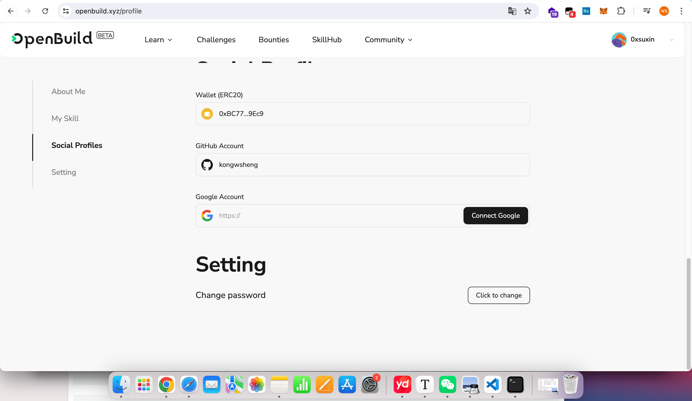

# Task2 Blockchain Basic

本任务分为简答题、分析题和选择题，以此为模板，在下方填写你的答案即可。

选择题，请在你选中的项目中，将 `[ ]` 改为 `[x]` 即可

## [单选题] 如果你莫名奇妙收到了一个 NFT，那么

- [ ] 天上掉米，我应该马上点开他的链接
- [x] 这可能是在对我进行诈骗！

## [单选题] 群里大哥给我发的网站，说能赚大米，我应该

- [ ] 赶紧冲啊，待会米被人抢了
- [x] 谨慎判断，不在不信任的网站链接钱包

## [单选题] 下列说法正确的是

- [ ] 一个私钥对应一个地址
- [x] 一个私钥对应多个地址
- [ ] 多个私钥对应一个地址
- [ ] 多个私钥对应多个地址

## [单选题] 下列哪个是以太坊虚拟机的简称

- [ ] CLR
- [x] EVM
- [ ] JVM

## [单选题] 以下哪个是以太坊上正确的地址格式？

- [ ] 1A4BHoT2sXFuHsyL6bnTcD1m6AP9C5uyT1
- [ ] TEEuMMSc6zPJD36gfjBAR2GmqT6Tu1Rcut
- [x] 0x997fd71a4cf5d214009619808176b947aec122890a7fcee02e78e329596c94ba
- [ ] 0xf39Fd6e51aad88F6F4ce6aB8827279cffFb92266

## [多选题] 有一天某个大哥说要按市场价的 80% 出油给你，有可能

- [ ] 他在洗米
- [x] 他良心发现
- [ ] 要给我黒米
- [ ] 给我下套呢

## [多选题] 以下哪些是以太坊的二层扩容方案？

- [ ] Lightning Network（闪电网络）
- [x] Optimsitic Rollup
- [x] Zk Rollup

## [简答题] 简述区块链的网络结构

```
点对点(P2P)网络结构:
	区块链网络由大量的节点(节点)组成,节点之间直接相互连接,没有中心化的服务器。
每个节点都可以直接与其他节点通信和交换数据,形成一个去中心化的网络拓扑。
无中心化架构:
	区块链网络没有中央控制节点或中央管理机构,每个节点都是对等的,共同维护整个网络。
节点之间通过共识机制来验证和记录交易,而不依赖任何中央机构。
分布式记账:
	区块链上的交易和数据记录都被复制到网络中的每个节点上,形成分布式的账本。
每个节点都拥有完整的交易历史记录,没有单点故障风险。
密码学安全:
	区块链利用密码学技术,如公私钥加密、数字签名等,确保交易和数据的安全性。
交易记录一经确认,就很难被篡改,具有不可逆性和不可伪造性。
```

## [简答题] 智能合约是什么，有何作用？

```
智能合约是一种自动化的协议，它以代码的形式存储在区块链上，能够自动执行合约条款。当预设的条件被满足时，智能合约会自动执行相应的功能，如转移资产、释放资金或更新记录，无需任何中间人的介入。智能合约利用区块链技术的特性，如去中心化、不可篡改和透明度，来确保交易的安全性和可靠性。

智能合约的作用主要包括：

自动化执行：减少对中介的需求，加快交易速度，降低执行成本。
提高透明度：所有交易记录都存储在区块链上，对所有参与者可见，增加信任。
减少欺诈风险：由于智能合约的执行是基于代码和算法，一旦条件达成，交易将自动进行，减少了人为干预的机会。
降低成本：通过去除传统合约中的中介环节，降低了交易成本。
增强安全性：区块链的分布式账本技术使得数据难以被篡改，增加了智能合约的安全性。
```

## [简答题] 怎么理解大家常说的 `EVM` 这个词汇？

```
EVM 是 Ethereum Virtual Machine（以太坊虚拟机）的缩写，它是以太坊平台的核心组件之一，负责执行以太坊上的智能合约。EVM 可以被看作是一个沙盒环境，在这个环境中，智能合约代码（通常用 Solidity 或其他支持的语言编写）可以在一个隔离且确定性的环境中运行，不受外部因素影响，保证了交易的一致性和安全性。
```

## [分析题] 你对去中心化的理解

```
去中心化（Decentralization）是指在组织结构、网络架构或社会系统中，权力、控制、信息或资源不是集中在一个单一的节点或中心，而是分散到网络中的各个节点上。这种模式减少了对单一中心的依赖，提高了系统的弹性和抗故障能力，同时也促进了更广泛和公平的参与。
```

## [分析题] 比较区块链与传统数据库，你的看法？

```
区块链与传统数据库在设计原理、用途和特性上有显著的不同。
```

## 操作题

安装一个 WEB3 钱包，创建账户后与 [openbuild.xyz](https://openbuild.xyz/profile) 进行绑定，截图后文件命名为 `./bind-wallet.jpg`.


