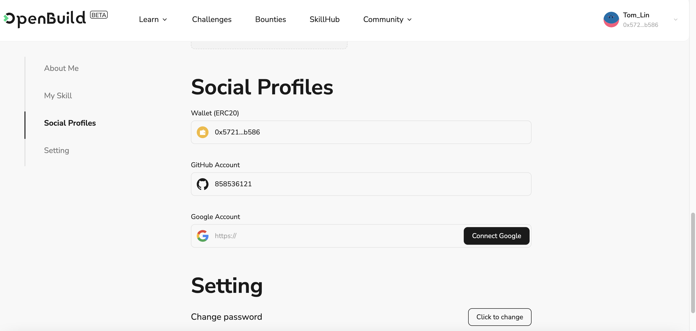

# Task2 Blockchain Basic

本任务分为简答题、分析题和选择题，以此为模板，在下方填写你的答案即可。

选择题，请在你选中的项目中，将 `[ ]` 改为 `[x]` 即可

## [单选题] 如果你莫名奇妙收到了一个 NFT，那么

- [ ] 天上掉米，我应该马上点开他的链接
- [x] 这可能是在对我进行诈骗！

## [单选题] 群里大哥给我发的网站，说能赚大米，我应该

- [ ] 赶紧冲啊，待会米被人抢了
- [x] 谨慎判断，不在不信任的网站链接钱包

## [单选题] 下列说法正确的是

- [x] 一个私钥对应一个地址
- [ ] 一个私钥对应多个地址
- [ ] 多个私钥对应一个地址
- [ ] 多个私钥对应多个地址

## [单选题] 下列哪个是以太坊虚拟机的简称

- [ ] CLR
- [x] EVM
- [ ] JVM

## [单选题] 以下哪个是以太坊上正确的地址格式？

- [ ] 1A4BHoT2sXFuHsyL6bnTcD1m6AP9C5uyT1
- [ ] TEEuMMSc6zPJD36gfjBAR2GmqT6Tu1Rcut
- [ ] 0x997fd71a4cf5d214009619808176b947aec122890a7fcee02e78e329596c94ba
- [x] 0xf39Fd6e51aad88F6F4ce6aB8827279cffFb92266

## [多选题] 有一天某个大哥说要按市场价的 80% 出油给你，有可能

- [x] 他在洗米
- [ ] 他良心发现
- [x] 要给我黒米
- [x] 给我下套呢

## [多选题] 以下哪些是以太坊的二层扩容方案？

- [ ] Lightning Network（闪电网络）
- [x] Optimsitic Rollup
- [x] Zk Rollup

## [简答题] 简述区块链的网络结构

```
区块链主要是使用分布式网络，有大量的去中心化节点构成，每个节点都是网络中的一个参与者，负责存储和维护区块链的副本。
```

## [简答题] 智能合约是什么，有何作用？

```
智能合约是运行在区块链上的自动化程序，在预定条件满足时自动执行和验证合约条款，具有不可篡改性和透明性。它通过消除中介机构、减少人为错误和欺诈行为，提高交易效率和降低成本，广泛应用于金融服务、供应链管理、房地产和数字身份认证等领域。
```

## [简答题] 怎么理解大家常说的 `EVM` 这个词汇？

```
EVM（以太坊虚拟机）是以太坊区块链上智能合约的运行环境，负责解释和执行智能合约代码，确保所有节点对合约执行结果达成一致。它通过Gas机制管理计算资源消耗，防止资源滥用，是实现去中心化应用的核心组件。
```

## [分析题] 你对去中心化的理解

```
数据和权力掌握在每一个用户手中，没有一个绝对的中心化节点，整个网络由不同的平等权益的节点组成，大家可以通过投票决定整个平台的发展。
```

## [分析题] 比较区块链与传统数据库，你的看法？

```
区块链与传统数据库在设计理念和应用场景上有明显差异，区块链通过去中心化、不可篡改性和共识机制提供了更高的安全性和可信度，适合需要跨组织合作和数据公开透明的场景。传统数据库则更侧重于集中式管理和操作的高效性，适用于企业内部的数据管理和日常运营。
```

## 操作题

安装一个 WEB3 钱包，创建账户后与 [openbuild.xyz](https://openbuild.xyz/profile) 进行绑定，截图后文件命名为 `./bind-wallet.jpg`.

