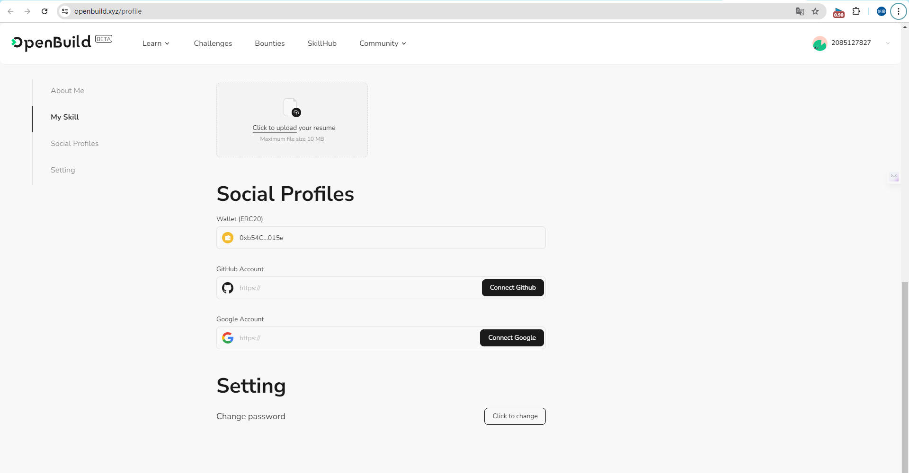

# Task2 Blockchain Basic

本任务分为简答题、分析题和选择题，以此为模板，在下方填写你的答案即可。

选择题，请在你选中的项目中，将 `[ ]` 改为 `[x]` 即可

## [单选题] 如果你莫名奇妙收到了一个 NFT，那么

- [ ] 天上掉米，我应该马上点开他的链接
- [x] 这可能是在对我进行诈骗！

## [单选题] 群里大哥给我发的网站，说能赚大米，我应该

- [ ] 赶紧冲啊，待会米被人抢了
- [x] 谨慎判断，不在不信任的网站链接钱包

## [单选题] 下列说法正确的是

- [ ] 一个私钥对应一个地址
- [x] 一个私钥对应多个地址
- [ ] 多个私钥对应一个地址
- [ ] 多个私钥对应多个地址

## [单选题] 下列哪个是以太坊虚拟机的简称

- [ ] CLR
- [x] EVM
- [ ] JVM

## [单选题] 以下哪个是以太坊上正确的地址格式？

- [ ] 1A4BHoT2sXFuHsyL6bnTcD1m6AP9C5uyT1
- [ ] TEEuMMSc6zPJD36gfjBAR2GmqT6Tu1Rcut
- [ ] 0x997fd71a4cf5d214009619808176b947aec122890a7fcee02e78e329596c94ba
- [x] 0xf39Fd6e51aad88F6F4ce6aB8827279cffFb92266

## [多选题] 有一天某个大哥说要按市场价的 80% 出油给你，有可能

- [x] 他在洗米
- [ ] 他良心发现
- [x] 要给我黒米
- [x] 给我下套呢

## [多选题] 以下哪些是以太坊的二层扩容方案？

- [x] Lightning Network（闪电网络）
- [ ] Optimsitic Rollup
- [x] Zk Rollup

## [简答题] 简述区块链的网络结构

```
区块链的网络结构是去中心化的，通常由以下几个关键组成部分构成：

节点（Node）:
区块链网络中的节点是构成网络的基本单元。每个节点都保存着区块链的一个副本，并且可以是任何类型的电子设备，如计算机、服务器或智能手机。

区块（Block）:
信息被存储在称为“区块”的数据结构中。每个区块包含一组交易记录，它们是按照时间顺序添加到区块链中的。

链（Chain）:
这些区块通过加密方式相互连接，每个区块都包含前一个区块的加密散列值，这种结构保证了区块链的不可篡改性。

共识机制（Consensus Mechanism）:
区块链网络通过共识机制来验证和记录交易。这个机制确保所有节点对区块链的状态达成一致。常见的共识机制包括工作量证明（Proof of Work, PoW）、权益证明（Proof of Stake, PoS）等。

分布式账本（Distributed Ledger）:
区块链是一个分布式账本，这意味着账本的副本分散存储在整个网络的所有节点上，而不是集中在某个单一位置。

加密技术:
区块链使用加密技术来保证数据的安全性和完整性。这包括对交易记录的加密、对区块的散列处理以及用于创建和验证数字签名的公钥和私钥。

智能合约（Smart Contracts）:
在某些区块链网络中，可以编程和部署智能合约，它们是自动执行、控制和记录合同条款的计算机程序。
```

## [简答题] 智能合约是什么，有何作用？

```
智能合约的作用包括：

自动执行交易：当合约中定义的条件得到满足时，智能合约会自动执行相关的交易或功能，如转账、发放奖励等。

提高效率：智能合约减少了手动处理和中介机构的需要，从而加快交易速度，降低成本。

增加信任：由于智能合约的执行是自动和透明的，它减少了欺诈的可能性，增加了交易双方的信任。

减少错误：智能合约是基于代码执行的，减少了人为错误的可能性。

多方参与：智能合约可以在多方之间创建复杂的交易和协议，每个人都能看到合约规则和交易发生。
```

## [简答题] 怎么理解大家常说的 `EVM` 这个词汇？

```
EVM 的特点包括：

兼容性：开发者可以使用Solidity等编程语言编写智能合约，然后将其编译成EVM可以理解的字节码，在以太坊网络上执行。

隔离性：EVM 在执行智能合约时提供隔离环境，确保区块链本身的安全性不会因为智能合约的执行而受到威胁。

确定性：EVM 设计为执行结果必须是确定的，以确保网络中的所有节点在处理交易时能够达成一致。

EVM 通过提供这样一个执行环境，成为了以太坊生态系统中开发和运行去中心化应用（DApps）的基础。在此处填写你的答案
```

## [分析题] 你对去中心化的理解

```
去中心化是指移除或减少中央或核心权威对系统的控制。在技术领域，特别是在区块链和加密货币的背景下，去中心化通常意味着以下几点：

权力分散：不是由单一实体控制，而是由网络中的多个参与者共同管理和维护。

抗审查：数据和交易分布在全球范围内，很难被单一实体审查或关闭。

抗故障：去中心化系统没有单点故障，因为系统不依赖于任何单一的服务器或节点。

透明性：交易和数据通常是公开的，任何人都可以验证和审计。

无需信任：参与者可以直接交互，无需信任对方或第三方中介，因为协议本身通过加密和共识机制确保了交易的安全性和有效性。
```

## [分析题] 比较区块链与传统数据库，你的看法？

```
块链与传统数据库在设计、结构和用途上有着本质的不同。以下是一些关键的比较点：

结构：

区块链：是由一系列按时间顺序链接的“区块”构成的，每个区块都包含一组交易记录。它通常是不可变的，一旦数据被添加到区块链上，就很难更改或删除。
传统数据库：通常采用表格形式存储数据，可以快速地进行增加、删除、修改和查询操作。
中央化与去中心化：

区块链：通常是去中心化的，不依赖于单一的控制点，数据在整个网络中分布存储。
传统数据库：通常是中央化管理的，由单个实体控制，数据存储在中心化的服务器上。
数据完整性和透明度：

区块链：提供了高度的数据不变性和透明度，所有交易都是可追溯的，且不可篡改。
传统数据库：虽然可以实施安全措施保护数据的完整性，但管理员具有更改或删除数据的能力。
性能：

区块链：由于其去中心化和每个交易都需要网络共识的特性，处理速度通常比传统数据库慢。
传统数据库：优化了读写速度，可以快速处理大量的交易和查询。
共识机制：

区块链：使用共识机制（如工作量证明、权益证明等）来验证和添加新的记录。
传统数据库：依靠数据库管理系统来维护数据的一致性。
安全性：

区块链：通过加密和分布式共识提供了较高的安全性，尤其适合于安全性要求高的应用。
传统数据库：需要通过外部措施（如防火墙、访问控制等）来确保安全性。
成本：

区块链：由于需要大量的计算资源和能源消耗（尤其是使用工作量证明的区块链），运营成本可能较高。
传统数据库：一般来说，运营成本较低，因为它们不需要复杂的共识算法和大量的节点验证。
```

## 操作题

安装一个 WEB3 钱包，创建账户后与 [openbuild.xyz](https://openbuild.xyz/profile) 进行绑定，截图后文件命名为 `./bind-wallet.jpg`.


