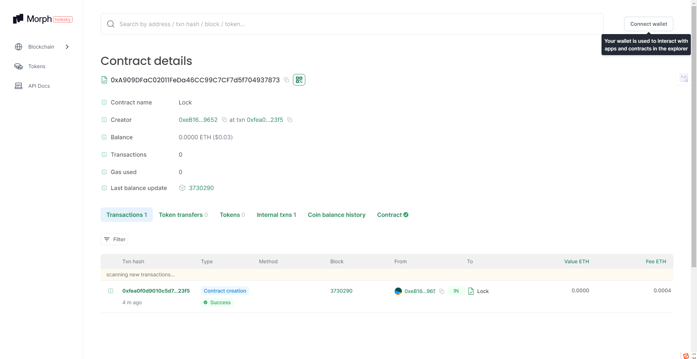

## Deploy log

```bash
$ yarn deploy:morphTestnet                                                                       
yarn run v1.22.21
$ npx hardhat run --network morphTestnet scripts/deploy.ts
Lock with 0.00001ETH and unlock timestamp 1720850740 deployed to 0xA909DFaC02011FeDa46CC99C7CF7d5f704937873
```

## Verifylog

```bash
npx hardhat verify --network morphTestnet 0xA909DFaC02011FeDa46CC99C7CF7d5f704937873 '0.00001'

https://explorer-holesky.morphl2.io/address/0xA909DFaC02011FeDa46CC99C7CF7d5f704937873#code
```


