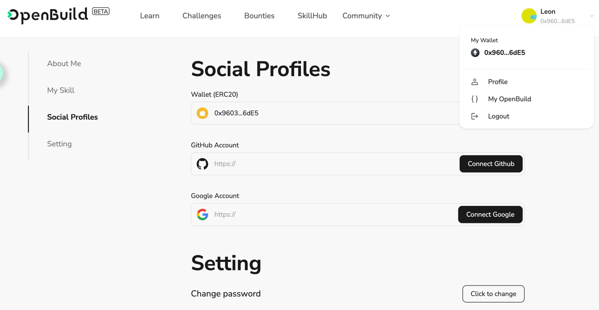

# Task2 Blockchain Basic

本任务分为简答题、分析题和选择题，以此为模板，在下方填写你的答案即可。

选择题，请在你选中的项目中，将 `[ ]` 改为 `[x]` 即可


## [单选题] 如果你莫名奇妙收到了一个 NFT，那么

- [ ] 天上掉米，我应该马上点开他的链接
- [x] 这可能是在对我进行诈骗！


## [单选题] 群里大哥给我发的网站，说能赚大米，我应该

- [ ] 赶紧冲啊，待会米被人抢了
- [x] 谨慎判断，不在不信任的网站链接钱包

## [单选题] 下列说法正确的是

- [x] 一个私钥对应一个地址
- [ ] 一个私钥对应多个地址
- [ ] 多个私钥对应一个地址
- [ ] 多个私钥对应多个地址

 ## [单选题] 下列哪个是以太坊虚拟机的简称

- [ ] CLR
- [ ] EVM
- [x] JVM

## [单选题] 以下哪个是以太坊上正确的地址格式？

- [ ] 1A4BHoT2sXFuHsyL6bnTcD1m6AP9C5uyT1
- [ ] TEEuMMSc6zPJD36gfjBAR2GmqT6Tu1Rcut
- [ ] 0x997fd71a4cf5d214009619808176b947aec122890a7fcee02e78e329596c94ba
- [x] 0xf39Fd6e51aad88F6F4ce6aB8827279cffFb92266
      
## [多选题] 有一天某个大哥说要按市场价的 80% 出油给你，有可能

- [x] 他在洗米
- [ ] 他良心发现
- [x] 要给我黒米
- [x] 给我下套呢

## [多选题] 以下哪些是以太坊的二层扩容方案？

- [ ] Lightning Network（闪电网络）
- [x] Optimsitic Rollup
- [x] Zk Rollup

## [简答题] 简述区块链的网络结构

```
区块链的网络结构通常被描述为一个分布式对等网络（P2P网络）。以下是其主要特点和组成部分：

1. 节点（Nodes）
节点是区块链网络的基本组成单元，每个节点都可以存储和验证区块链中的数据。根据功能的不同，节点可以分为以下几种类型：
全节点（Full Nodes）： 存储完整的区块链数据，验证和传播交易和区块，参与共识过程。
轻节点（Light Nodes）： 只存储区块链的一部分数据，通常是区块头，依赖全节点进行验证。
矿工节点（Miner Nodes）： 参与工作量证明（PoW）或权益证明（PoS）等共识机制，负责打包和生成新区块。

2. 对等网络（P2P Network）
区块链依赖P2P网络实现节点之间的通信和数据传输。P2P网络的特点包括：
去中心化： 没有中央服务器，所有节点地位平等，直接相互通信。
冗余： 数据在多个节点之间冗余存储，增强了数据的可靠性和可用性。
抗审查： 由于网络是去中心化的，单点失效或攻击对整体网络的影响有限。

3. 传播机制（Propagation Mechanism）
区块链网络中的信息传播机制确保交易和区块能迅速在全网扩散。常见的传播机制有：
洪泛法（Gossip Protocol）： 每个节点接收到新的交易或区块后，随机选择若干邻居节点转发，逐步扩散到整个网络。
拉取机制（Pulling）： 节点定期向邻居节点请求最新的区块信息，以保持同步。

4. 共识机制（Consensus Mechanism）
共识机制是区块链网络中节点达成一致的协议，主要包括以下几种类型：
工作量证明（PoW）： 节点通过计算复杂数学问题竞争记账权，解决问题最快的节点获得新区块奖励。
权益证明（PoS）： 节点根据持有的加密货币数量和持有时间获得记账权和区块奖励，减少计算资源消耗。
委托权益证明（DPoS）： 通过选举产生有限数量的节点作为代表，负责生成新区块，提高网络效率。

5. 激励机制（Incentive Mechanism）
区块链网络设计了经济激励机制来鼓励节点参与记账和维护网络安全。常见的激励方式包括：
区块奖励： 新生成的区块附带一定数量的新发行加密货币作为奖励，支付给记账节点。
交易手续费： 每笔交易包含的小额费用作为奖励，支付给打包该交易的节点。

6. 安全机制（Security Mechanism）
区块链通过密码学和共识协议来确保数据的安全性和不可篡改性。主要包括：
哈希函数： 用于生成数据的唯一标识，确保数据的完整性。
数字签名： 确保交易的真实性和不可抵赖性。
分布式存储： 防止单点故障和恶意攻击，提高系统的容错能力。

```


## [简答题] 智能合约是什么，有何作用？

```
智能合约充当区块链上的自动化程序或协议，在满足某些预设条件时激活。
这些自动执行的合同直接写入代码，详细说明了买卖双方之间的协议条款。
它们在使交易可追踪、透明和不可逆转方面发挥着关键作用，从而消除中介并减少时间延迟。
智能合约托管在区块链网络上，根据触发特定结果的特定条件进行编码。
```


## [简答题] 怎么理解大家常说的 `EVM` 这个词汇？

```
以太坊虚拟机（EVM）是以太坊区块链中的关键组件，充当开发人员的虚拟计算机或软件平台。 这项创新允许创建和部署去中心化应用程序（DApp）以及在以太坊网络上执行智能合约。
EVM 由Vitalik Buterin于2013 年提出概念，成为以太坊网络的核心，强调了其在决定以太坊区块链中每个区块的状态方面的基础作用。
```


## [分析题] 你对去中心化的理解

```
去中心化是一种现象或结构，其只能出现在拥有众多用户或众多节点的系统中，每个用户都可连接并影响其他节点。 通俗地讲，就是每个人都是中心，每个人都可以连接并影响其他节点，这种扁平化、开源化、平等化的现象或结构，称之为“去中心化”。
```


## [分析题] 比较区块链与传统数据库，你的看法？

```
总的来说，区块链和传统数据库之间的最大区别在于去中心化、数据共享和隐私、数据安全性、可扩展性、数据一致性以及智能合约的支持等方面。 区块链技术在某些特定场景下可以提供更安全、透明和可信的数据管理解决方案。 但是，也需要考虑到区块链技术的可用性、性能和成本等因素，以确定是否适合特定的业务需求。
```


## 操作题

安装一个 WEB3 钱包，创建账户后与 [openbuild.xyz](https://openbuild.xyz/profile) 进行绑定，截图后文件命名为 `./bind-wallet.jpg`.

