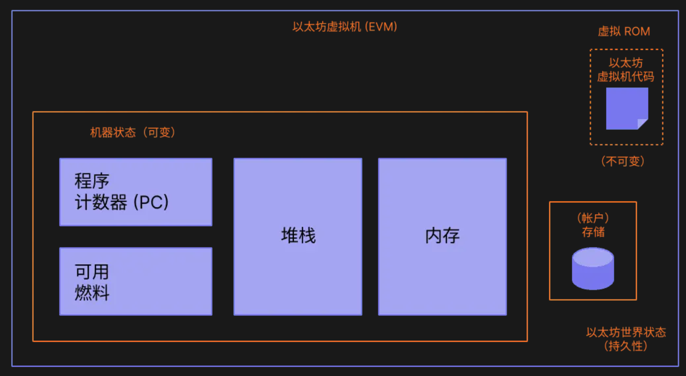
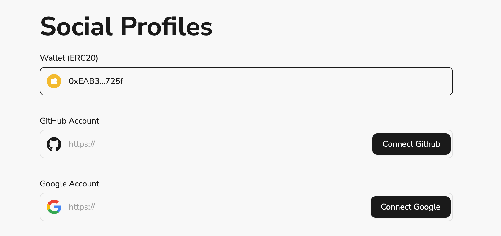

# Task2 Blockchain Basic

本任务分为简答题、分析题和选择题，以此为模板，在下方填写你的答案即可。

选择题，请在你选中的项目中，将 `[ ]` 改为 `[x]` 即可

## [单选题] 如果你莫名奇妙收到了一个 NFT，那么

- [ ] 天上掉米，我应该马上点开他的链接
- [x] 这可能是在对我进行诈骗！

## [单选题] 群里大哥给我发的网站，说能赚大米，我应该

- [ ] 赶紧冲啊，待会米被人抢了
- [x] 谨慎判断，不在不信任的网站链接钱包

## [单选题] 下列说法正确的是

- [x] 一个私钥对应一个地址
- [ ] 一个私钥对应多个地址
- [ ] 多个私钥对应一个地址
- [ ] 多个私钥对应多个地址

## [单选题] 下列哪个是以太坊虚拟机的简称

- [ ] CLR
- [x] EVM
- [ ] JVM

## [单选题] 以下哪个是以太坊上正确的地址格式？

- [ ] 1A4BHoT2sXFuHsyL6bnTcD1m6AP9C5uyT1
- [ ] TEEuMMSc6zPJD36gfjBAR2GmqT6Tu1Rcut
- [ ] 0x997fd71a4cf5d214009619808176b947aec122890a7fcee02e78e329596c94ba
- [x] 0xf39Fd6e51aad88F6F4ce6aB8827279cffFb92266

## [多选题] 有一天某个大哥说要按市场价的 80% 出油给你，有可能

- [x] 他在洗米
- [ ] 他良心发现
- [x] 要给我黒米
- [x] 给我下套呢

## [多选题] 以下哪些是以太坊的二层扩容方案？

- [ ] Lightning Network（闪电网络）
- [x] Optimsitic Rollup
- [x] Zk Rollup

## [简答题] 简述区块链的网络结构

```
区块链网络是一个运行在全世界各处的节点(Node)组成
每个节点都包含了一个区块链的全部或者部分副本
一个区块链由区块(block)构成，区块是包含交易记录的集合，区块主要由区块头和区块体构成。区块头主要包含区块哈希值、前一个区块的哈希值等信息；区块体包含实际的交易数据。
节点之间通过P2P网络进行通信，传递交易和区块信息，通过共识算法判断数据的正确性
```

## [简答题] 智能合约是什么，有何作用？

```
智能合约是部署在区块链网络上的满足一定条件就自动执行的程序，能够被用户发起和调用
1. 自动执行协议:智能合约可以根据预先编码的条件自动执行协议,无需人工干预,提高了效率和透明度。
2. 去中介化:智能合约在分布式网络上运行,不依赖于任何中介机构,降低了交易成本。
3. 可信任:智能合约的执行结果在区块链上不可篡改,所有参与方都可以验证,提高了信任度。
4. 自动化流程:智能合约可以在满足条件时自动触发下一步操作,实现工作流程自动化。

```

## [简答题] 怎么理解大家常说的 `EVM` 这个词汇？

```
EVM指的是以太坊虚拟机，为执行智能合约提供了一个统一的运行环境。
1. 兼容性:EVM定义了一套标准,使得基于EVM的区块链网络可以运行相同的智能合约代码,提高了开发者的效率和代码的可移植性。
2. 隔离性:EVM在区块链网络的每个节点上都有一个实例运行,为智能合约提供了与底层区块链网络隔离的执行环境,增强了安全性。
3. 确定性:EVM为智能合约的执行提供了确定性的环境,相同的输入在任何EVM实例上都会产生相同的输出,确保了智能合约在分布式网络上的一致性。
```


## [分析题] 你对去中心化的理解

```
去中心化是未来互联网的一个特性，从原来的主从式的网络，
到现在点对点网络，去中心化网络正在逐步实现
它的好处也有很多，避免了政府/企业监管，
让用户更安全地访问互联网资源
```

## [分析题] 比较区块链与传统数据库，你的看法？

```
区块链对比数据库，安全性极大提升，通过密码学保证了数据访问和传输的安全性，
通过分布式共识算法来生成和更新数据，保证了数据的一致性
利用由自动化脚本代码组成的智能合约来编程和操作数据，保证了数据的可信度
```

## 操作题

安装一个 WEB3 钱包，创建账户后与 [openbuild.xyz](https://openbuild.xyz/profile) 进行绑定，截图后文件命名为 `./bind-wallet.jpg`.

