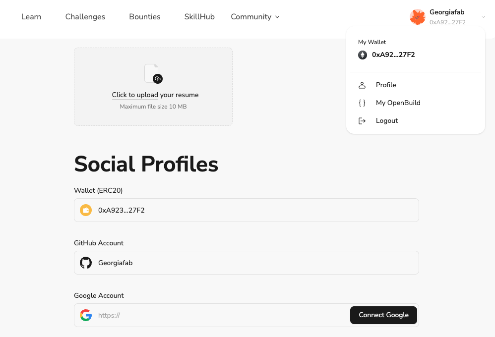

# Task2 Blockchain Basic

本任务分为简答题、分析题和选择题，以此为模板，在下方填写你的答案即可。

选择题，请在你选中的项目中，将 `[ ]` 改为 `[x]` 即可

## [单选题] 如果你莫名奇妙收到了一个 NFT，那么

- [ ] 天上掉米，我应该马上点开他的链接
- [x] 这可能是在对我进行诈骗！

## [单选题] 群里大哥给我发的网站，说能赚大米，我应该

- [ ] 赶紧冲啊，待会米被人抢了
- [x] 谨慎判断，不在不信任的网站链接钱包

## [单选题] 下列说法正确的是

- [x] 一个私钥对应一个地址
- [ ] 一个私钥对应多个地址
- [ ] 多个私钥对应一个地址
- [ ] 多个私钥对应多个地址

## [单选题] 下列哪个是以太坊虚拟机的简称

- [ ] CLR
- [x] EVM
- [ ] JVM

## [单选题] 以下哪个是以太坊上正确的地址格式？

- [ ] 1A4BHoT2sXFuHsyL6bnTcD1m6AP9C5uyT1
- [ ] TEEuMMSc6zPJD36gfjBAR2GmqT6Tu1Rcut
- [ ] 0x997fd71a4cf5d214009619808176b947aec122890a7fcee02e78e329596c94ba
- [x] 0xf39Fd6e51aad88F6F4ce6aB8827279cffFb92266

## [多选题] 有一天某个大哥说要按市场价的 80% 出油给你，有可能

- [x] 他在洗米
- [ ] 他良心发现
- [x] 要给我黒米
- [x] 给我下套呢

## [多选题] 以下哪些是以太坊的二层扩容方案？

- [ ] Lightning Network（闪电网络）
- [x] Optimsitic Rollup
- [x] Zk Rollup

## [简答题] 简述区块链的网络结构

```
节点
对等网络
共识机制
数据结构
分布式账本
网络通信协议

```

## [简答题] 智能合约是什么，有何作用？

```
智能合约是一种运行在区块链上的自执行代码
作用：
1. 自动化交易和业务流程
2. 降低成本和提高效率
3. 增强信任和透明度
4.支持去中心化应用（DApps）
```

## [简答题] 怎么理解大家常说的 `EVM` 这个词汇？

```
EVM 是 Ethereum Virtual Machine（以太坊虚拟机）的缩写。它是以太坊区块链的核心组件，负责执行智能合约并确保整个网络的状态一致性
```

## [分析题] 你对去中心化的理解

```

去中心化是指将控制权和决策权从单一的中心实体转移到分布式的网络节点或多个独立个体的过程。这种架构常见于区块链和分布式账本技术（DLT）
```

## [分析题] 比较区块链与传统数据库，你的看法？

```
区块链是一个去中心化的分布式账本，不可篡改，并且按区块形式存储，传统数据库由一个中心化服务器集中式管理，可修改，使用表、行、列等关系型数据结构（如SQL数据库），或文档、键值对等非关系型数据结构（如NoSQL数据库）
```

## 操作题

安装一个 WEB3 钱包，创建账户后与 [openbuild.xyz](https://openbuild.xyz/profile) 进行绑定，截图后文件命名为 `./bind-wallet.jpg`.

