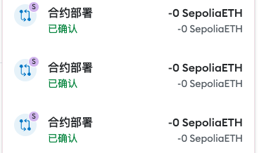

## task3 介绍

1. 部署在 Sepolia 测试网上
   
2. 提交全部合约文件（ERC20、ERC721、NFTMarket）  
   在 contract 文件夹中，其他文件用来测试的，忽略掉
3. 提交上架 NFT、购买 NFT 的交易哈希  
   提交上架 NFT： 0x754e73598b6b0059510532a5b53dd6068dcd81ac3a7cdf9d2ed5d06b1662562d  
   购买 NFT： 0xf937159ae007f8de3cd163752d66b33a8ad8897926f8e619c9b436c689d864e0
