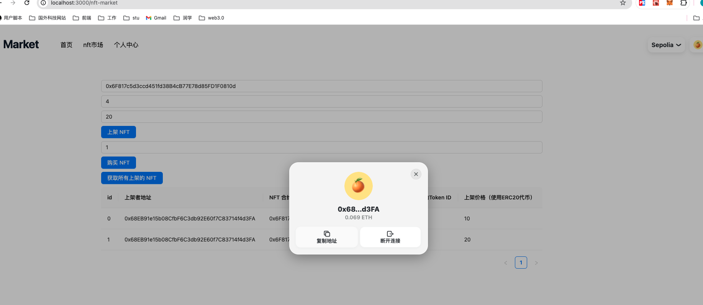

## task4 介绍

### 任务目标

使用 ethers.js 和 wagmi 库编写一个前端应用程序，允许用户上架 NFT 并使用 ERC20 代币购买 NFT。

### 前端组件要求

连接钱包：用户可以通过 MetaMask 连接他们的钱包。  
上架 NFT：用户可以输入 NFT 合约地址、Token ID 和价格（ERC20 代币），并将 NFT 上架到市场。  
显示上架的 NFT：显示所有上架的 NFT，包括 NFT 的合约地址、Token ID、价格和卖家地址。  
购买 NFT：用户可以选择一个上架的 NFT 并使用 ERC20 代币进行购买。

## 提交要求

提交完整代码  
提交界面截图



## 环境搭建：

- Hardhat
- react

## 钱包与合约访问

- wagmi
- metamask
- Ethersjs

---

- 编译合约：
  `npx hardhat compile`
- 开启本地网络：
  `npx hardhat node`
- 在本地网络上测试合约：
  `npx hardhat test --network localhost`
- 在本地网络上部署合约：
  `npx hardhat ignition deploy ./ignition/modules/ERC20Token.ts --network localhost`

---

开启前端服务：
`npx run dev`

## 合约

# Sample Hardhat Project

This project demonstrates a basic Hardhat use case. It comes with a sample contract, a test for that contract, and a Hardhat Ignition module that deploys that contract.

Try running some of the following tasks:

```shell
npx hardhat help
npx hardhat test
REPORT_GAS=true npx hardhat test
npx hardhat node
npx hardhat ignition deploy ./ignition/modules/NFTMarket.ts
```
