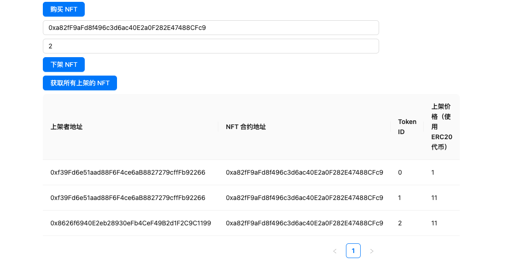
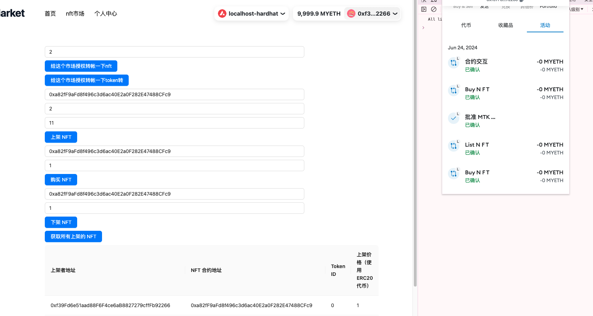

## task4 介绍

## 开发一个完整的 NFTMarket 的 Dapp

### 任务目标

在 task4 基础上开发一个完整的 NFTMarket-Dapp 并对功能点进行测试

### 任务要求

合约增加一个下架 NFT 的功能，用户可以在上架 NFT 后、被别人购买前下架 NFT
在 Market 界面展示出所有上架的 NFT（图片、NFT 信息）
NFT 信息包括（价格、上架时间、拥有者）
测试上架、下架、购买 NFT 的功能
提交要求
提交完整代码
提交界面的截图
提交测试的截图（上架后、下架后、购买 NFT 后买家获得 NFT 的三个截图）

### 提交完整代码

### 提交界面截图

上架后：  

下架后:

购买后：


## 环境搭建：

- Hardhat
- react

## 钱包与合约访问

- wagmi
- metamask
- Ethersjs

---

- 编译合约：
  `npx hardhat compile`
- 开启本地网络：
  `npx hardhat node`
- 在本地网络上测试合约：
  `npx hardhat test --network localhost`
- 在本地网络上部署合约：
  `npx hardhat ignition deploy ./ignition/modules/ERC20Token.ts --network localhost`

---

开启前端服务：
`npx run dev`

## 合约

# Sample Hardhat Project

This project demonstrates a basic Hardhat use case. It comes with a sample contract, a test for that contract, and a Hardhat Ignition module that deploys that contract.

Try running some of the following tasks:

```shell
npx hardhat help
npx hardhat test
REPORT_GAS=true npx hardhat test
npx hardhat node
npx hardhat ignition deploy ./ignition/modules/NFTMarket.ts
```
