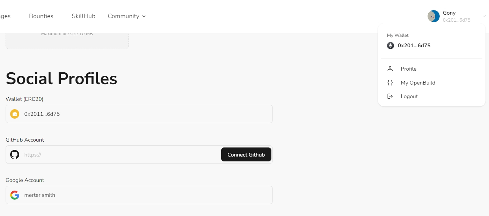

# Task2 Blockchain Basic

本任务分为简答题、分析题和选择题，以此为模板，在下方填写你的答案即可。

选择题，请在你选中的项目中，将 `[ ]` 改为 `[x]` 即可


## [单选题] 如果你莫名奇妙收到了一个 NFT，那么

- [ ] 天上掉米，我应该马上点开他的链接
- [x] 这可能是在对我进行诈骗！


## [单选题] 群里大哥给我发的网站，说能赚大米，我应该

- [ ] 赶紧冲啊，待会米被人抢了
- [x] 谨慎判断，不在不信任的网站链接钱包

## [单选题] 下列说法正确的是

- [x] 一个私钥对应一个地址
- [ ] 一个私钥对应多个地址
- [ ] 多个私钥对应一个地址
- [ ] 多个私钥对应多个地址

 ## [单选题] 下列哪个是以太坊虚拟机的简称

- [ ] CLR
- [x] EVM
- [ ] JVM

## [单选题] 以下哪个是以太坊上正确的地址格式？

- [ ] 1A4BHoT2sXFuHsyL6bnTcD1m6AP9C5uyT1
- [ ] TEEuMMSc6zPJD36gfjBAR2GmqT6Tu1Rcut
- [ ] 0x997fd71a4cf5d214009619808176b947aec122890a7fcee02e78e329596c94ba
- [x] 0xf39Fd6e51aad88F6F4ce6aB8827279cffFb92266
      
## [多选题] 有一天某个大哥说要按市场价的 80% 出油给你，有可能

- [x] 他在洗米
- [ ] 他良心发现
- [x] 要给我黒米
- [x] 给我下套呢

## [多选题] 以下哪些是以太坊的二层扩容方案？

- [ ] Lightning Network（闪电网络）
- [ ] Optimsitic Rollup
- [ ] Zk Rollup

## [简答题] 简述区块链的网络结构

```
区块链的网络结构是去中心化的分布式网络。它由许多节点组成，每个节点都存储整个区块链的副本。  
节点通过共识机制来验证和记录交易，确保网络的安全性和一致性。区块链网络可以是公开的（如比特币、以太坊）或私有的（如企业内部使用的区块链）。
```


## [简答题] 智能合约是什么，有何作用？

```
智能合约是运行在区块链上的自执行代码。它们在满足预定条件时自动执行，不需要第三方干预。  
智能合约的作用包括自动化交易和协议执行、减少人为错误、提高交易透明度和安全性。它们广泛应用于金融、供应链等领域。
```


## [简答题] 怎么理解大家常说的 `EVM` 这个词汇？

```
EVM 是以太坊虚拟机（Ethereum Virtual Machine）的简称。EVM 是一种图灵完备的虚拟机，负责执行以太坊上的智能合约。它允许开发者在区块链上部署和运行复杂的去中心化应用（DApps）。EVM 是以太坊生态系统的核心，确保智能合约的正确执行和区块链的一致性。
```


## [分析题] 你对去中心化的理解

```
在去中心化的系统里，每个人都可以参与决策和管理，这样即使某个节点出现问题，整个系统也不会受到太大影响。

去中心化的好处是透明度高、安全性强，因为所有的记录都是公开的，每个人都可以看到并验证。另外，没有单一的控制中心，也就没有单点故障，不容易被黑客攻击或人为篡改。

当然，去中心化也有一些实际的问题，比如决策速度可能会慢一些，因为需要大家一起达成共识。不过总的来说，去中心化是一个让系统更加公平和安全的方式，在区块链技术中得到广泛应用
```


## [分析题] 比较区块链与传统数据库，你的看法？

```
区块链和传统数据库在数据存储和管理方式上有显著不同：

数据结构：区块链是一个链式结构，每个区块包含若干交易数据，并通过哈希链接到前一个区块，形成不可篡改的记录。传统数据库通常是表格结构，可以随意增删改查数据。

去中心化：区块链是去中心化的，每个节点都有完整的数据副本，依靠共识机制确保数据一致性。而传统数据库通常是集中式的，由一个或多个中心化服务器控制和管理。

安全性和透明度：区块链的数据透明且难以篡改，所有交易都可以被所有节点验证。而传统数据库的数据修改和访问权限通常由管理员控制，存在单点故障和数据篡改的风险。

性能和效率：区块链由于去中心化和共识机制，交易处理速度较慢，且需要大量计算资源。传统数据库在集中管理下，处理速度快且效率高。
```


## 操作题

安装一个 WEB3 钱包，创建账户后与 [openbuild.xyz](https://openbuild.xyz/profile) 进行绑定，截图后文件命名为 `./bind-wallet.jpg`.


