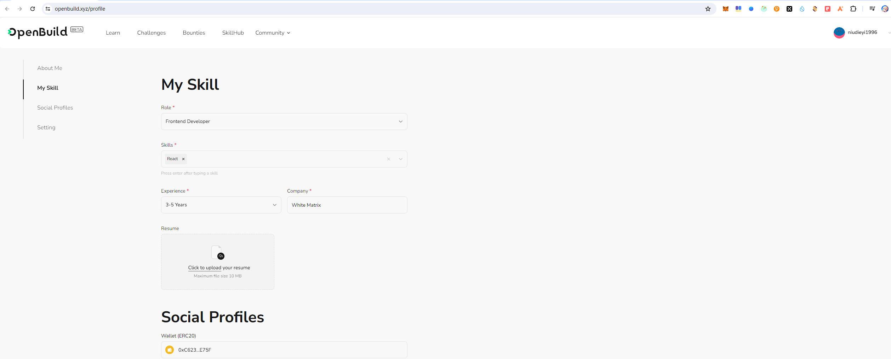

# Task2 Blockchain Basic

## [单选题] 如果你莫名奇妙收到了一个 NFT，那么

- [ ] 天上掉米，我应该马上点开他的链接
- [x] 这可能是在对我进行诈骗！


## [单选题] 群里大哥给我发的网站，说能赚大米，我应该

- [ ] 赶紧冲啊，待会米被人抢了
- [x] 谨慎判断，不在不信任的网站链接钱包

## [单选题] 下列说法正确的是

- [ ] 一个私钥对应一个地址
- [x] 一个私钥对应多个地址
- [ ] 多个私钥对应一个地址
- [ ] 多个私钥对应多个地址

 ## [单选题] 下列哪个是以太坊虚拟机的简称

- [ ] CLR
- [x] EVM
- [ ] JVM

## [单选题] 以下哪个是以太坊上正确的地址格式？

- [ ] 1A4BHoT2sXFuHsyL6bnTcD1m6AP9C5uyT1
- [ ] TEEuMMSc6zPJD36gfjBAR2GmqT6Tu1Rcut
- [ ] 0x997fd71a4cf5d214009619808176b947aec122890a7fcee02e78e329596c94ba
- [x] 0xf39Fd6e51aad88F6F4ce6aB8827279cffFb92266
      
## [多选题] 有一天某个大哥说要按市场价的 80% 出油给你，有可能

- [x] 他在洗米
- [ ] 他良心发现
- [x] 要给我黒米
- [x] 给我下套呢

## [多选题] 以下哪些是以太坊的二层扩容方案？

- [ ] Lightning Network（闪电网络）
- [x] Optimsitic Rollup
- [x] Zk Rollup

## [简答题] 简述区块链的网络结构

```
区块链的网络结构是一个去中心化的对等网络（P2P网络），其中每个节点都持有一个区块链的完整副本。网络中的节点通过共识算法（如PoW或PoS）进行数据验证和交易确认。节点之间通过加密通信协议（如TCP/IP）进行信息交换，确保数据的安全性和完整性。区块链网络具有高容错性、抗审查性和去中心化管理的特点。
```


## [简答题] 智能合约是什么，有何作用？

```
智能合约是一种运行在区块链上的自执行程序，具有自动执行和自我验证的功能。它们由代码编写，并在满足特定条件时自动执行预定义的操作。智能合约的作用包括自动化合约执行、减少人为干预和错误、降低交易成本、提高效率和透明度。它们广泛应用于金融、供应链管理、法律和数字身份等领域。
```


## [简答题] 怎么理解大家常说的 `EVM` 这个词汇？

```
EVM（Ethereum Virtual Machine）是以太坊虚拟机，是一个运行在以太坊网络上的图灵完备的虚拟机。它负责执行以太坊智能合约的字节码，并提供计算资源和存储空间。EVM使得开发者可以在以太坊平台上构建和部署去中心化应用（DApps），并确保这些应用能够在不同的节点上正确执行。EVM的图灵完备性意味着它能够执行任何可计算的任务，只要有足够的资源。
```


## [分析题] 你对去中心化的理解

```
去中心化是指系统或网络中的决策权和控制权不集中在某一个中心化实体，而是分散在多个参与者之间。去中心化的优势包括提高系统的安全性和容错性，减少单点故障的风险，增强透明度和信任度。区块链技术通过分布式账本和共识算法实现了去中心化，使得数据的存储和处理不依赖于中央服务器。去中心化在金融、数据管理、治理和社会组织等领域具有广泛的应用前景，能够推动权力下放和资源公平分配。
```


## [分析题] 比较区块链与传统数据库，你的看法？

```
区块链和传统数据库在架构和功能上有显著的差异：

1. 架构：区块链是去中心化的分布式账本，每个节点都持有完整的账本副本；传统数据库通常是中心化的，数据存储在一个或多个服务器中。
2. 数据完整性：区块链通过加密和共识机制确保数据的不可篡改性和完整性；传统数据库依赖于访问控制和备份机制。
3. 透明性和信任：区块链的交易记录公开透明，可供任何人验证，提高了系统的信任度；传统数据库的访问权限通常受限，透明度较低。
4. 性能：区块链在处理速度和扩展性方面相对较低，适合处理需要高安全性和透明度的交易；传统数据库性能较高，适合处理大量快速事务。
5. 成本和效率：区块链由于需要进行复杂的共识计算和数据冗余存储，成本较高；传统数据库的运行成本较低，效率较高。

总体来看，区块链适用于需要高安全性、透明性和去中心化的应用场景，而传统数据库适用于需要高性能和高效率的数据处理场景。两者各有优劣，具体选择应根据实际需求进行。
```


## 操作题

安装一个 WEB3 钱包，创建账户后与 [openbuild.xyz](https://openbuild.xyz/profile) 进行绑定，截图后文件命名为 `./bind-wallet.jpg`.


