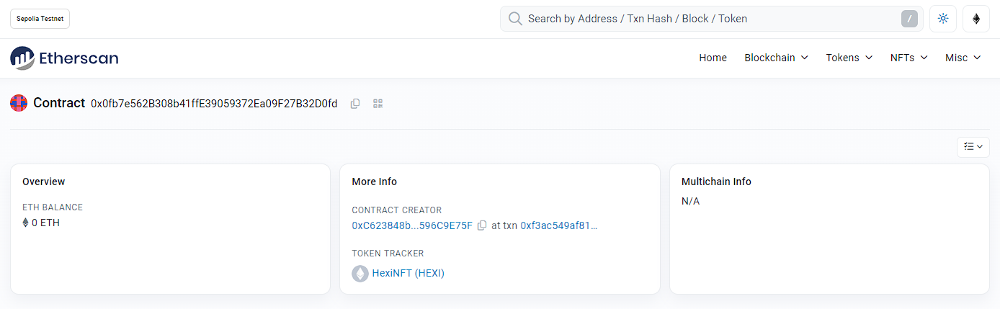

# Task 3

## ERC20 合约地址 (HexiToken)

[0x9546Da8C91CFF054690431ffbEd9d96F0aD4eD58](https://sepolia.etherscan.io/address/0x9546Da8C91CFF054690431ffbEd9d96F0aD4eD58)

## ERC721 合约地址 (HexiNFT)
[0x0fb7e562B308b41ffE39059372Ea09F27B32D0fd](https://sepolia.etherscan.io/address/0x0fb7e562B308b41ffE39059372Ea09F27B32D0fd#code)

## Market 合约地址
[0x19A04fDEE17ee651f096c3f82b27EFDFfBc852aE](https://sepolia.etherscan.io/address/0x19A04fDEE17ee651f096c3f82b27EFDFfBc852aE#code)

## 操作哈希
- 上架 NFT

[0xf12f56da372cd0eda04e1645d5dec68c9fb277f6d8f0765548e2b498d90cd142](https://sepolia.etherscan.io/tx/0xf12f56da372cd0eda04e1645d5dec68c9fb277f6d8f0765548e2b498d90cd142)

- 购买 NFT

[0x675c9f30f55ee8b5aa63b9b0cc1587ba478e4f90867b0187a85084c0f619d979](https://sepolia.etherscan.io/tx/0x675c9f30f55ee8b5aa63b9b0cc1587ba478e4f90867b0187a85084c0f619d979)

----

## TestAccount
- Contract Deployer: 0xC623848bcc9764cF26F7392D5FF1277596C9E75F
- Lister:            0x3b8b92755720ed5b276f15d8a3ecff03d42eec47
- Buyer:             0x4539f5211e6c567b2ab04c950ff0857f7eacd986