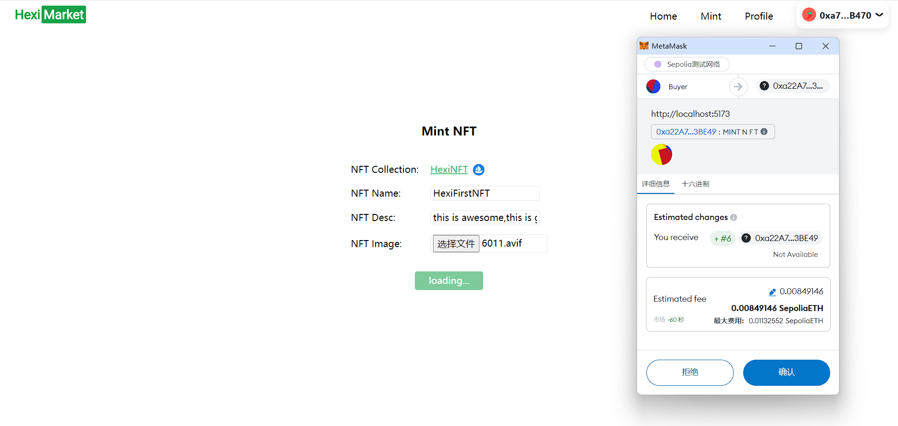
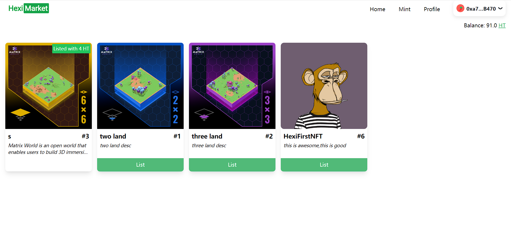
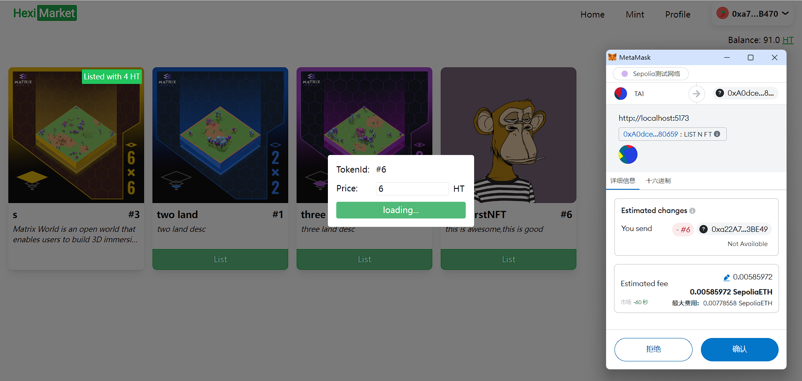
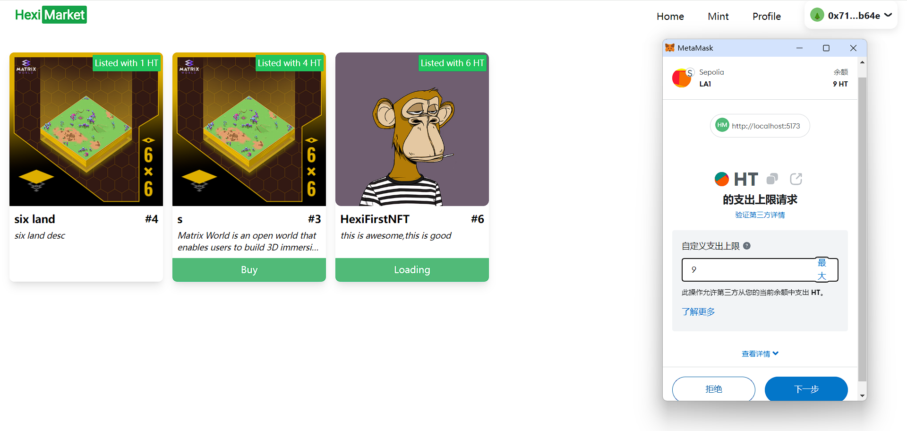
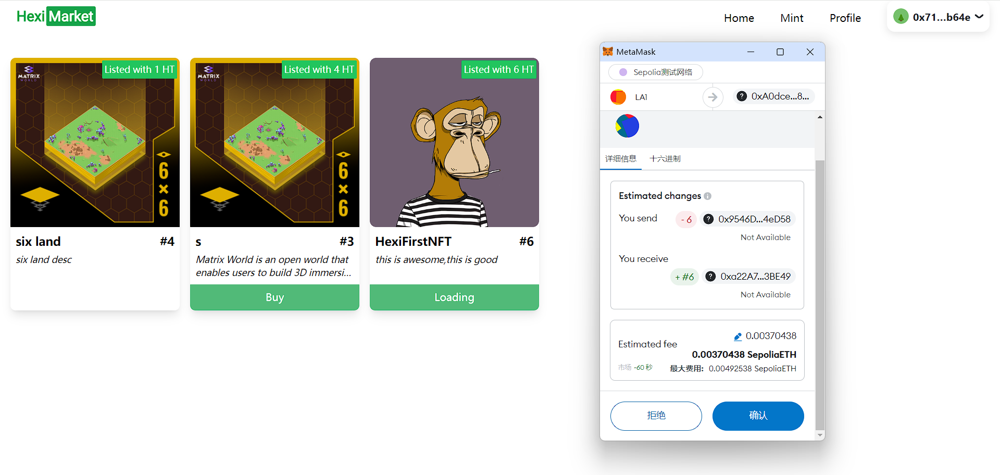
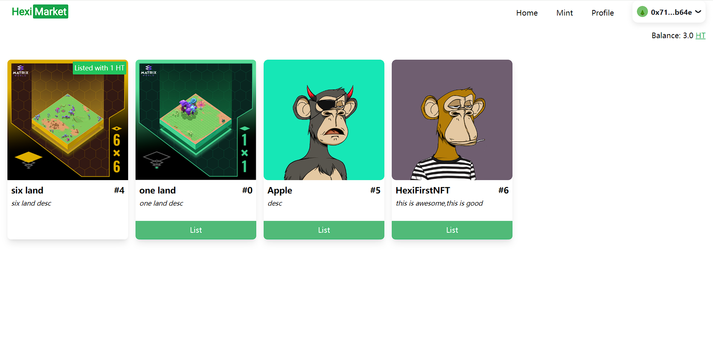
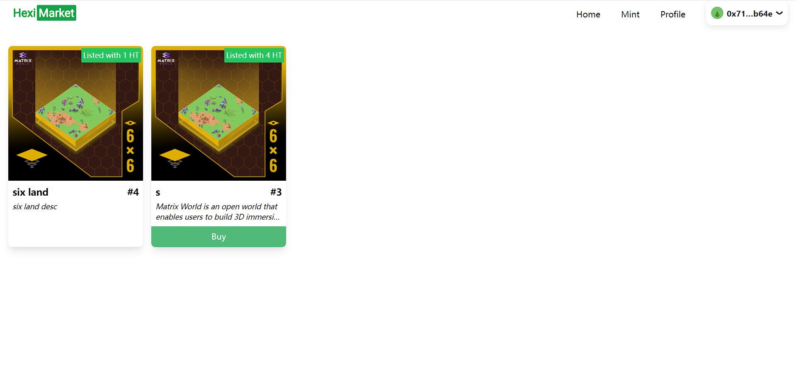

# Task 4

## 连接钱包

## Mint NFT

[0x845e3b814c3d24bc815d3bcd0a353934d749e17c2bf975887a97e8c4f8fbb962](https://sepolia.etherscan.io/tx/0x845e3b814c3d24bc815d3bcd0a353934d749e17c2bf975887a97e8c4f8fbb962)

## Profile

## 上架 NFT

[0x089123ce071bba00c5d2b3244fd33d1799723ca1f9d2038559a4320a7b2e8b6a](https://sepolia.etherscan.io/tx/0x089123ce071bba00c5d2b3244fd33d1799723ca1f9d2038559a4320a7b2e8b6a)

## 购买 NFT

[0x29bcc770138ca4dce35e26c87afa0b16400dc44a8e2b2496c86802c45de9dacf](https://sepolia.etherscan.io/tx/0x29bcc770138ca4dce35e26c87afa0b16400dc44a8e2b2496c86802c45de9dacf)

### approve

### confirm

### result

## 当前正在上架中的所有 NFT

