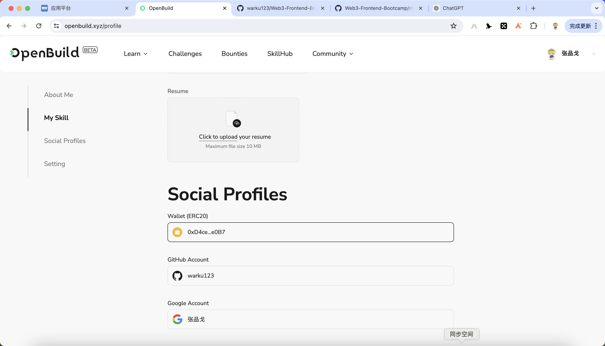

# Task2 Blockchain Basic

本任务分为简答题、分析题和选择题，以此为模板，在下方填写你的答案即可。

选择题，请在你选中的项目中，将 `[ ]` 改为 `[x]` 即可

## [单选题] 如果你莫名奇妙收到了一个 NFT，那么

- [ ] 天上掉米，我应该马上点开他的链接
- [x] 这可能是在对我进行诈骗！

## [单选题] 群里大哥给我发的网站，说能赚大米，我应该

- [ ] 赶紧冲啊，待会米被人抢了
- [x] 谨慎判断，不在不信任的网站链接钱包

## [单选题] 下列说法正确的是

- [x] 一个私钥对应一个地址
- [ ] 一个私钥对应多个地址
- [ ] 多个私钥对应一个地址
- [ ] 多个私钥对应多个地址

 ## [单选题] 下列哪个是以太坊虚拟机的简称

- [ ] CLR
- [x] EVM
- [ ] JVM

## [单选题] 以下哪个是以太坊上正确的地址格式？

- [ ] 1A4BHoT2sXFuHsyL6bnTcD1m6AP9C5uyT1
- [ ] TEEuMMSc6zPJD36gfjBAR2GmqT6Tu1Rcut
- [ ] 0x997fd71a4cf5d214009619808176b947aec122890a7fcee02e78e329596c94ba
- [x] 0xf39Fd6e51aad88F6F4ce6aB8827279cffFb92266
      
## [多选题] 有一天某个大哥说要按市场价的 80% 出油给你，有可能

- [x] 他在洗米
- [ ] 他良心发现
- [x] 要给我黒米
- [x] 给我下套呢

## [多选题] 以下哪些是以太坊的二层扩容方案？

- [ ] Lightning Network（闪电网络）
- [x] Optimsitic Rollup
- [x] Zk Rollup

## [简答题] 简述区块链的网络结构

1. 数据层（Data Layer）：这是区块链的基础层，包含区块链的数据结构，例如区块、链表、哈希函数、时间戳、非对称加密等。这个层次的主要功能是数据存储和验证。

2. 网络层（Network Layer）：这一层负责区块链节点之间的通信，包括数据传播、区块广播、共识信息的传递等。常见的网络协议包括P2P（点对点）协议。

3. 共识层（Consensus Layer）：共识层负责区块链系统中的共识算法和共识机制，确保分布式节点能够就数据达成一致。常见的共识算法包括PoW（工作量证明）、PoS（权益证明）、DPoS（委托权益证明）等。

4. 激励层（Incentive Layer）：激励层主要包括区块链系统中的经济激励机制，通过代币的奖励和惩罚机制，激励参与节点保持诚实并提供计算资源。比如比特币的挖矿奖励机制。

5. 合约层（Contract Layer）：合约层实现和执行智能合约。智能合约是存储在区块链上的自执行代码，能够在满足特定条件时自动执行特定操作。以太坊是这一层的典型代表。

6. 应用层（Application Layer）：这是区块链架构的最上层，包括各种面向用户的应用程序，如去中心化应用（DApps）、钱包、交易平台等。用户通过这些应用程序与区块链系统进行交互。

## [简答题] 智能合约是什么，有何作用？

智能合约（Smart Contract）是存储在区块链上的自执行代码，当满足预设条件时，它会自动执行预定的操作或条款。

**作用：**

- 自动执行：无需人工干预，自动执行图灵完备的代码。
- 去中心化：不依赖于第三方中介，减少代码执行中的信任风险。
- 透明：代码和执行结果公开透明，所有参与者都可以验证。
- 不可篡改：一旦部署到区块链上，代码和数据不可更改，保证了合同的安全性和可靠性。

## [简答题] 怎么理解大家常说的 `EVM` 这个词汇？

EVM是以太坊虚拟机的简写，以太坊虚拟机（Ethereum Virtual Machine，EVM）是以太坊区块链上的一个去中心化的计算引擎，它负责执行智能合约。EVM将智能合约编译成字节码，并在以太坊节点上运行这些字节码，确保以太坊网络中的所有节点以相同的方式执行相同的智能合约。

## [分析题] 你对去中心化的理解

**定义：**
去中心化（Decentralization）指系统或网络中的控制和决策权分散在多个节点或参与者之间，而不是集中在一个单一的中央机构或个体。

**作用：**
- 提高安全性：减少单点故障和被攻击的风险。
- 增加透明性：交易同时记录在所有节点上，被所有节点进行审查，减少信任问题。
- 提升抗审查性：没有中心化的控制点，难以被政府或其他机构控制或关闭。
- 增强系统弹性：分布式架构更能适应各种网络环境和故障情景。

## [分析题] 比较区块链与传统数据库，你的看法？

区块链和传统数据库在结构、功能和应用场景上有显著的区别。
- 去中心化 vs. 中心化：区块链是去中心化的，而传统数据库通常是中心化的。
- 不可篡改 vs. 可修改：区块链的数据不可篡改，传统数据库的数据可随时修改。
- 透明性 vs. 权限控制：区块链的透明性高，传统数据库通过权限控制保护数据。
- 共识机制 vs. 高效性：区块链通过共识机制确保数据一致性，传统数据库在数据处理和查询方面效率更高。

## 操作题

安装一个 WEB3 钱包，创建账户后与 [openbuild.xyz](https://openbuild.xyz/profile) 进行绑定，截图后文件命名为 `./bind-wallet.jpg`.

