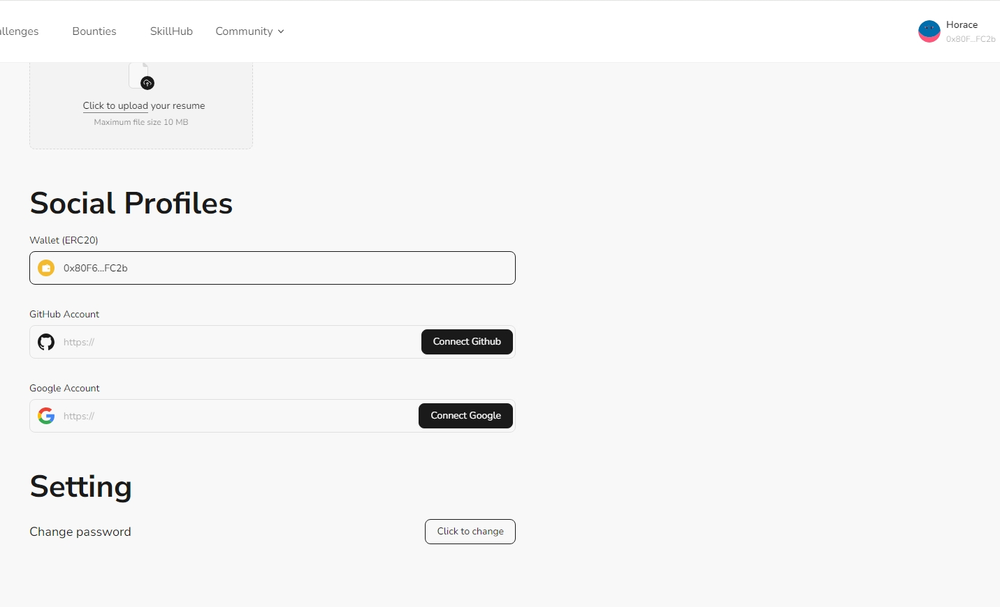

# Task2 Blockchain Basic

本任务分为简答题、分析题和选择题，以此为模板，在下方填写你的答案即可。

选择题，请在你选中的项目中，将 `[ ]` 改为 `[x]` 即可


## [单选题] 如果你莫名奇妙收到了一个 NFT，那么

- [ ] 天上掉米，我应该马上点开他的链接
- [x] 这可能是在对我进行诈骗！


## [单选题] 群里大哥给我发的网站，说能赚大米，我应该

- [ ] 赶紧冲啊，待会米被人抢了
- [x] 谨慎判断，不在不信任的网站链接钱包

## [单选题] 下列说法正确的是

- [x] 一个私钥对应一个地址
- [ ] 一个私钥对应多个地址
- [ ] 多个私钥对应一个地址
- [ ] 多个私钥对应多个地址

 ## [单选题] 下列哪个是以太坊虚拟机的简称

- [ ] CLR
- [x] EVM
- [ ] JVM

## [单选题] 以下哪个是以太坊上正确的地址格式？

- [ ] 1A4BHoT2sXFuHsyL6bnTcD1m6AP9C5uyT1
- [ ] TEEuMMSc6zPJD36gfjBAR2GmqT6Tu1Rcut
- [ ] 0x997fd71a4cf5d214009619808176b947aec122890a7fcee02e78e329596c94ba
- [x] 0xf39Fd6e51aad88F6F4ce6aB8827279cffFb92266
      
## [多选题] 有一天某个大哥说要按市场价的 80% 出油给你，有可能

- [x] 他在洗米
- [ ] 他良心发现
- [x] 要给我黒米
- [x] 给我下套呢

## [多选题] 以下哪些是以太坊的二层扩容方案？

- [ ] Lightning Network（闪电网络）
- [x] Optimsitic Rollup
- [x] Zk Rollup

## [简答题] 简述区块链的网络结构

```
区块链数据储存于全世界若干个节点当中，这些节点采用 P2P的形式通讯，相互验证数据正确性，提供查询和改写入口。
数据由用户以交易的形式提交至区块链节点，支付费用让矿工将其打包至区块中，所有节点共识确认即成功。
读取数据通过回溯区块链所有交易，或者基于目前的缓存，发送至用户。
```


## [简答题] 智能合约是什么，有何作用？

```
智能合约只是一个运行在以太坊链上的一个程序。 它是位于以太坊区块链上一个特定地址的一系列代码（函数）和数据（状态）。
智能合约也是一个以太坊帐户，我们称之为合约帐户。
```


## [简答题] 怎么理解大家常说的 `EVM` 这个词汇？

```
EVM:以太坊虚拟;由数以千计运行以太坊客户端的计算机共同维护的一个实体
```


## [分析题] 你对去中心化的理解

```
去中心化是一种通过分布式网络来实现数据存储、处理和传输的方式，而不依赖于单一中心化的服务器或机构。去中心化的实现通常依赖于区块链技术或者其他分布式账本技术。
```


## [分析题] 比较区块链与传统数据库，你的看法？

```
区块链设计为去中心化系统,数据一旦写入不可修改；传统数据库通常是中心化的，依赖于权限控制，管理员可以进行曾删改查操作；
区块链上的交易对所有参与者可见，提供了高度的透明性；传统数据库的透明性取决于其管理和配置
```


## 操作题

安装一个 WEB3 钱包，创建账户后与 [openbuild.xyz](https://openbuild.xyz/profile) 进行绑定，截图后文件命名为 `./bind-wallet.jpg`.
