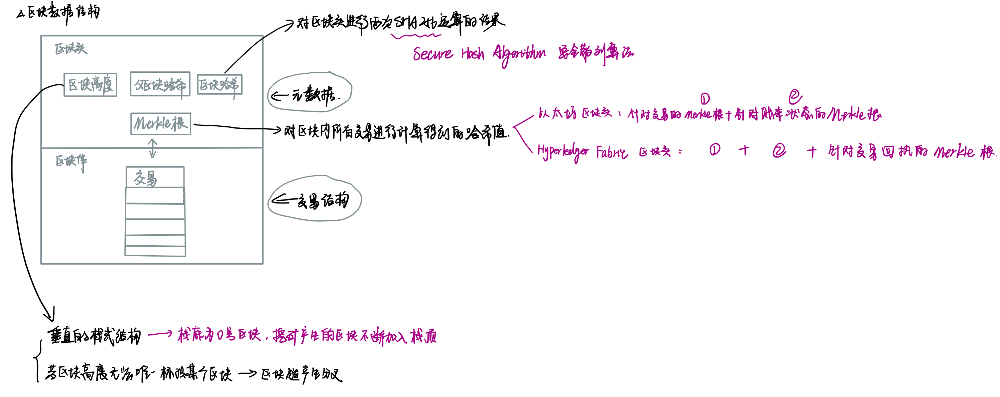
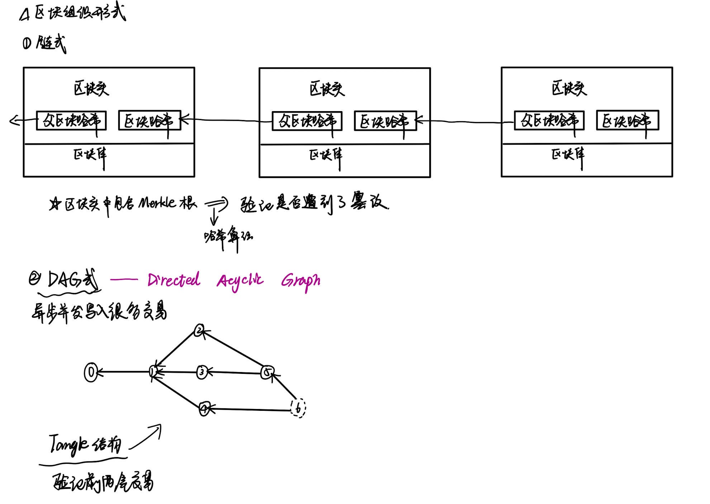

# Task2 Blockchain Basic

本任务分为简答题、分析题和选择题，以此为模板，在下方填写你的答案即可。

选择题，请在你选中的项目中，将 `[ ]` 改为 `[x]` 即可

## [单选题] 如果你莫名奇妙收到了一个 NFT，那么

- [ ] 天上掉米，我应该马上点开他的链接
- [x] 这可能是在对我进行诈骗！

## [单选题] 群里大哥给我发的网站，说能赚大米，我应该

- [ ] 赶紧冲啊，待会米被人抢了
- [x] 谨慎判断，不在不信任的网站链接钱包

## [单选题] 下列说法正确的是

- [x] 一个私钥对应一个地址
- [ ] 一个私钥对应多个地址
- [ ] 多个私钥对应一个地址
- [ ] 多个私钥对应多个地址

## [单选题] 下列哪个是以太坊虚拟机的简称

- [ ] CLR
- [x] EVM
- [ ] JVM

## [单选题] 以下哪个是以太坊上正确的地址格式？

- [ ] 1A4BHoT2sXFuHsyL6bnTcD1m6AP9C5uyT1
- [ ] TEEuMMSc6zPJD36gfjBAR2GmqT6Tu1Rcut
- [ ] 0x997fd71a4cf5d214009619808176b947aec122890a7fcee02e78e329596c94ba
- [x] 0xf39Fd6e51aad88F6F4ce6aB8827279cffFb92266

## [多选题] 有一天某个大哥说要按市场价的 80% 出油给你，有可能

- [x] 他在洗米
- [ ] 他良心发现
- [x] 要给我黒米
- [x] 给我下套呢

## [多选题] 以下哪些是以太坊的二层扩容方案？

- [ ] Lightning Network（闪电网络）
- [x] Optimsitic Rollup
- [x] Zk Rollup

## [简答题] 简述区块链的网络结构

```
区块链中每个区块分为区块头与区块体，区块头中存储区块高度、父区块哈希、区块哈希、Merkle根等元数据；区块体中存储交易。
区块链的组织形式分为链式和DAG式。链式结构简单、成熟，但交易吞吐量有限；DAG式结构则具有高并发、快速确认的优势，适合需要高交易量的应用场景。



```

## [简答题] 智能合约是什么，有何作用？

```
智能合约是在区块链上执行的代码，定义了在特定条件下自动执行的协议。提出目的是为了减少交易成本、提高交易效率并减少对中介的依赖。
区块链一旦在区块链上部署，便会在满足条件的情况下执行。智能合约的代码和状态记录在区块链上，一旦部署无法修改，从而保证了其执行的可靠性和透明性。智能合约的执行不依赖任何中央机构，而是通过区块链中的分布式节点进行验证和执行。

智能合约的作用：自动执行和减少中介、透明和不可篡改、去信任化交易等。
```

## [简答题] 怎么理解大家常说的 `EVM` 这个词汇？

```
EVM-以太坊虚拟机，用于执行以太坊上的交易，以太坊交易分为两种：普通交易和智能合约交易，执行交易需要支付gas费，智能合约之间有四种调用方式。

交易信息会形成一个Message对象，传入EVM进行处理：普通交易仅修改StateDB的信息，智能合约的创建或调用将通过EVM中的解释器加载和执行字节码，执行过程中可能涉及StateDB的查询或修改。

交易会被生成一个Message对象传入EVM，EVM则会根据Message生成一个Contract，Contract根据合约地址，从stateDB中加载对应的代码，后面就可以送入解释器进行执行操作了。

代码跟输入都有了，就可以送入解释器执行了。EVM是基于栈的虚拟机，解释器中需要操作四大组件：
- PC：类似于CPU中的PC寄存器，指向当前执行的指令
- Stack：执行堆栈，位宽为256 bits，最大深度为1024
- Memory：内存空间
- Gas：油费池，耗光则交易执行失败


```

## [分析题] 你对去中心化的理解

```
去中心化（Decentralization）是一种系统结构或治理模型，在这种模型中，权力和控制分布在网络中的多个节点或参与者之间，而不是集中在一个单一的中心或权威机构。去中心化的概念在多个领域都有应用，特别是在区块链技术、计算机网络、组织治理和金融系统中。

去中心化具备天生的安全性、透明性、抗审查性和自主性。

```

## [分析题] 比较区块链与传统数据库，你的看法？

```
数据结构与存储：
区块链是一个链式结构的分布式账本，由一系列按时间顺序链接的区块组成，每个区块包含多个交易记录和一个指向前一个区块的哈希值。其数据分布在网络中的多个节点上，每个节点都有一份完整的账本副本。
传统数据库通常采用表格、树状或图状结构（如关系型数据库使用表格，NoSQL数据库使用文档、键值对等）。其数据集中存储在服务器或服务器集群上，由中央管理者控制。

去中心化与集中化：
区块链是去中心化的，没有中央控制点，数据由所有参与节点共同维护和验证，系统更具容错性和抗攻击性。通过工作量证明（PoW）、权益证明（PoS）等共识机制确保数据的一致性和完整性。
传统数据库是集中化的，由中央管理者（如数据库管理员）控制和管理，数据的读写权限和维护由中心化实体决定。通过ACID（原子性、一致性、隔离性、持久性）特性确保事务的一致性和完整性。

区块链和传统数据库各有优缺点，适用于不同的应用场景。区块链技术在去中心化、安全性和数据不可篡改性方面具有独特优势，适合需要信任中介和高透明度的应用。然而，区块链的性能和效率问题限制了其在高频交易和大规模数据处理场景中的应用。传统数据库在性能、效率和灵活性方面表现优异，适合需要快速处理大量数据和频繁更新的场景，但其集中化管理带来的安全和单点故障风险需要通过其他技术手段进行弥补。

```

## 操作题

安装一个 WEB3 钱包，创建账户后与 [openbuild.xyz](https://openbuild.xyz/profile) 进行绑定，截图后文件命名为 `./bind-wallet.jpg`.