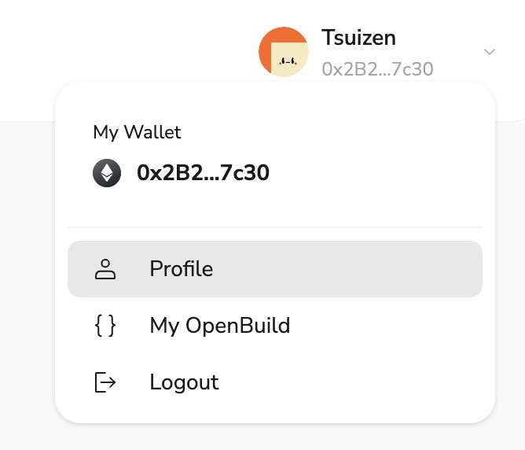

# Task2 Blockchain Basic

本任务分为简答题、分析题和选择题，以此为模板，在下方填写你的答案即可。

选择题，请在你选中的项目中，将 `[ ]` 改为 `[x]` 即可

## [单选题] 如果你莫名奇妙收到了一个 NFT，那么

- [ ] 天上掉米，我应该马上点开他的链接
- [x] 这可能是在对我进行诈骗！

## [单选题] 群里大哥给我发的网站，说能赚大米，我应该

- [ ] 赶紧冲啊，待会米被人抢了
- [x] 谨慎判断，不在不信任的网站链接钱包

## [单选题] 下列说法正确的是

- [x] 一个私钥对应一个地址
- [ ] 一个私钥对应多个地址
- [ ] 多个私钥对应一个地址
- [ ] 多个私钥对应多个地址

## [单选题] 下列哪个是以太坊虚拟机的简称

- [ ] CLR
- [x] EVM
- [ ] JVM

## [单选题] 以下哪个是以太坊上正确的地址格式？

- [ ] 1A4BHoT2sXFuHsyL6bnTcD1m6AP9C5uyT1
- [ ] TEEuMMSc6zPJD36gfjBAR2GmqT6Tu1Rcut
- [ ] 0x997fd71a4cf5d214009619808176b947aec122890a7fcee02e78e329596c94ba
- [x] 0xf39Fd6e51aad88F6F4ce6aB8827279cffFb92266

## [多选题] 有一天某个大哥说要按市场价的 80% 出油给你，有可能

- [x] 他在洗米
- [ ] 他良心发现
- [x] 要给我黒米
- [x] 给我下套呢

## [多选题] 以下哪些是以太坊的二层扩容方案？

- [ ] Lightning Network（闪电网络）
- [x] Optimsitic Rollup
- [x] Zk Rollup

## [简答题] 简述区块链的网络结构

```
区块链的网络结构采用点对点（P2P）组网方式，节点之间通过扁平化拓扑结构连接，实现分布式组网、消息传播和数据验证，每个节点在网络中地位平等，承担路由、验证和传播数据的功能，确保整个网络中的数据一致性和安全性。
```

## [简答题] 智能合约是什么，有何作用？

```
智能合约是一种在区块链上自动执行的合约。它是由计算机代码编写的程序，能够在特定条件满足时自动执行预定的操作。智能合约的主要作用包括：1）自动化执行合同条款，减少人为干预和错误；2）提高交易透明度和安全性，因其记录在区块链上，难以篡改；3）降低交易成本，省去中介环节。智能合约广泛应用于金融、供应链管理、物联网等领域。
```

## [简答题] 怎么理解大家常说的 `EVM` 这个词汇？

```
EVM，即以太坊虚拟机（Ethereum Virtual Machine），是以太坊网络的核心组件。它是一种图灵完备的虚拟机，能够执行智能合约的字节码。EVM 通过在以太坊网络上运行智能合约，确保所有节点都能达成共识并维护区块链的一致性。它支持多种编程语言，如 Solidity 和 Vyper，使开发者能够编写和部署去中心化应用（DApps）。EVM 的设计使其具有高度的灵活性和安全性，成为区块链开发的重要基础设施。
```

## [分析题] 你对去中心化的理解

```
去中心化是一种系统架构和管理模式，旨在通过分布式网络来分散权力和控制。与传统的集中化系统不同，去中心化系统没有单一的控制中心，所有参与者共同维护和验证系统的运行。这种模式提高了系统的透明度、安全性和抗审查能力，减少了单点故障的风险。区块链技术是去中心化的典型应用，通过共识机制和加密技术，实现了去中心化的记录和交易管理。
```

## [分析题] 比较区块链与传统数据库，你的看法？

```
区块链与传统数据库在结构和功能上有显著差异。区块链是一个去中心化的分布式账本，每个节点都保留一份完整的记录，数据通过共识机制进行验证和添加，具有高度的透明度和不可篡改性。而传统数据库通常是集中化的，由单一或少数实体控制，数据可以被修改或删除，适合快速查询和事务处理。区块链适用于需要高安全性、透明度和信任的场景，而传统数据库更适合高效的读写和大规模数据管理。
```

## 操作题

安装一个 WEB3 钱包，创建账户后与 [openbuild.xyz](https://openbuild.xyz/profile) 进行绑定，截图后文件命名为 `./bind-wallet.jpg`.

