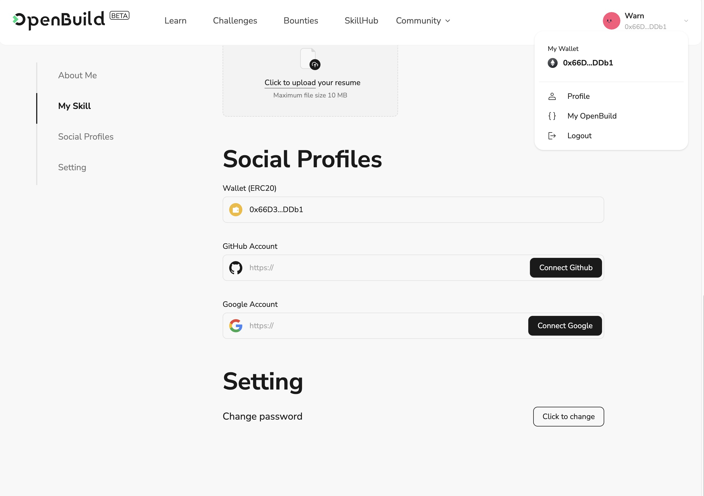

# Task2 Blockchain Basic

本任务分为简答题、分析题和选择题，以此为模板，在下方填写你的答案即可。

选择题，请在你选中的项目中，将 `[ ]` 改为 `[x]` 即可

## [单选题] 如果你莫名奇妙收到了一个 NFT，那么

- [ ] 天上掉米，我应该马上点开他的链接
- [x] 这可能是在对我进行诈骗！

## [单选题] 群里大哥给我发的网站，说能赚大米，我应该

- [ ] 赶紧冲啊，待会米被人抢了
- [x] 谨慎判断，不在不信任的网站链接钱包

## [单选题] 下列说法正确的是

- [x] 一个私钥对应一个地址
- [ ] 一个私钥对应多个地址
- [ ] 多个私钥对应一个地址
- [ ] 多个私钥对应多个地址

## [单选题] 下列哪个是以太坊虚拟机的简称

- [ ] CLR
- [x] EVM
- [ ] JVM

## [单选题] 以下哪个是以太坊上正确的地址格式？

- [ ] 1A4BHoT2sXFuHsyL6bnTcD1m6AP9C5uyT1
- [ ] TEEuMMSc6zPJD36gfjBAR2GmqT6Tu1Rcut
- [ ] 0x997fd71a4cf5d214009619808176b947aec122890a7fcee02e78e329596c94ba
- [x] 0xf39Fd6e51aad88F6F4ce6aB8827279cffFb92266

## [多选题] 有一天某个大哥说要按市场价的 80% 出油给你，有可能

- [x] 他在洗米
- [ ] 他良心发现
- [x] 要给我黒米
- [x] 给我下套呢

## [多选题] 以下哪些是以太坊的二层扩容方案？

- [ ] Lightning Network（闪电网络）
- [x] Optimsitic Rollup
- [x] Zk Rollup

## [简答题] 简述区块链的网络结构

``` bash
区块链的网络结构是一种分布式的数据库系统,其核心特征是去中心化和对等网络(P2P)的架构.
在这种结构中,每个参与节点豆包存有完整或部分的数据副本,共同维护整个网络的数据完整性和一致性.
一个链由运行在全世界的若干个节点构成,彼此之间相互广播数据,同时通过共识算法在自身验证数据.而用户与区块链网络的交互以节点作为入门,其实节点就是一堆运行了RPC服务的服务器.
```

## [简答题] 智能合约是什么，有何作用？

``` bash
智能合约是部署在区块链上的程序,可以被用户发起交易来调用.
开发者可以自己编写,部署智能合约.通过智能合约,将数据保存在链上,同时也可以调用智能合约读取数据.
从Web2开发者的角度来理解,如果Web3区块链是远程服务器,那么智能合约就是运行在服务器上的后端服务程序.
智能合约条款由代码形式定义,允许在没有第三方中介的情况下,进行可信的交易和协议,这些交易是可追踪的,不可逆转的,并且由程序自动执行合约的条款.

智能合约的作用:

1.自动执行: 智能合约一旦部署到区块链上,其内定义的操作将在预设条件满足时自动执行.这消除了人为执行过程中的延迟和错误.

2.增强信任: 由于智能合约的执行完全依赖于预设的规则和条款,不涉及任何中介机构,因此它能够在不信任的环境中建立信任.参与方可以确信合约将严格按照编码执行,不用担心对方违约.

3.降低交易成本和时间

4.提高安全性: 利用区块链的加密技术,保证合约数据的安全性和防篡改性.一旦智能合约被添加到区块链上,无法被修改或删除,保证了合约执行的透明性和安全性.

5.应用场景广泛: 智能合约可以在金融、保险、供应链管理、物联网等领域发挥重要作用,比如在供应链管理中,智能合约可以自动处理货物的支付和交付,确保交易双方的责任和义务自动得到履行.
```

## [简答题] 怎么理解大家常说的 `EVM` 这个词汇？

``` bash
EVM是以太坊虚拟机(Etherum Virtual Machine)的缩写,它是以太坊区块链的核心组成部分,负责执行智能合约的代码和交易处理.EVM是一个完全隔离的运行环境,意味着在这个虚拟机中运行的代码无法访问网络/文件系统或其他外部环境,确保了执行的安全性和确定性.
```

## [分析题] 你对去中心化的理解

``` bash
去中心化是一种通过分布式网络来实现数据存储/处理和传输的方式,不依赖于单一中心化的服务器或机构.去中心化的实现通常依赖于区块链技术或者其他分布式账本技术.
去中心化是一种分散权力和控制的系统结构,她将传统集中式模型中的决策权/管理权或资源由一个或几个中心点转移到多个独立的单位或个体手中.
在去中心化系统中,没有单一的控制点或权威中心,每个参与者都可以在网络中独立地做出决策及执行操作.

去中心化的主要特点
1. 增强的抗干扰能力: 不依赖于单一中心,更能抵抗外部攻击或内部故障的影响.即使部分节点出现问题,也不会影响整个系统的允许.

2. 提高透明度和信任: 去中心化系统的信息和决策过程是公开的,每个节点都能验证监督其他节点的行为.

3. 促进创新和灵活性: 去中心化允许多个独立实体自主创新和响应环境变化,这通常能够加速新技术和解决方案的开发和应用.

4. 权力下方和参与度提高: 去中心化系统鼓励更多的参与者加入到决策管理过程中,从而提高参与者的满意度和系统的整体效率.
```

## [分析题] 比较区块链与传统数据库，你的看法？

``` bash
区块链和传统数据库存在显著差异,主要体现在数据管理/安全性/控制结构和性能等方面.

1. 数据管理和存储结构方面
区块链: 采用分布式账本的形式,以区块链表形式来存储数据,每个区块包含一定数据的交易纪录,并通过加密散列的方式与前一个区块链接起来,形成链式结构.这种结构使得数据一旦写入后难以修改,保证了数据的不可篡改性.
传统数据库: 通常采用中心化的结构,数据存储在中央服务器的表格中,可以随时进行增删改查操作.这种结构便于数据的快速处理和管理,但可能存在数据安全和完整性风险.

2. 安全性和透明度
区块链: 提供高度的安全性和透明性,利用加密技术和共识机制保护数据不被未授权修改.每个节点都保存有完整的数据副本,任何数据的变更都需要网络中多数节点的验证和确认.
传统数据库: 虽然可以通过访问控制和加密来实现更高级的安全措施,但因为依赖于中心化的管理系统,一旦系统收到攻击,整个数据库的安全性可能收到威胁.

3. 控制结构
区块链: 去中心化,没有中心权威机构控制,数据的管理和验证由网络中多个节点共同完成,增强了系统的抗审查和抗故障能力.
传统数据库: 中心化管理,一个或几个数据库管理员负责数据的维护管理,虽然操作效率高,但也可能成为攻击的目标.

4. 性能和扩展性
区块链: 由于其分布式验证和加密的数据结构,处理速度通常不如传统数据库,尤其是在大规模交易处理时可能面临性能瓶颈.
传统数据库: 在处理大量数据和高度查询方面有明显优势,可以通过增加硬件配置和优化索引策略来提高性能和扩展性.

在我看来,区块链具有高安全性和透明性,但是处理效率不高,适合需要高度信任和不可篡改记录的应用场景.
传统数据库在数据处理效率/管理性/扩展性方面有显著优势,适合需要处理大量数据的商业应用.
```

## 操作题

安装一个 WEB3 钱包，创建账户后与 [openbuild.xyz](https://openbuild.xyz/profile) 进行绑定，截图后文件命名为 `./bind-wallet.jpg`.


