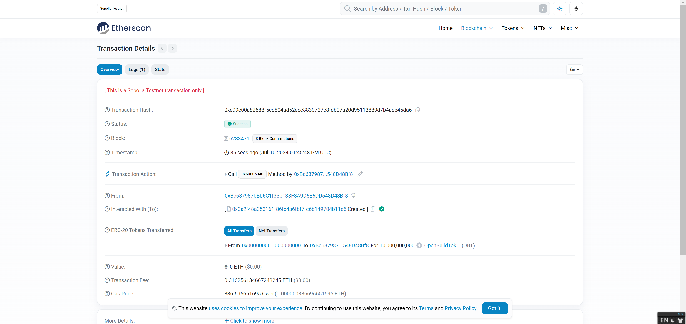
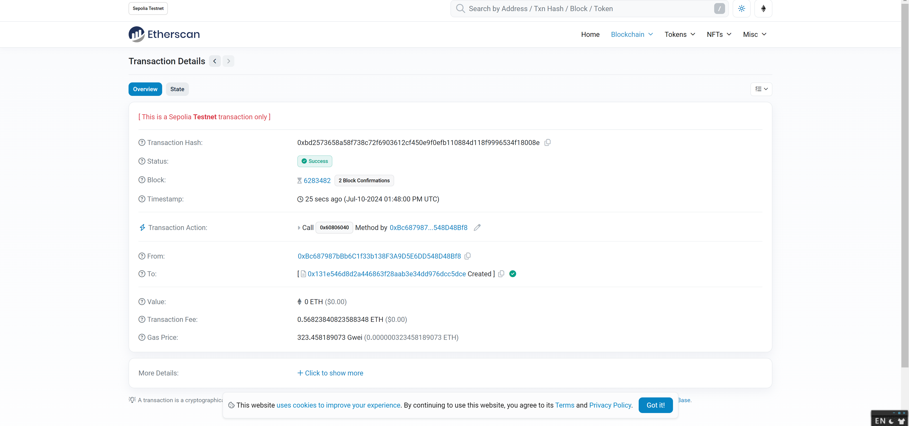
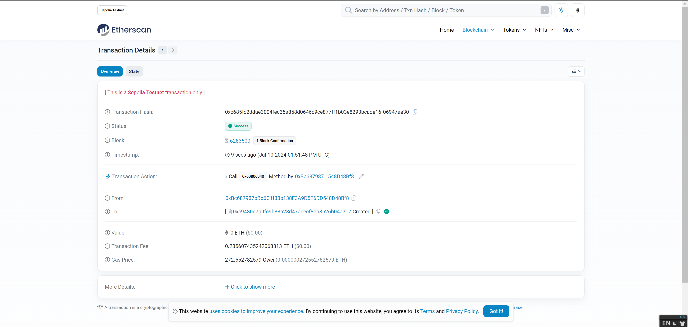
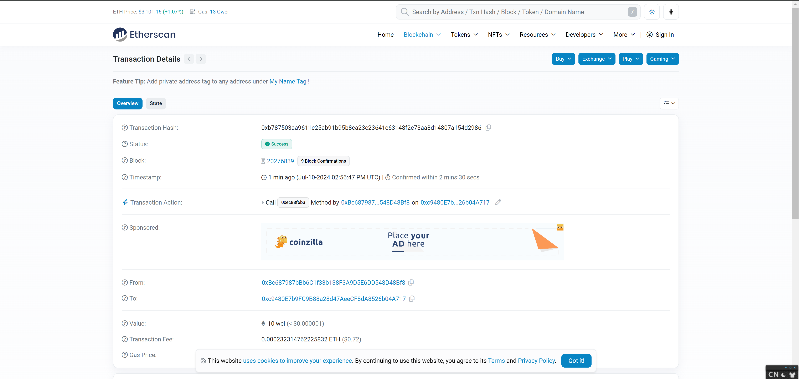
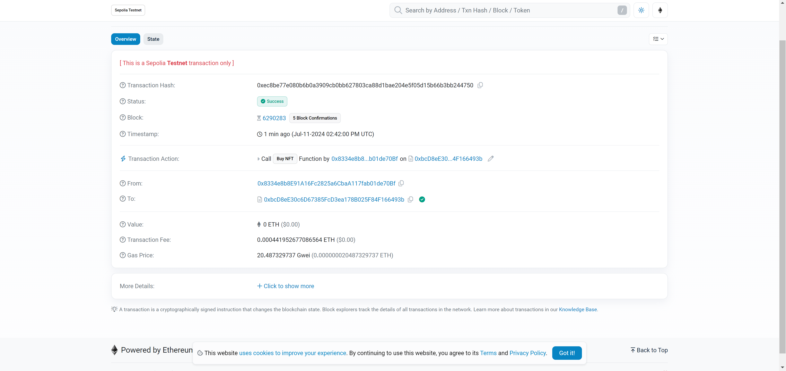

# task3
## 1、在测试网部署三个合约
0xe99c00a82688f5cd804ad52ecc8839727c8fdb07a20d95113889d7b4aeb45da6
https://sepolia.etherscan.io/tx/0xe99c00a82688f5cd804ad52ecc8839727c8fdb07a20d95113889d7b4aeb45da6

0xbd2573658a58f738c72f6903612cf450e9f0efb110884d118f9996534f18008e
https://sepolia.etherscan.io/tx/0xbd2573658a58f738c72f6903612cf450e9f0efb110884d118f9996534f18008e

0xc685fc2ddae3004fec35a858d0646c9ce877ff1b03e8293bcade16f06947ae30
https://sepolia.etherscan.io/tx/0xc685fc2ddae3004fec35a858d0646c9ce877ff1b03e8293bcade16f06947ae30

## 2、上架NFT、购买NFT的交易哈希
### 1）上架NFT
https://etherscan.io/tx/0xb787503aa9611c25ab91b95b8ca23c23641c63148f2e73aa8d14807a154d2986

### 2）购买NFT的交易哈希
https://sepolia.etherscan.io/tx/0xec8be77e080b6b0a3909cb0bb627803ca88d1bae204e5f05d15b66b3bb244750
