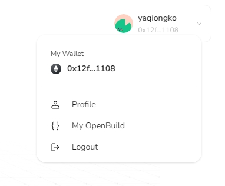

# Task2 Blockchain Basic

本任务分为简答题、分析题和选择题，以此为模板，在下方填写你的答案即可。

选择题，请在你选中的项目中，将 `[ ]` 改为 `[x]` 即可


## [单选题] 如果你莫名奇妙收到了一个 NFT，那么

- [ ] 天上掉米，我应该马上点开他的链接
- [x] 这可能是在对我进行诈骗！


## [单选题] 群里大哥给我发的网站，说能赚大米，我应该

- [ ] 赶紧冲啊，待会米被人抢了
- [x] 谨慎判断，不在不信任的网站链接钱包

## [单选题] 下列说法正确的是

- [ ] 一个私钥对应一个地址
- [ ] 一个私钥对应多个地址
- [x] 多个私钥对应一个地址
- [ ] 多个私钥对应多个地址

 ## [单选题] 下列哪个是以太坊虚拟机的简称

- [ ] CLR
- [x] EVM
- [ ] JVM

## [单选题] 以下哪个是以太坊上正确的地址格式？

- [ ] 1A4BHoT2sXFuHsyL6bnTcD1m6AP9C5uyT1
- [ ] TEEuMMSc6zPJD36gfjBAR2GmqT6Tu1Rcut
- [ ] 0x997fd71a4cf5d214009619808176b947aec122890a7fcee02e78e329596c94ba
- [x] 0xf39Fd6e51aad88F6F4ce6aB8827279cffFb92266

## [多选题] 有一天某个大哥说要按市场价的 80% 出油给你，有可能

- [x] 他在洗米
- [ ] 他良心发现
- [x] 要给我黒米
- [x] 给我下套呢

## [多选题] 以下哪些是以太坊的二层扩容方案？

- [ ] Lightning Network（闪电网络）
- [x] Optimsitic Rollup
- [x] Zk Rollup

## [简答题] 简述区块链的网络结构

```
区块链系统由数据层、网络层、共识层、激励层、合约层和应用层组成。
1. 数据层：封装了底层数据区块以及相关的数据加密和时间戳等基础数据和基本算法；
2. 网络层：包括分布式组网机制、数据传播机制和数据验证机制等；
3. 共识层：主要封装网络节点的各类共识算法；
4. 激励层：将经济因素集成到区块链技术体系中，主要包括经济激励的发行机制与分配机制等；
5. 合约层：主要封装各类脚本、算法、智能合约，是区块链可编程特性的基础；
6. 应用层：封装了区块链的各种应用场景和安全。
```


## [简答题] 智能合约是什么，有何作用？

```
智能合约是一种运行在区块链上的程序，它允许在没有中介的情况下执行合同条款
智能合约的应用包括但不限于：
1. 金融服务：如自动化的贷款协议、保险赔付、自动化的金融衍生品交易等。
2. 供应链管理：追踪产品从生产到交付的整个过程，确保合同中规定的条件得到满足。
3. 投票系统：提供一个透明、不可篡改的投票机制。
4. 身份验证：管理和验证用户身份，确保只有授权用户才能访问特定的服务或数据。
5. 版权管理：自动执行版权协议，确保创作者获得应有的报酬。
...
```


## [简答题] 怎么理解大家常说的 `EVM` 这个词汇？

```
EVM（Ethereum Virtual Machine）是以太坊虚拟机
开发者可以在EVM上部署智能合约，构建各种去中心化的应用程序和服务。为智能合约的执行提供了一个安全、确定性的环境。
```


## [分析题] 你对去中心化的理解

```
decentralization区别于传统的中心化模式，每个人都是一个节点，可以通过一定协议和其他的节点建立连接，而不用通过传统的互联网厂商提供的中心化服务器，大程度的保证了用户的权利和隐私安全。但与此同时，节点信用问题无法保证，传统的基于中心化网络的认证机制被打破，用户对于网络上的信息需要更加注意甄别。
```


## [分析题] 比较区块链与传统数据库，你的看法？

```
区块链和传统数据库各有优势和适用场景。区块链在安全性、不可篡改性和透明度方面具有优势，而传统数据库在性能、灵活性和可扩展性方面表现更佳。
```


## 操作题

安装一个 WEB3 钱包，创建账户后与 [openbuild.xyz](https://openbuild.xyz/profile) 进行绑定，截图后文件命名为 `./bind-wallet.jpg`.


