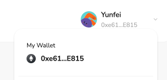

# Task2 Blockchain Basic

## [单选题] 如果你莫名奇妙收到了一个 NFT，那么

- [ ] 天上掉米，我应该马上点开他的链接
- [x] 这可能是在对我进行诈骗！

## [单选题] 群里大哥给我发的网站，说能赚大米，我应该

- [ ] 赶紧冲啊，待会米被人抢了
- [x] 谨慎判断，不在不信任的网站链接钱包

## [单选题] 下列说法正确的是

- [x] 一个私钥对应一个地址
- [ ] 一个私钥对应多个地址
- [ ] 多个私钥对应一个地址
- [ ] 多个私钥对应多个地址

## [单选题] 下列哪个是以太坊虚拟机的简称

- [ ] CLR
- [x] EVM
- [ ] JVM

## [单选题] 以下哪个是以太坊上正确的地址格式？

- [ ] 1A4BHoT2sXFuHsyL6bnTcD1m6AP9C5uyT1
- [ ] TEEuMMSc6zPJD36gfjBAR2GmqT6Tu1Rcut
- [ ] 0x997fd71a4cf5d214009619808176b947aec122890a7fcee02e78e329596c94ba
- [x] 0xf39Fd6e51aad88F6F4ce6aB8827279cffFb92266

## [多选题] 有一天某个大哥说要按市场价的 80% 出油给你，有可能

- [x] 他在洗米
- [ ] 他良心发现
- [x] 要给我黒米
- [x] 给我下套呢

## [多选题] 以下哪些是以太坊的二层扩容方案？

- [ ] Lightning Network（闪电网络）
- [x] Optimsitic Rollup
- [x] Zk Rollup

## [简答题] 简述区块链的网络结构

```
区块链的网络结构由多个节点组成，包括全节点、轻节点和矿工节点。节点通过链式连接的区块记录交易，使用共识机制（如PoW或PoS）验证和生成新块，形成一个分布式账本。支持智能合约的区块链可自动执行预定条件的代码。
```

## [简答题] 智能合约是什么，有何作用？

```
智能合约是一种存储在区块链上的自执行代码，按照预设条件自动执行合约条款。其主要作用包括：
1. 自动化：无需人工干预，智能合约能在满足条件时自动执行。
2. 透明性：所有合约条款和执行记录公开透明，减少了欺诈和争议。
3. 安全性：由区块链技术保障，不可篡改，确保合约的可信性。
4. 效率：减少中间环节，降低交易成本和时间，提高业务效率。

智能合约广泛应用于金融、供应链、法律和数字身份验证等领域。
```

## [简答题] 怎么理解大家常说的 `EVM` 这个词汇？

```
EVM，即以太坊虚拟机，是以太坊网络的核心组件，负责执行智能合约和管理状态。它提供一个去中心化的、图灵完备的运行环境，使开发者可以编写和部署去中心化应用（dApps），确保合约在整个网络中一致地自动执行。
```

## [分析题] 你对去中心化的理解

```
去中心化是指系统的控制权和决策权分散在多个节点之间，没有中央控制机构。这种结构提高了透明性和抗审查性，增强了安全性和自主性，减少了单点故障风险。
```

## [分析题] 比较区块链与传统数据库，你的看法？

```
区块链与传统数据库在结构、控制方式和应用场景等方面有显著差异。区块链强调去中心化和数据不可篡改性，适用于需要高信任度和安全性的场景，而传统数据库注重高效数据管理和操作灵活性，适合常规业务应用。
```

## 操作题

安装一个 WEB3 钱包，创建账户后与 [openbuild.xyz](https://openbuild.xyz/profile) 进行绑定，截图后文件命名为 `./bind-wallet.jpg`.


