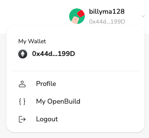

# Task2 Blockchain Basic

本任务分为简答题、分析题和选择题，以此为模板，在下方填写你的答案即可。

选择题，请在你选中的项目中，将 `[ ]` 改为 `[x]` 即可

## [单选题] 如果你莫名奇妙收到了一个 NFT，那么

- [ ] 天上掉米，我应该马上点开他的链接
- [x] 这可能是在对我进行诈骗！

## [单选题] 群里大哥给我发的网站，说能赚大米，我应该

- [ ] 赶紧冲啊，待会米被人抢了
- [x] 谨慎判断，不在不信任的网站链接钱包

## [单选题] 下列说法正确的是

- [x] 一个私钥对应一个地址
- [ ] 一个私钥对应多个地址
- [ ] 多个私钥对应一个地址
- [ ] 多个私钥对应多个地址

## [单选题] 下列哪个是以太坊虚拟机的简称

- [ ] CLR
- [x] EVM
- [ ] JVM

## [单选题] 以下哪个是以太坊上正确的地址格式？

- [ ] 1A4BHoT2sXFuHsyL6bnTcD1m6AP9C5uyT1
- [ ] TEEuMMSc6zPJD36gfjBAR2GmqT6Tu1Rcut
- [ ] 0x997fd71a4cf5d214009619808176b947aec122890a7fcee02e78e329596c94ba
- [x] 0xf39Fd6e51aad88F6F4ce6aB8827279cffFb92266

## [多选题] 有一天某个大哥说要按市场价的 80% 出油给你，有可能

- [x] 他在洗米
- [ ] 他良心发现
- [x] 要给我黒米
- [x] 给我下套呢

## [多选题] 以下哪些是以太坊的二层扩容方案？

- [ ] Lightning Network（闪电网络）
- [x] Optimsitic Rollup
- [x] Zk Rollup

## [简答题] 简述区块链的网络结构

```
区块链的网络结构是一个去中心化的分布式账本技术，主要由以下几个核心组成：

1. 节点（Node）：区块链网络中的节点是独立的计算机，它们在全球范围内分布。每个节点都持有网络上的账本的一个副本，并且节点之间通过网络相互通信。

2. 区块（Block）：区块是记录交易信息的数据结构。每个区块包含一组交易记录，这些记录是在区块生成时被网络认证和确认的。

3. 链（Chain）：每个新生成的区块都会被添加到前一个区块的后面，形成一个链条。这种结构通过加密哈希函数保证了前后区块的连接不可更改和篡改，从而确保整个区块链的数据完整性和安全性。

4. 共识机制（Consensus Mechanism）：共识机制是网络中所有节点达成一致的过程，以验证和记录交易。常见的共识机制包括工作量证明（PoW）、权益证明（PoS）等。

5. 智能合约（Smart Contracts）：智能合约是存储在区块链上的程序，它们在满足特定条件时自动执行约定的操作。这使得在不需要第三方中介的情况下进行可信的交易成为可能。

这种去中心化和自动化的网络结构是区块链技术的核心优势，使其能够在金融、供应链、医疗等多个行业中发挥重要作用。
```

## [简答题] 智能合约是什么，有何作用？

```
智能合约是一种在区块链技术中使用的程序，它允许在没有第三方中介的情况下执行可验证、不可逆的合同。这些程序由代码组成，一旦部署到区块链上，就会在满足特定条件时自动执行预定义的逻辑。

智能合约的作用包括：

1. 自动执行：智能合约在其条件被满足时自动执行，无需人工干预，这提高了处理速度和效率。

2. 增加信任：由于合约的执行完全基于代码，且交易记录在区块链上不可更改，这降低了欺诈的可能性并增加了参与方之间的信任。

3. 降低成本：智能合约减少了中介机构的需求，因此在多个方面，如合同执行、验证以及交易的清算与结算，均可节省成本。

4. 提高安全性：智能合约通过加密和分布式计算提供了高级的安全性，使得合约难以被攻击或篡改。

5. 可编程性：智能合约可以编写复杂的逻辑，实现自定义的金融工具、自动化系统和其他各种需要可靠执行的合同形式。

应用场景：

- 金融服务：如创建去中心化的金融产品、自动化的贷款和支付系统。

- 供应链管理：智能合约可以用来确保货物和服务在供应链中的各个阶段自动验证和记录。

- 版权和知识产权：艺术家和创作者可以使用智能合约来自动分配版税和维护版权。

- 房地产：在房地产买卖过程中自动处理交易和记录所有权转移。

智能合约因其提供的自动化、安全性和去中心化的特性，被认为是区块链技术中最具革命性的应用之一。
```

## [简答题] 怎么理解大家常说的 `EVM` 这个词汇？

```
EVM 指的是以太坊虚拟机（Ethereum Virtual Machine），它是以太坊区块链的核心组成部分，提供了一个沙盒环境，使得在全球范围内的节点能够执行智能合约和其他交易。

EVM的主要特点和作用如下：

1. 兼容性：EVM 设计成与具体的硬件或操作系统无关，这意味着任何开发的智能合约都可以在全球任何运行EVM的以太坊节点上运行。

2. 隔离性：EVM 在执行智能合约时，提供了一个隔离的环境，确保智能合约的执行不会影响到主机系统。这有助于保障网络安全和数据完整性。

3. 确定性：EVM 确保智能合约的执行是确定性的，即在全球任何地方的任何节点上，相同的合约输入会得到相同的输出。这是维护全网一致状态的关键。

4. 图灵完备：EVM 是图灵完备的，意味着理论上它能计算任何可计算的函数，只要有足够的计算资源和时间。这使得开发者可以编写复杂和功能丰富的智能合约。

EVM的重要性：

- 标准化：EVM 为智能合约的编写和执行提供了一个标准化的平台，促进了开发者的共同工作和创新。

- 安全性：通过隔离执行环境，EVM 帮助防止恶意代码或者错误代码对网络其他部分产生影响。

- 去中心化应用开发（DApp）：EVM 是开发去中心化应用的基础，它允许开发者利用智能合约来创建应用，这些应用运行在全球分布的去中心化平台上，不受单一控制点或故障点的影响。

因此，EVM 是以太坊生态系统的关键技术，支持了广泛的应用和创新，是以太坊能够实现智能合约和去中心化应用的基础。
```

## [分析题] 你对去中心化的理解

```
去中心化是一种设计和组织方法，其核心思想是去除或减少中央控制或权威，将权力和控制分散到网络的多个参与者或节点中。在技术、经济和组织结构等多个领域，去中心化都是一个重要的概念。

去中心化的主要特点包括：

1. 分散权力：去中心化减少单一实体或个体的控制力，通过分散决策权和执行权来提高系统的整体效率和公正性。

2. 提高安全性：在去中心化系统中，由于没有单一的故障点，系统对攻击和故障更具有抵抗力。即使部分节点遭受攻击或失败，整个系统仍能继续运行。

3. 增加透明度和信任：去中心化通常伴随着更高的透明度，因为信息在网络中广泛分布，每个参与者都可以验证和监督过程和结果。

4. 促进创新：去中心化结构激励和允许更多的参与者加入和贡献，这种开放性可以促进技术和社会创新。

去中心化的应用实例：

- 区块链和加密货币：区块链是去中心化的典型例子，特别是在比特币和以太坊等加密货币中，它通过分布式账本技术实现了去中心化的货币发行和交易记录。

- P2P网络：在点对点（P2P）网络中，如文件分享或通信网络，数据直接在用户之间传输，没有中心服务器。

去中心化金融（DeFi）：在金融领域，去中心化金融应用允许用户在没有传统金融中介（如银行）的情况下进行借贷、交易和其他金融服务。

去中心化自治组织（DAO）：这是一种基于区块链的组织形式，通过智能合约来自治管理和操作，没有传统的管理层或董事会。

去中心化的理念是创造一个更平等、透明和高效的系统，这在当今快速发展的数字经济中尤为重要。
```

## [分析题] 比较区块链与传统数据库，你的看法？

```
区块链和传统数据库都是存储和管理数据的技术，但它们的设计理念、结构和适用场景存在显著差异。以下是区块链和传统数据库的一些主要比较：

数据结构：

- 区块链：区块链是一种分布式账本技术，数据以区块的形式链式存储。每个区块包含一系列交易，并通过加密哈希与前一个区块链接，这保证了数据的不可篡改性和历史连续性。

- 传统数据库：传统数据库通常采用表格形式存储数据，支持结构化查询语言（SQL）进行高效的数据检索和管理。数据存储在中心服务器上，易于修改和更新。

管理与控制：

- 区块链：去中心化管理，无需中央权威机构。数据的验证和共识由网络中的多个节点共同完成，增强了系统的透明度和信任。

- 传统数据库：中心化管理，由数据库管理员或控制实体进行数据的维护和管理。这种集中控制有助于快速处理大量数据和复杂的事务管理。

安全性与可靠性：

- 区块链：通过加密和分布式共识机制提供高度安全性。不易遭受数据篡改或损失，但对数据的写入速度和即时更新有限制。

- 传统数据库：虽然具备强大的安全措施，但中心化的特性使其更容易成为攻击的目标。数据的修改和删除相对容易，可能影响数据的不变性。

性能：
- 区块链：由于其共识机制和每个节点都需存储全量数据的特性，写入数据的速度较慢，扩展性受限。适合不经常变动的数据记录。
- 传统数据库：优化了读写速度，支持大规模数据处理，具有良好的扩展性。适合需要频繁读写和实时处理的场景。

适用场景：
- 区块链：适用于需要高度透明和数据不可篡改的应用，如金融交易、供应链追踪、身份验证等。

- 传统数据库：适用于数据管理需求复杂、读写频繁的商业和行政系统，如在线零售、客户关系管理、资源规划等。

总结来说，区块链和传统数据库各有优势和局限，选择使用哪种技术应根据具体的应用需求和场景来决定。区块链提供了一种新的数据管理方式，特别适合那些需要高度安全性和数据不变性的场景，而传统数据库则更适合处理高效、复杂的数据操作和管理任务。
```

## 操作题

安装一个 WEB3 钱包，创建账户后与 [openbuild.xyz](https://openbuild.xyz/profile) 进行绑定，截图后文件命名为 `./bind-wallet.jpg`.
