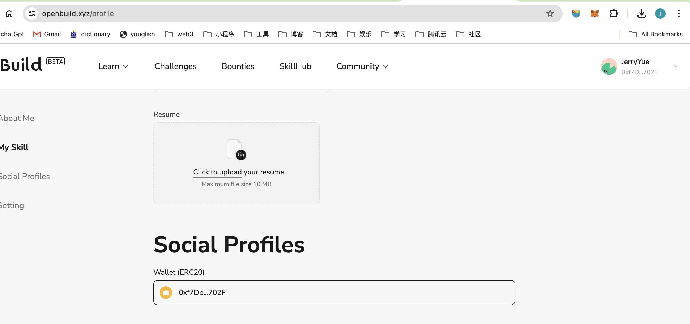

# Task2 Blockchain Basic

## [单选题] 如果你莫名奇妙收到了一个 NFT，那么

- [ ] 天上掉米，我应该马上点开他的链接
- [x] 这可能是在对我进行诈骗！

## [单选题] 群里大哥给我发的网站，说能赚大米，我应该

- [ ] 赶紧冲啊，待会米被人抢了
- [x] 谨慎判断，不在不信任的网站链接钱包

## [单选题] 下列说法正确的是

- [x] 一个私钥对应一个地址
- [ ] 一个私钥对应多个地址
- [ ] 多个私钥对应一个地址
- [ ] 多个私钥对应多个地址

## [单选题] 下列哪个是以太坊虚拟机的简称

- [ ] CLR
- [x] EVM
- [ ] JVM

## [单选题] 以下哪个是以太坊上正确的地址格式？

- [ ] 1A4BHoT2sXFuHsyL6bnTcD1m6AP9C5uyT1
- [ ] TEEuMMSc6zPJD36gfjBAR2GmqT6Tu1Rcut
- [ ] 0x997fd71a4cf5d214009619808176b947aec122890a7fcee02e78e329596c94ba
- [x] 0xf39Fd6e51aad88F6F4ce6aB8827279cffFb92266

## [多选题] 有一天某个大哥说要按市场价的 80% 出油给你，有可能

- [x] 他在洗米
- [ ] 他良心发现
- [x] 要给我黒米
- [x] 给我下套呢

## [多选题] 以下哪些是以太坊的二层扩容方案？

- [ ] Lightning Network（闪电网络）
- [x] Optimsitic Rollup
- [x] Zk Rollup

## [简答题] 简述区块链的网络结构

节点（nodes）、区块（blocks）、交易（transaction）、共识机制（consensus mechanisms）、分布式账本（distributed leger）、网络协议（network protocols）、smart contracts（智能合约）

## [简答题] 智能合约是什么，有何作用？

1.**自动执行合同条款**：

- 智能合约在满足预设条件时自动执行，不需要人工干预。这减少了人为错误和欺诈的可能性。

2.**去中心化应用（DApps）**：

- 智能合约是去中心化应用（DApps）的基础，它们可以在区块链上运行复杂的逻辑，提供去中心化的服务，例如金融服务、供应链管理、身份认证等。

3.**资产管理**：

- 智能合约可以用于管理和转移数字资产。它们可以自动执行资产转移、分配和记录等操作。

4.**信任机制**：

- 由于智能合约在区块链上运行，所有操作都是透明的，并且记录不可篡改，这建立了一种基于代码的信任机制，而不是依赖于第三方中介。

5.**提高效率**：

- 智能合约消除了中介机构，直接在区块链上执行，减少了交易成本和时间，提高了效率。

## [简答题] 怎么理解大家常说的 `EVM` 这个词汇？

EVM，全称为以太坊虚拟机（Ethereum Virtual Machine），是以太坊平台的核心组件之一。它是一个计算引擎，为智能合约的执行提供了一个安全、可靠和一致的环境。通过EVM，开发者可以创建和部署复杂的去中心化应用，推动区块链技术的发展和应用。

## [分析题] 你对去中心化的理解

传统数据库是集中式的，数据的控制权在数据库拥有者的手中，可被其任意修改或变卖等；而区块链是分布式的，没有哪个具体的人或组织能够随意修改，相对安全可靠。

#### **优点**

- **抗审查性**：由于没有单一控制中心，去中心化系统更难被审查或控制。例如，去中心化的区块链网络不易被政府或其他机构干预。
- **提高安全性**：去中心化减少了单点故障的风险。即使部分节点失效，整个系统仍能正常运行。
- **透明和信任**：去中心化系统中的数据和操作都是公开和透明的，增加了系统的可信度，减少了对中介机构的依赖。

####  **缺点**

- **效率问题**：去中心化系统往往需要在多个节点之间达成共识，这可能会导致效率降低。例如，比特币的交易确认时间较长。
- **复杂性**：去中心化系统的设计和维护相对复杂，特别是在确保安全性和共识达成方面。
- **资源消耗**：某些共识机制（如PoW）需要大量的计算资源，导致高能耗和资源浪费。

## [分析题] 比较区块链与传统数据库，你的看法？

区块链和传统数据库各有优劣，适用于不同的应用场景。区块链在去中心化、透明性和数据不可篡改性方面具有独特优势，适用于需要高安全性和信任机制的场景。而传统数据库在性能、效率和数据管理灵活性方面表现更佳，适用于企业应用、数据分析等需要高效数据处理的场景。根据具体需求选择合适的技术方案，才能充分发挥各自的优势。

## 操作题

