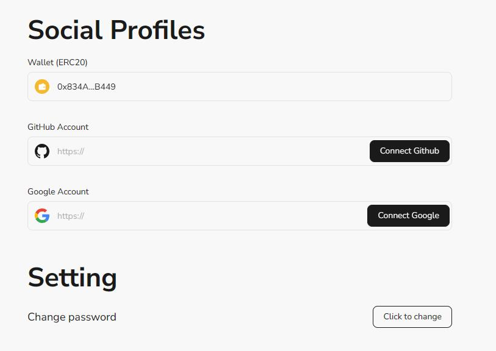

# Task2 Blockchain Basic

本任务分为简答题、分析题和选择题，以此为模板，在下方填写你的答案即可。

选择题，请在你选中的项目中，将 `[ ]` 改为 `[x]` 即可

## [单选题] 如果你莫名奇妙收到了一个 NFT，那么

- [ ] 天上掉米，我应该马上点开他的链接
- [x] 这可能是在对我进行诈骗！

## [单选题] 群里大哥给我发的网站，说能赚大米，我应该

- [ ] 赶紧冲啊，待会米被人抢了
- [x] 谨慎判断，不在不信任的网站链接钱包

## [单选题] 下列说法正确的是

- [x] 一个私钥对应一个地址
- [ ] 一个私钥对应多个地址
- [ ] 多个私钥对应一个地址
- [ ] 多个私钥对应多个地址

## [单选题] 下列哪个是以太坊虚拟机的简称

- [ ] CLR
- [x] EVM
- [ ] JVM

## [单选题] 以下哪个是以太坊上正确的地址格式？

- [ ] 1A4BHoT2sXFuHsyL6bnTcD1m6AP9C5uyT1
- [ ] TEEuMMSc6zPJD36gfjBAR2GmqT6Tu1Rcut
- [ ] 0x997fd71a4cf5d214009619808176b947aec122890a7fcee02e78e329596c94ba
- [x] 0xf39Fd6e51aad88F6F4ce6aB8827279cffFb92266

## [多选题] 有一天某个大哥说要按市场价的 80% 出油给你，有可能

- [x] 他在洗米
- [ ] 他良心发现
- [x] 要给我黒米
- [x] 给我下套呢

## [多选题] 以下哪些是以太坊的二层扩容方案？

- [ ] Lightning Network（闪电网络）
- [x] Optimsitic Rollup
- [x] Zk Rollup

## [简答题] 简述区块链的网络结构

```
- 数据层：作为最底层封装了数据区块以及相关数据加密和时间戳等技术
- 网络层：包括分布式组网机制、数据传播机制和数据验证机制等
- 共识层：主要封装网络节点的各类共识算法
- 激励层：它将经济因素集成到区块链技术体系，包括经济激励的发行机制和分配机制，主要出现在公链中
- 合约层：它封装各种脚本、算法和智能合约
- 应用层：封装了区块链的各种应用场景和案例
```

## [简答题] 智能合约是什么，有何作用？

```
智能合约是部署在区块链上的自动化程序，用于根据预设条件自动执行协议和操作。

作用：
自动执行：一旦满足条件，智能合约会自动执行合约条款，无需人工干预。
降低成本：减少对中介和第三方的依赖，从而减少交易费用和时间。
提高透明度和信任度：所有合约操作和记录都透明可查，增加了参与各方的信任。
增强安全性：区块链的不可篡改性和分布式验证提高了合约的安全性。
智能合约的应用领域包括金融、供应链管理、房产交易等，具有广泛的应用前景。
```

## [简答题] 怎么理解大家常说的 `EVM` 这个词汇？

```
EVM是以太坊虚拟机（Ethereum Virtual Machine）的缩写。它是以太坊区块链运行环境的核心组件，专门用于执行智能合约
```

## [分析题] 你对去中心化的理解

```
去中心化最大的特点就是权利分配,在去中心化系统中每个节点都有拥有一定的自治性和参与决策的能力。
同事去中心化增加了数据篡改的难度，提高了数据的透明度和安全性，但是也会牺牲一定的处理效率。
```

## [分析题] 比较区块链与传统数据库，你的看法？

```
传统数据库和区块链他们的本质都是存储数据，但区别是区块链是去中心化的，而传统数据库是中心化的。
区块链的数据以区块的形式链式存储在每一台节点上,并且这些数据都是不可变的。
同时因为需要网络共识，区块链处理速度相对较慢，吞吐量有限，他并不是一个高效的数据库。反而传统数据库在读写速度和处理大量并发请求方面的表现更好。
无论是区块链和传统数据库 他们的都有不同的适用场景，根据不同的场景，选择适合的数据库才是正确的。
```

## 操作题

安装一个 WEB3 钱包，创建账户后与 [openbuild.xyz](https://openbuild.xyz/profile) 进行绑定，截图后文件命名为 `./bind-wallet.jpg`.

