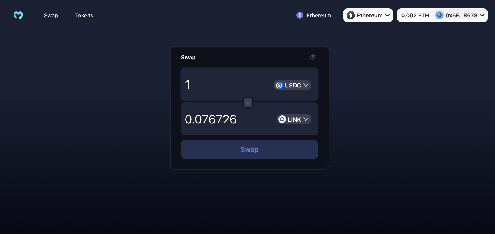
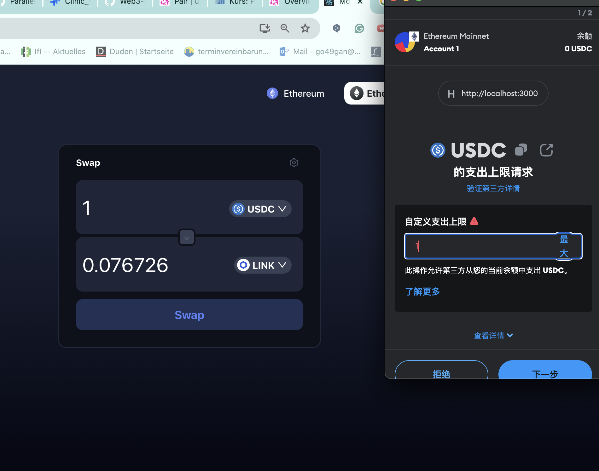
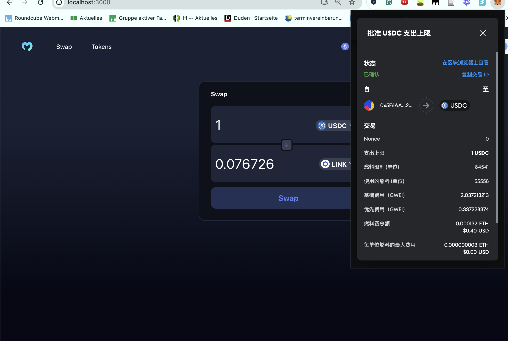

### Uniswap DEX demo

# My RainbowKit DEX

This is a decentralized exchange (DEX) frontend built with React, Wagmi, and RainbowKit. The application allows users to swap tokens on the Ethereum blockchain.

## Screenshots

### Swap Interface

### Transaction Confirmation

### Transaction Success

