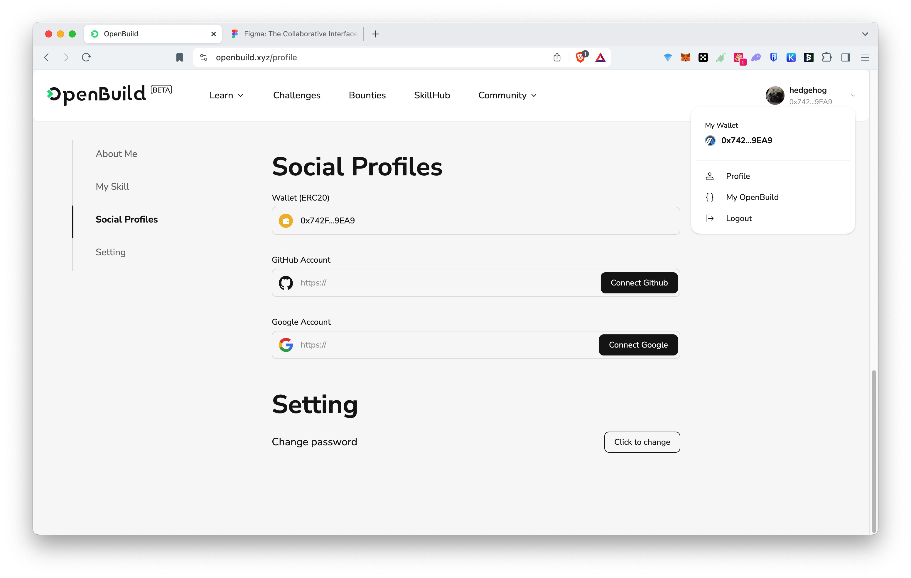

# Task2 Blockchain Basic

本任务分为简答题、分析题和选择题，以此为模板，在下方填写你的答案即可。

选择题，请在你选中的项目中，将 `[ ]` 改为 `[x]` 即可

## [单选题] 如果你莫名奇妙收到了一个 NFT，那么

- [ ] 天上掉米，我应该马上点开他的链接
- [x] 这可能是在对我进行诈骗！

## [单选题] 群里大哥给我发的网站，说能赚大米，我应该

- [ ] 赶紧冲啊，待会米被人抢了
- [x] 谨慎判断，不在不信任的网站链接钱包

## [单选题] 下列说法正确的是

- [x] 一个私钥对应一个地址
- [ ] 一个私钥对应多个地址
- [ ] 多个私钥对应一个地址
- [ ] 多个私钥对应多个地址

## [单选题] 下列哪个是以太坊虚拟机的简称

- [ ] CLR
- [x] EVM
- [ ] JVM

## [单选题] 以下哪个是以太坊上正确的地址格式？

- [ ] 1A4BHoT2sXFuHsyL6bnTcD1m6AP9C5uyT1
- [ ] TEEuMMSc6zPJD36gfjBAR2GmqT6Tu1Rcut
- [ ] 0x997fd71a4cf5d214009619808176b947aec122890a7fcee02e78e329596c94ba
- [x] 0xf39Fd6e51aad88F6F4ce6aB8827279cffFb92266

## [多选题] 有一天某个大哥说要按市场价的 80% 出油给你，有可能

- [x] 他在洗米
- [ ] 他良心发现
- [x] 要给我黒米
- [x] 给我下套呢

## [多选题] 以下哪些是以太坊的二层扩容方案？

- [ ] Lightning Network（闪电网络）
- [x] Optimsitic Rollup
- [x] Zk Rollup

## [简答题] 简述区块链的网络结构

```
1. 去中心化
2. P2P网络
3. 共识机制
4. 分布式账本
5. 链式结构
6. 安全性
```

## [简答题] 智能合约是什么，有何作用？

```
智能合约是区块链上自动执行代码。
拥有以下特点：
透明、不可篡改，无需中介，降低成本，提高交易效率。
```

## [简答题] 怎么理解大家常说的 `EVM` 这个词汇？

```
EVM通常指的是“以太坊虚拟机”，它是以太坊区块链的核心组件，负责执行智能合约的代码。EVM确保了无论在何处执行，智能合约的运行结果都是一致的，从而保障了去中心化应用的安全性和可预测性。开发者编写的智能合约在部署到以太坊网络后，由EVM在区块链上执行。
```

## [分析题] 你对去中心化的理解

```
去中心化是一种分布式的架构理念，其核心在于消除单一的控制中心或故障点，将权力、数据或服务分散到整个网络中。
有以下几个特点
1. 分布式网络
2. 透明性
3. 不可篡改性
```

## [分析题] 比较区块链与传统数据库，你的看法？

```
1、区块链是去中心化的，数据分布在网络中的多个节点上，而传统数据库通常是中心化的，数据存储在单一的服务器或受控的数据中心。

2、区块链的数据一旦写入，就不可更改，提供了高度的数据不可变性。而传统数据库允许数据的增删改查，具有更高的灵活性。

3、区块链是透明的，所有交易对网络中的参与者可见。而传统数据库可以根据需要设置访问权限，保护隐私。

4、区块链通过加密和共识机制提供高安全性，抵抗篡改。而传统数据库的安全性依赖于其安全措施，如防火墙、访问控制等。

6、区块链可能面临扩展性问题，处理速度受限于网络共识。而传统数据库在性能上通常更优，特别是在处理复杂查询时。

```

## 操作题

安装一个 WEB3 钱包，创建账户后与 [openbuild.xyz](https://openbuild.xyz/profile) 进行绑定，截图后文件命名为 `./bind-wallet.jpg`.

