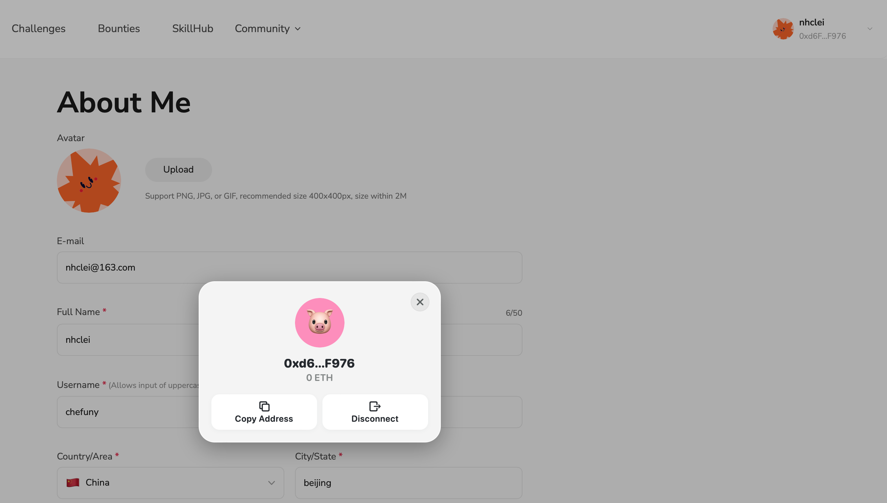

# Task2 Blockchain Basic

本任务分为简答题、分析题和选择题，以此为模板，在下方填写你的答案即可。

选择题，请在你选中的项目中，将 `[ ]` 改为 `[x]` 即可


## [单选题] 如果你莫名奇妙收到了一个 NFT，那么

- [ ] 天上掉米，我应该马上点开他的链接
- [x] 这可能是在对我进行诈骗！


## [单选题] 群里大哥给我发的网站，说能赚大米，我应该

- [ ] 赶紧冲啊，待会米被人抢了
- [x] 谨慎判断，不在不信任的网站链接钱包

## [单选题] 下列说法正确的是

- [x] 一个私钥对应一个地址
- [ ] 一个私钥对应多个地址
- [ ] 多个私钥对应一个地址
- [ ] 多个私钥对应多个地址

 ## [单选题] 下列哪个是以太坊虚拟机的简称

- [ ] CLR
- [x] EVM
- [ ] JVM

## [单选题] 以下哪个是以太坊上正确的地址格式？

- [ ] 1A4BHoT2sXFuHsyL6bnTcD1m6AP9C5uyT1
- [ ] TEEuMMSc6zPJD36gfjBAR2GmqT6Tu1Rcut
- [ ] 0x997fd71a4cf5d214009619808176b947aec122890a7fcee02e78e329596c94ba
- [x] 0xf39Fd6e51aad88F6F4ce6aB8827279cffFb92266
      
## [多选题] 有一天某个大哥说要按市场价的 80% 出油给你，有可能

- [x] 他在洗米
- [ ] 他良心发现
- [x] 要给我黒米
- [x] 给我下套呢

## [多选题] 以下哪些是以太坊的二层扩容方案？

- [ ] Lightning Network（闪电网络）
- [x] Optimsitic Rollup
- [x] Zk Rollup

## [简答题] 简述区块链的网络结构

```
区块链的网络结构是一种去中心化的对等网络（P2P网络），由多个节点（计算机）组成。以下是区块链网络结构的主要特征：

1. 去中心化：区块链网络没有中心化的控制节点，所有节点地位平等，每个节点都可以独立进行验证和处理交易。这种去中心化结构提高了系统的容错能力和安全性。

2. 对等网络（P2P）：在区块链网络中，各节点之间直接进行通信，而不依赖于中间服务器。节点之间共享区块链的副本，通过广播机制传播交易和区块信息。

3. 分布式账本：区块链的核心是分布式账本技术，每个节点都持有完整的账本副本。所有交易记录都按时间顺序保存在区块中，形成链条结构，确保数据不可篡改。

4. 共识机制：区块链网络通过共识机制来达成对账本状态的一致意见。常见的共识机制包括工作量证明（PoW）、权益证明（PoS）、拜占庭容错（PBFT）等。这些机制确保即使在存在恶意节点的情况下，网络仍能可靠地运行。

5. 加密技术：区块链使用公钥加密、哈希函数等加密技术来确保数据的安全性和隐私性。每笔交易都需要数字签名以验证其真实性和完整性。

6. 智能合约：部分区块链（如以太坊）支持智能合约，允许用户在区块链上编写和执行自定义程序。这些智能合约在满足特定条件时自动执行，扩大了区块链的应用范围。

这种结构使区块链具有去中心化、透明、安全、不可篡改等特点，适用于多种应用场景，如数字货币、供应链管理、智能合约等。
```

## [简答题] 智能合约是什么，有何作用？

```
智能合约是一种运行在区块链上的自执行合约，其条款和执行逻辑通过代码进行定义。当满足预定条件时，智能合约会自动执行，无需人工干预。以下是对智能合约的详细解释及其作用：

什么是智能合约？
智能合约是由计算机程序表示的合约，运行在区块链平台上（如以太坊）。智能合约的代码和相关的数据被存储在区块链上，通过区块链的分布式网络来进行验证和执行。

智能合约的作用
1. 自动化执行：智能合约在满足特定条件时会自动执行。这样减少了人为干预的需要，提高了执行效率。例如，资金在特定条件下自动转账。

2. 透明和可验证：由于智能合约的代码存储在区块链上，任何人都可以查看和验证合同的逻辑和执行状态。这种透明性增强了信任，特别是在陌生人或不完全信任的各方之间进行交易时。

3. 不可篡改：一旦部署在区块链上，智能合约的代码和状态是不可篡改的。这种特性确保了合约执行的公正性和可靠性。

4. 降低成本：智能合约减少了对中介机构的需求（如律师、公证人等），从而降低了交易成本和时间。例如，在房地产交易中，智能合约可以自动处理所有权转移和资金托管。

5. 提高效率：智能合约能够快速处理和执行合约条款，减少了传统合约中繁琐的审核和处理流程。例如，保险理赔可以在事故发生并验证后自动支付。

应用场景
金融服务：智能合约可以自动执行贷款发放、利息支付、股息分配等金融操作。
供应链管理：跟踪货物的运输和交付，确保供应链的透明和高效。
数字身份验证：管理和验证身份信息，确保数据的安全和隐私。
物联网（IoT）：在物联网设备之间自动执行协议，如智能家居设备之间的互操作。
去中心化应用（DApps）：构建各种去中心化应用，如去中心化金融（DeFi）平台、NFT市场等。
通过自动化、透明和不可篡改的特性，智能合约大大提升了传统合同的效率和安全性，开辟了许多新的应用场景。
```


## [简答题] 怎么理解大家常说的 `EVM` 这个词汇？

```

EVM 是 Ethereum Virtual Machine 的缩写，即以太坊虚拟机。它是一个用于运行以太坊智能合约的去中心化计算环境。以下是对 EVM 的详细解释及其作用：

什么是 EVM？
以太坊虚拟机 (EVM) 是一个运行在以太坊网络节点上的沙箱环境。它能够执行由智能合约和去中心化应用 (DApps) 编写的字节码。EVM 的主要特点包括：

沙箱环境：EVM 提供了一个隔离的执行环境，确保智能合约的执行不会直接影响底层主机系统。这种隔离性提高了安全性和稳定性。
图灵完备性：EVM 是图灵完备的，这意味着它能够执行任何计算任务，只要有足够的资源（如时间和内存）。
字节码执行：智能合约在以太坊上是用高级编程语言（如 Solidity）编写的，然后被编译成 EVM 字节码。EVM 负责执行这些字节码指令。
EVM 的作用
智能合约执行环境：EVM 是智能合约的执行引擎，负责处理智能合约的创建、部署和执行。每个以太坊节点都运行一个 EVM 实例，确保智能合约在整个网络中的一致性和可验证性。

状态管理：EVM 维护以太坊网络的状态，包括账户余额、合约状态、存储等。每次智能合约执行后，EVM 会更新网络的全局状态。

安全性和确定性：EVM 确保智能合约的执行是确定性的，即相同的输入在不同节点上会产生相同的输出。这种确定性和一致性是区块链网络的基础，保证了数据的完整性和可靠性。

计算资源的衡量（Gas）：EVM 使用 Gas 机制来衡量计算资源的消耗。每条智能合约指令执行时都会消耗一定数量的 Gas，防止恶意用户在网络上执行无限循环或占用过多资源。用户需要支付 Gas 费用来执行合约，这也激励了矿工验证和处理交易。

总结
EVM 是以太坊网络的核心组件，它提供了一个图灵完备的执行环境，用于运行智能合约和去中心化应用。通过 EVM，开发者可以在以太坊上构建各种去中心化应用，并确保这些应用的安全性、确定性和去中心化特性。EVM 的设计使得以太坊不仅仅是一个数字货币平台，而是一个支持复杂应用的去中心化计算平台。
```


## [分析题] 你对去中心化的理解

```
去中心化（Decentralization）是一个重要的概念，特别是在区块链技术和分布式系统中。它指的是将控制权和决策权从单一的中央机构分散到多个独立的节点或参与者。去中心化系统通过分布式架构来提高系统的安全性、透明性和弹性。以下是对去中心化的详细分析：

去中心化的基本理解
分布式控制：

无单点故障：去中心化系统没有中央控制点，因此不存在单点故障的问题。这提高了系统的容错能力和稳定性。
多方参与：决策和控制权分散在多个节点或参与者手中，每个节点都可以独立地进行操作和验证，防止任何一方垄断权力。
透明性和可信度：

公开账本：在去中心化系统中，所有交易和操作记录通常都是公开可见的。例如，在区块链中，每个节点都持有完整的账本副本，这样所有交易都是透明的。
信任机制：去中心化减少了对中介机构的依赖，通过共识机制和加密技术建立信任。例如，比特币通过工作量证明（PoW）机制来确保交易的可靠性。
安全性和抗审查性：

抗攻击能力：由于数据分布在多个节点上，攻击者很难通过攻击单个或少数节点来控制整个系统。
抗审查性：去中心化系统通常不受单一实体控制，这使得任何一方都难以审查或篡改数据。例如，在以太坊上，智能合约一旦部署，任何人都无法单方面更改其代码和状态。
去中心化的应用
区块链和加密货币：

比特币：作为去中心化数字货币的代表，比特币没有中央发行机构，通过分布式网络和共识机制实现了安全和信任。
以太坊：除了数字货币，以太坊还支持智能合约，使去中心化应用（DApps）的开发成为可能。
去中心化金融（DeFi）：

借贷平台：去中心化借贷平台允许用户在无需传统银行的情况下进行借贷交易，资金由智能合约管理。
去中心化交易所（DEX）：这些平台允许用户直接进行加密货币交易，而无需中介机构。
去中心化自治组织（DAO）：

社区治理：DAO 是一种去中心化的组织形式，成员通过投票和共识机制来进行决策，没有中央管理机构。例如，某些区块链项目的开发和升级由DAO来管理。
内容分发和社交网络：

去中心化内容平台：平台如 IPFS 和 Filecoin 通过分布式网络存储和分发内容，避免了中心化服务器的限制和审查。
去中心化社交网络：这类平台允许用户掌控自己的数据，防止数据滥用和隐私侵犯。
去中心化的挑战
效率问题：去中心化系统往往在效率上不如中心化系统，例如，区块链的交易速度和处理能力有限。
共识机制的复杂性：保持分布式网络的一致性需要复杂的共识机制，这可能带来延迟和高能耗问题。
治理问题：去中心化系统的治理通常更加复杂，需要创新的机制来解决分歧和协调利益。
总结
去中心化是一种将控制权和决策权从单一中心分散到多个节点或参与者的系统架构。它通过分布式网络、透明性和信任机制提高了系统的安全性和弹性。在区块链、去中心化金融、去中心化自治组织和内容分发等领域，去中心化展示了巨大的潜力和优势。然而，去中心化也面临着效率、共识机制和治理方面的挑战，需要不断创新和优化。
```


## [分析题] 比较区块链与传统数据库，你的看法？

```
区块链和传统数据库是两种不同的数据存储和管理系统，各有其独特的特点、优势和应用场景。以下是对区块链和传统数据库的详细比较和分析：

区块链

特点

1.去中心化：区块链是一个分布式账本，没有中央控制点。所有节点都持有相同的数据副本，并通过共识机制达成一致。
2.不可篡改性：一旦数据被写入区块链，就很难更改。这是由于数据被加密并链接成链条，篡改某个区块会影响后续所有区块。
3.透明性：区块链上的数据对所有参与者公开可见，任何人都可以验证交易的真实性。
4.智能合约：区块链（如以太坊）支持智能合约，即自执行的代码，可以在满足特定条件时自动执行。

优势

1.信任机制：通过密码学和共识算法，区块链建立了无需信任的交易环境，适用于陌生人之间的交易。
2.安全性：由于数据分散存储并通过加密保护，区块链具有较高的抗攻击性和数据完整性。
3.去中介化：区块链减少了对中介机构的依赖，降低了交易成本和复杂性。

应用场景

1.加密货币：如比特币、以太坊等，允许点对点的数字货币交易。
2.供应链管理：追踪产品从生产到交付的全流程，提高透明度和效率。
3.去中心化金融（DeFi）：通过智能合约实现去中心化的金融服务，如借贷、交易等。

传统数据库

特点

1.中心化：传统数据库通常由一个中央服务器管理和控制，所有操作通过该服务器进行。
2.可变性：传统数据库允许数据的读写和修改，提供灵活的数据操作和管理功能。
3.访问控制：通过权限设置，传统数据库可以精细控制用户对数据的访问权限。
4.高效性：传统数据库在处理大量数据和复杂查询方面效率较高，适用于高频率的数据读写操作。

优势

1. 性能：传统数据库优化了读写性能，能高效处理复杂查询和大规模数据。
2. 成熟度：传统数据库技术成熟，拥有丰富的功能和强大的支持系统，如事务管理、备份和恢复。
3. 灵活性：支持多种数据模型（关系型、文档型、图形型等），满足不同应用需求。

应用场景

1. 企业管理系统：如ERP、CRM系统，管理企业的各种业务数据。
2. 电子商务平台：处理用户订单、库存管理、支付等数据。
3. 金融服务：银行、保险等机构用于管理账户、交易记录等。

比较

1. 数据存储和管理：

区块链：数据以区块的形式链式存储，每个区块包含一组交易记录和前一区块的哈希。
传统数据库：数据存储在表格或文档中，支持多种数据模型和灵活的查询操作。

2. 安全性和透明性：

区块链：通过密码学和共识机制确保数据安全和透明，适合需要高信任和不可篡改性的场景。
传统数据库：依赖于访问控制和权限管理，适合需要高性能和灵活数据管理的场景。

3. 去中心化 vs. 中心化：

区块链：分布式账本，去中心化控制，适合点对点交易和无信任环境。
传统数据库：中心化管理，适合企业内部数据管理和高效查询。

4. 效率和性能：

区块链：由于去中心化和共识机制，交易处理速度较慢，不适合高频交易。
传统数据库：优化的性能和查询效率，适合大规模数据处理和复杂查询。

结论

区块链和传统数据库各有优势，适用于不同的应用场景。区块链强调去中心化、安全性和透明性，适合需要高信任、不可篡改和去中介化的场景，如加密货币和去中心化应用。而传统数据库则强调性能、灵活性和成熟度，适合企业内部数据管理、电子商务和金融服务等高效数据处理需求。选择使用哪种技术应根据具体的应用需求和场景来决定。
```


## 操作题

安装一个 WEB3 钱包，创建账户后与 [openbuild.xyz](https://openbuild.xyz/profile) 进行绑定，截图后文件命名为 `./bind-wallet.jpg`.

