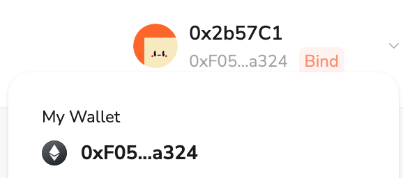

# Task2 Blockchain Basic

本任务分为简答题、分析题和选择题，以此为模板，在下方填写你的答案即可。

选择题，请在你选中的项目中，将 `[ ]` 改为 `[x]` 即可

## [单选题] 如果你莫名奇妙收到了一个 NFT，那么

- [ ] 天上掉米，我应该马上点开他的链接
- [x] 这可能是在对我进行诈骗！

## [单选题] 群里大哥给我发的网站，说能赚大米，我应该

- [ ] 赶紧冲啊，待会米被人抢了
- [x] 谨慎判断，不在不信任的网站链接钱包

## [单选题] 下列说法正确的是

- [x] 一个私钥对应一个地址
- [ ] 一个私钥对应多个地址
- [ ] 多个私钥对应一个地址
- [ ] 多个私钥对应多个地址

 ## [单选题] 下列哪个是以太坊虚拟机的简称

- [ ] CLR
- [x] EVM
- [ ] JVM

## [单选题] 以下哪个是以太坊上正确的地址格式？

- [ ] 1A4BHoT2sXFuHsyL6bnTcD1m6AP9C5uyT1
- [ ] TEEuMMSc6zPJD36gfjBAR2GmqT6Tu1Rcut
- [ ] 0x997fd71a4cf5d214009619808176b947aec122890a7fcee02e78e329596c94ba
- [x] 0xf39Fd6e51aad88F6F4ce6aB8827279cffFb92266
      
## [多选题] 有一天某个大哥说要按市场价的 80% 出油给你，有可能

- [x] 他在洗米
- [ ] 他良心发现
- [x] 要给我黒米
- [x] 给我下套呢

## [多选题] 以下哪些是以太坊的二层扩容方案？

- [ ] Lightning Network（闪电网络）
- [x] Optimsitic Rollup
- [x] Zk Rollup

## [简答题] 简述区块链的网络结构

区块链的网络结构是一种去中心化的对等网络（P2P网络），由多个节点组成，这些节点分布在全球各地。每个节点都存储一份完整的区块链数据，并通过共识算法来验证和确认交易，确保数据的安全性和一致性。节点之间通过广播协议进行通信，共享交易数据和区块信息，从而维持整个区块链网络的运行和更新。

## [简答题] 智能合约是什么，有何作用？

智能合约是一种运行在区块链上的自执行代码，具有合同的功能。它们由预先编写的代码定义并执行合约条款，能够在特定条件满足时自动执行。智能合约的作用包括：

	•	自动化：消除中介和手动处理，提高效率。
	•	透明性：合约条款公开透明，任何人都可以查看。
	•	安全性：基于区块链的不可篡改性，确保数据和执行的可靠性。
	•	去中心化：智能合约运行在去中心化的网络中，无需依赖中央权威机构。

## [简答题] 怎么理解大家常说的 EVM 这个词汇？

EVM（Ethereum Virtual Machine，以太坊虚拟机）是以太坊网络中的运行环境，用于执行智能合约。它是一个图灵完备的虚拟机，可以处理任何计算任务。EVM的作用包括：

	•	执行智能合约：EVM负责解释和执行以太坊区块链上的智能合约代码。
	•	提供隔离环境：EVM将智能合约的执行环境与底层硬件隔离，确保合约执行的安全性。
	•	支持多个编程语言：EVM支持Solidity等多种编程语言的智能合约。

## [分析题] 你对去中心化的理解

去中心化是指系统或网络中没有单一的中央控制点，而是通过多个分布式节点来实现数据存储、处理和管理。去中心化的主要特点包括：

	•	安全性：由于没有单一故障点，去中心化系统更能抵御攻击和故障。
	•	透明性：数据和操作公开透明，每个节点都可以参与验证和决策。
	•	权力分散：权力和控制权分散在多个节点，避免了单一实体的垄断和控制。
	•	隐私保护：用户数据由多个节点维护，增强了隐私保护。

## [分析题] 比较区块链与传统数据库，你的看法？

区块链提供了一种全新的数据管理方式，特别适用于需要高度安全性、透明度和去中心化的场景。而传统数据库则在需要快速读写、复杂查询和中心化管理的业务场景中更为适用。选择使用哪种技术取决于具体的业务需求和场景。

## 操作题

安装一个 WEB3 钱包，创建账户后与 [openbuild.xyz](https://openbuild.xyz/profile) 进行绑定，截图后文件命名为 `./bind-wallet.jpg`.
