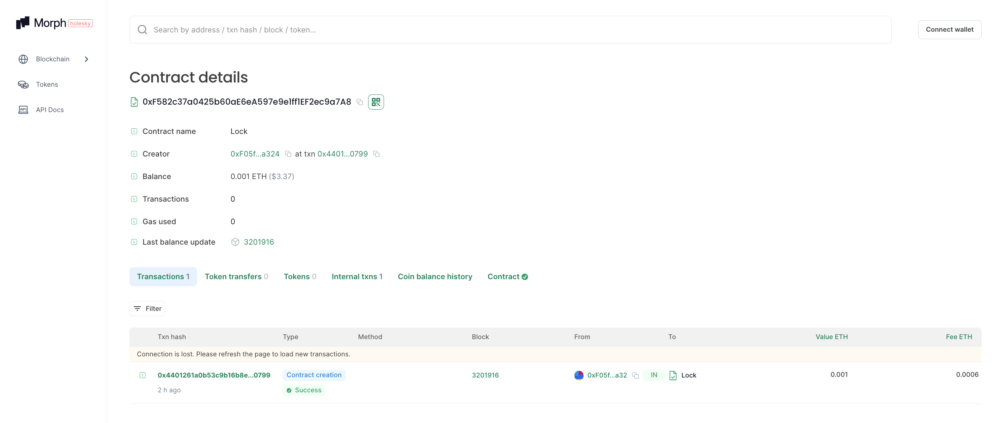

# 在Morph Holesky上部署任意合约并在Morph浏览器上验证
## 教程：
https://docs.morphl2.io/docs/build-on-morph/code-examples/deploy-contract-on-morph
## 提交要求：
- 提交合约的Morph浏览器链接
- 提交验证后的截图

## 合约的Morph浏览器链接: 
https://explorer-holesky.morphl2.io/address/0xF582c37a0425b60aE6eA597e9e1ff1EF2ec9a7A8?tab=txs
## 截图
