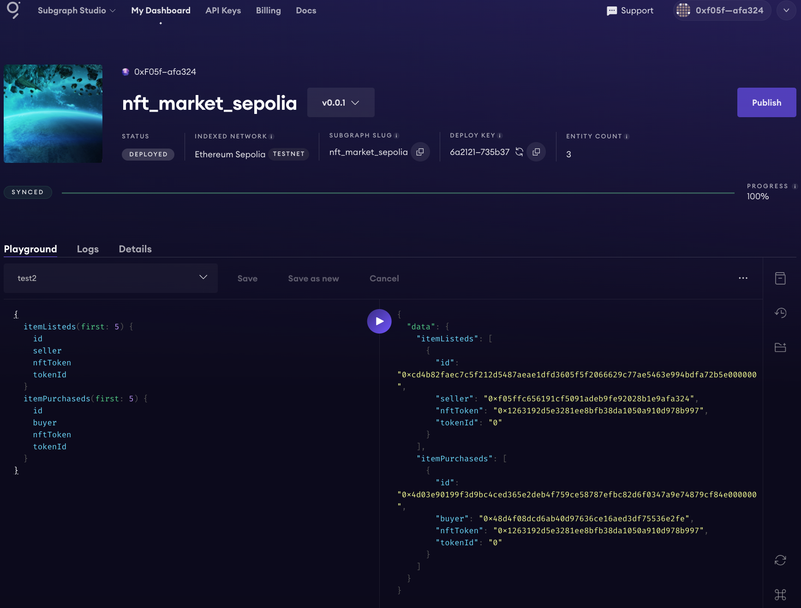

任务要求及步骤:
安装Graph CLI 在本地环境中安装Graph CLI工具
初始化子图 使用Graph CLI初始化一个新的子图
配置子图（subgraph.yaml） 设置要索引的NFTMarket合约和List、Buy事件
定义Schema（schema.graphql） 定义List和Buy实体
编写映射（mapping.ts） 编写映射逻辑，以处理合约事件并更新子图的存储
部署子图 使用Graph CLI工具部署子图到The Graph Studio。

提交要求:
提交NFTMarket合约地址
提交在The Graph Sudio ( https://thegraph.com/studio/ ) 上部署的子图的链接以及截图

合约地址：

0x337842afe0901bD5089F208e9a31ee1041Fb99f4

https://sepolia.etherscan.io/address/0x337842afe0901bd5089f208e9a31ee1041fb99f4

子图链接：

https://api.studio.thegraph.com/query/83099/nft_market_sepolia/v0.0.1⁠

截图：
