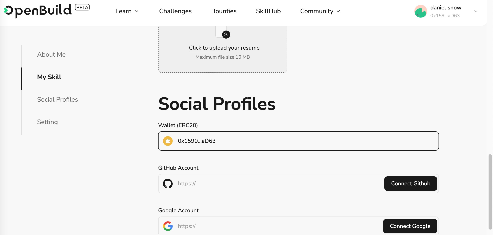

# Task2 Blockchain Basic

## [单选题] 如果你莫名奇妙收到了一个 NFT，那么

- [ ] 天上掉米，我应该马上点开他的链接
- [x] 这可能是在对我进行诈骗！

## [单选题] 群里大哥给我发的网站，说能赚大米，我应该

- [ ] 赶紧冲啊，待会米被人抢了
- [x] 谨慎判断，不在不信任的网站链接钱包

## [单选题] 下列说法正确的是

- [x] 一个私钥对应一个地址
- [ ] 一个私钥对应多个地址
- [ ] 多个私钥对应一个地址
- [ ] 多个私钥对应多个地址

## [单选题] 下列哪个是以太坊虚拟机的简称

- [ ] CLR
- [x] EVM
- [ ] JVM

## [单选题] 以下哪个是以太坊上正确的地址格式？

- [ ] 1A4BHoT2sXFuHsyL6bnTcD1m6AP9C5uyT1
- [ ] TEEuMMSc6zPJD36gfjBAR2GmqT6Tu1Rcut
- [ ] 0x997fd71a4cf5d214009619808176b947aec122890a7fcee02e78e329596c94ba
- [x] 0xf39Fd6e51aad88F6F4ce6aB8827279cffFb92266

## [多选题] 有一天某个大哥说要按市场价的 80% 出油给你，有可能

- [x] 他在洗米
- [ ] 他良心发现
- [x] 要给我黒米
- [x] 给我下套呢

## [多选题] 以下哪些是以太坊的二层扩容方案？

- [ ] Lightning Network（闪电网络）
- [x] Optimsitic Rollup
- [x] Zk Rollup

## [简答题] 简述区块链的网络结构

由区块链层、节点网络、共识机制、智能合约、隐私保护和跨链技术等组成。

## [简答题] 智能合约是什么，有何作用？

智能合约是代码化的业务规则，相当于一个业务系统，实现某种/些特定的业务功能。

## [简答题] 怎么理解大家常说的 `EVM` 这个词汇？

EVM 是以太坊区块链的核心，为智能合约提供了安全、可靠的运行环境，推动了整个以太坊生态的发展繁荣。

## [分析题] 你对去中心化的理解

顾名思义，「去中心化」就是没有中心，也就不会有中央集权的情况，于是要做任何事需要网络中的每个节点间达成共识，最大化民主。

但这也造成了决策流程长、效率低下等问题，因而需要就「如何达成共识」这个基本核心问题先达成共识，之后的其他共识按照这个来执行。

## [分析题] 比较区块链与传统数据库，你的看法？

传统数据库是集中式的，数据的控制权在数据库拥有者的手中，可被其任意修改或变卖等；而区块链是分布式的，没有哪个具体的人或组织能够随意修改，相对安全可靠。

## 操作题

