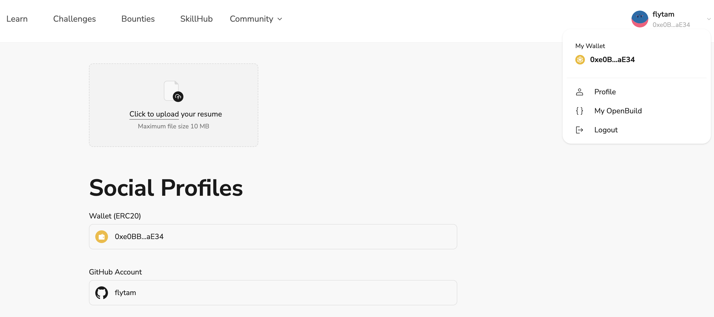

# Task2 Blockchain Basic

本任务分为简答题、分析题和选择题，以此为模板，在下方填写你的答案即可。

选择题，请在你选中的项目中，将 `[ ]` 改为 `[x]` 即可


## [单选题] 如果你莫名奇妙收到了一个 NFT，那么

- [ ] 天上掉米，我应该马上点开他的链接
- [x] 这可能是在对我进行诈骗！


## [单选题] 群里大哥给我发的网站，说能赚大米，我应该

- [ ] 赶紧冲啊，待会米被人抢了
- [x] 谨慎判断，不在不信任的网站链接钱包

## [单选题] 下列说法正确的是

- [ ] 一个私钥对应一个地址
- [x] 一个私钥对应多个地址
- [ ] 多个私钥对应一个地址
- [ ] 多个私钥对应多个地址

 ## [单选题] 下列哪个是以太坊虚拟机的简称

- [ ] CLR
- [x] EVM
- [ ] JVM

## [单选题] 以下哪个是以太坊上正确的地址格式？

- [ ] 1A4BHoT2sXFuHsyL6bnTcD1m6AP9C5uyT1
- [ ] TEEuMMSc6zPJD36gfjBAR2GmqT6Tu1Rcut
- [ ] 0x997fd71a4cf5d214009619808176b947aec122890a7fcee02e78e329596c94ba
- [x] 0xf39Fd6e51aad88F6F4ce6aB8827279cffFb92266
      
## [多选题] 有一天某个大哥说要按市场价的 80% 出油给你，有可能

- [x] 他在洗米
- [ ] 他良心发现
- [x] 要给我黒米
- [x] 给我下套呢

## [多选题] 以下哪些是以太坊的二层扩容方案？

- [ ] Lightning Network（闪电网络）
- [x] Optimsitic Rollup
- [x] Zk Rollup

## [简答题] 简述区块链的网络结构

```
区块链的网络结构是去中心化的，这意味着不像传统网络那样存在一个中心服务器来存放所有的数据，而是数据被存储在网络上的众多节点中。每个节点都保持着一份数据的副本，这些节点通过共识机制来同步数据并验证交易。这样的结构增强了网络的透明性、安全性，并且提高了抗审查的能力，因为要控制或者改变网络上的信息需要同时改变大量节点上的数据，而这几乎是不可能的
```


## [简答题] 智能合约是什么，有何作用？

```
智能合约是一段存储在区块链上的代码，类似 web2 的后端服务。当满足预设条件时，智能合约会自动执行相关的操作，无需任何第三方的干预。它的作用包括自动化执行合约条款、降低交易成本、提高效率和透明度、减少纠纷和人为错误。智能合约在诸如金融、法律、供应链管理等领域有广泛的应用。
```


## [简答题] 怎么理解大家常说的 `EVM` 这个词汇？

```
EVM即以太坊虚拟机，是以太坊网络上运行智能合约的运行时环境。它是一个完全隔离的系统，确保运行在其中的代码无法访问网络、文件系统或其他外部系统。EVM允许智能合约以字节码的形式部署到区块链上，并在执行时由EVM进行解释执行。这样可以保证智能合约的执行结果具有确定性，对所有网络参与者都一致。EVM为智能合约的开发和运行提供了一个安全、高效的平台
```


## [分析题] 你对去中心化的理解

```
去中心化是指不依赖于单一控制实体的分布式网络结构。在这种结构中，权力和控制被分散在网络的多个节点之间，而不是集中于单一的实体或组织。去中心化的优点在于它能提高系统的透明度、安全性和抵抗力。比如，在去中心化的协议或网络中，没有单点故障问题，数据更难被篡改，且对参与者更加公平。去中心化经常与区块链技术联系在一起，因为区块链提供了创建和维护去中心化系统的基础
```


## [分析题] 比较区块链与传统数据库，你的看法？

```
区块链与传统数据库在多个层面有显著的区别。首先，区块链是一种分布式数据库，它通过网络上的多个节点共享数据，而传统数据库通常集中存储在单个服务器或服务器集群中。其次，区块链数据具有不可篡改性，由于采用了加密技术和共识机制，一旦数据被记录在区块链上，修改或删除数据非常困难，这使得区块链在安全性和透明度方面优于很多传统数据库。此外，区块链通过智能合约支持自动化执行逻辑，这在传统数据库中通常需要外部程序或者中介。然而区块链技术在性能、可扩展性方面还面临挑战，处理速度和存储容量通常不如传统数据库。总的来说，区块链在提供安全、去中心化的数据记录和存储方面有明显优势，但在处理大量数据和高速交易处理方面，传统数据库仍然有其不可替代的地位
```


## 操作题

安装一个 WEB3 钱包，创建账户后与 [openbuild.xyz](https://openbuild.xyz/profile) 进行绑定，截图后文件命名为 `./bind-wallet.jpg`.

