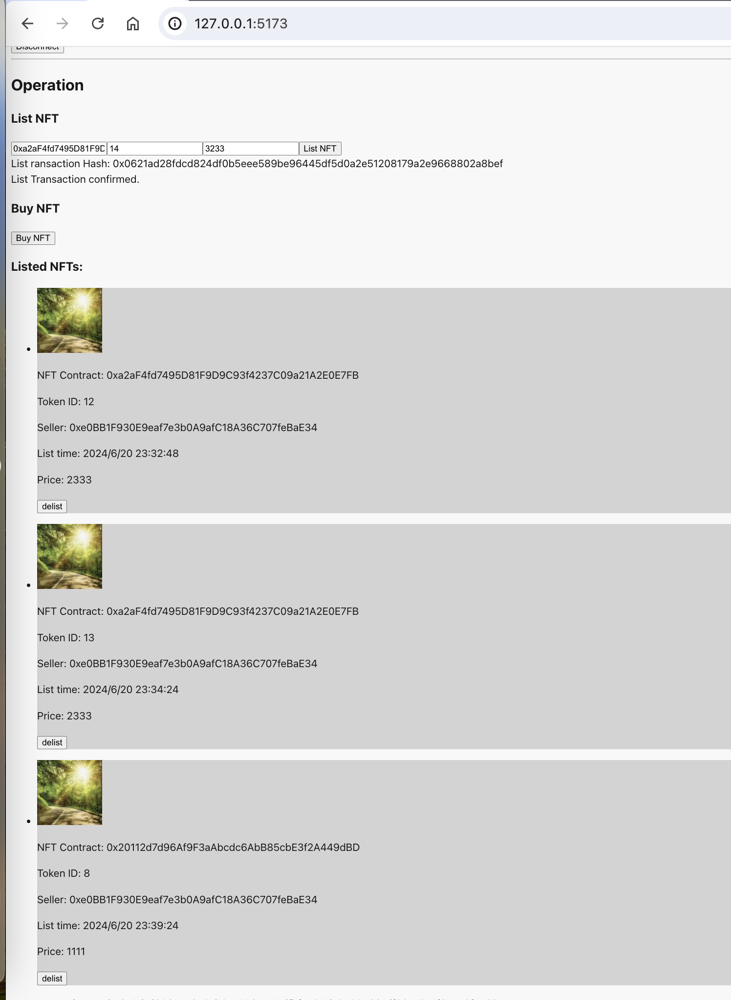
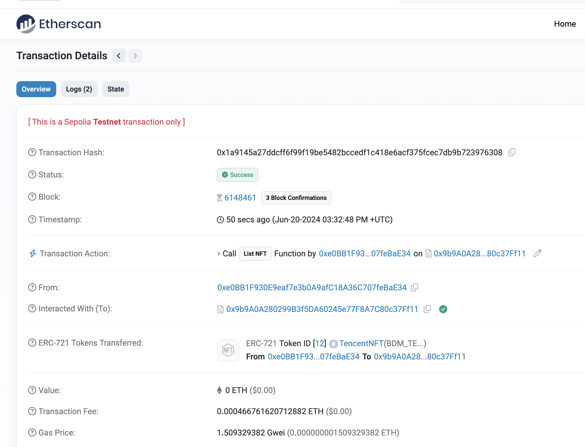
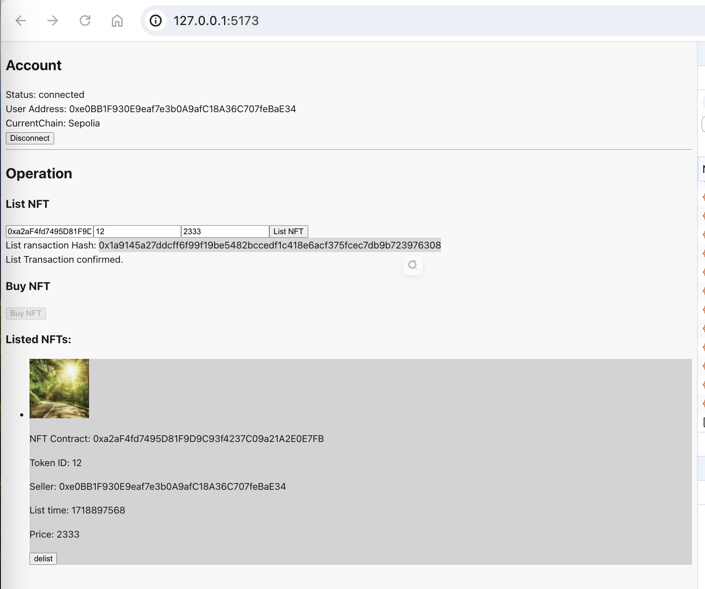
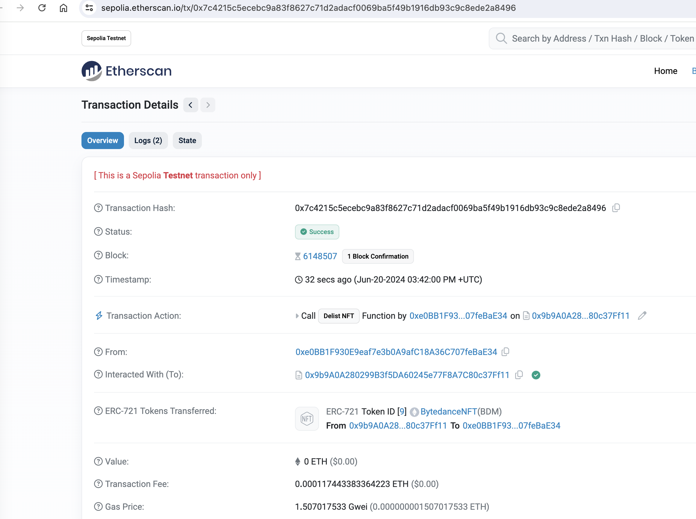
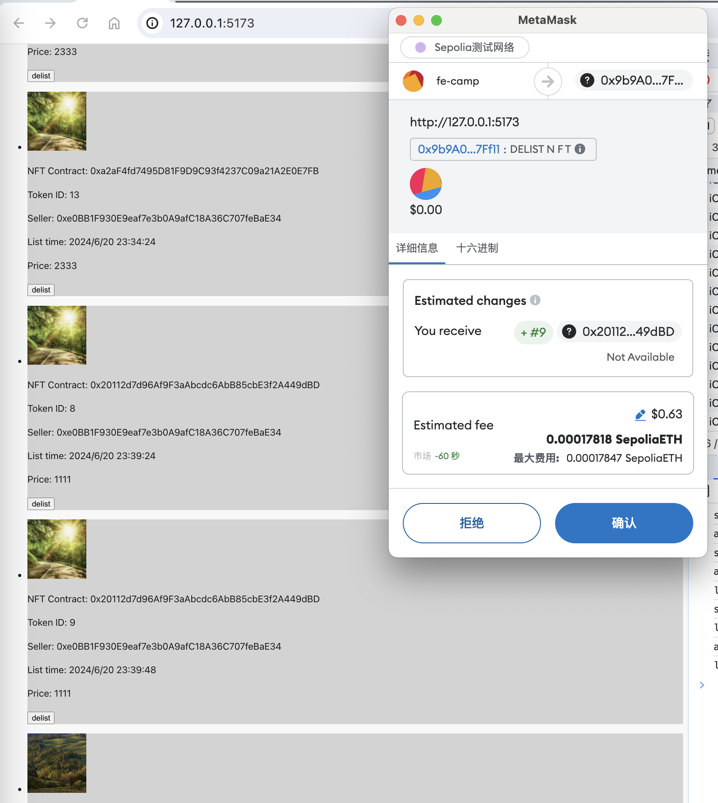
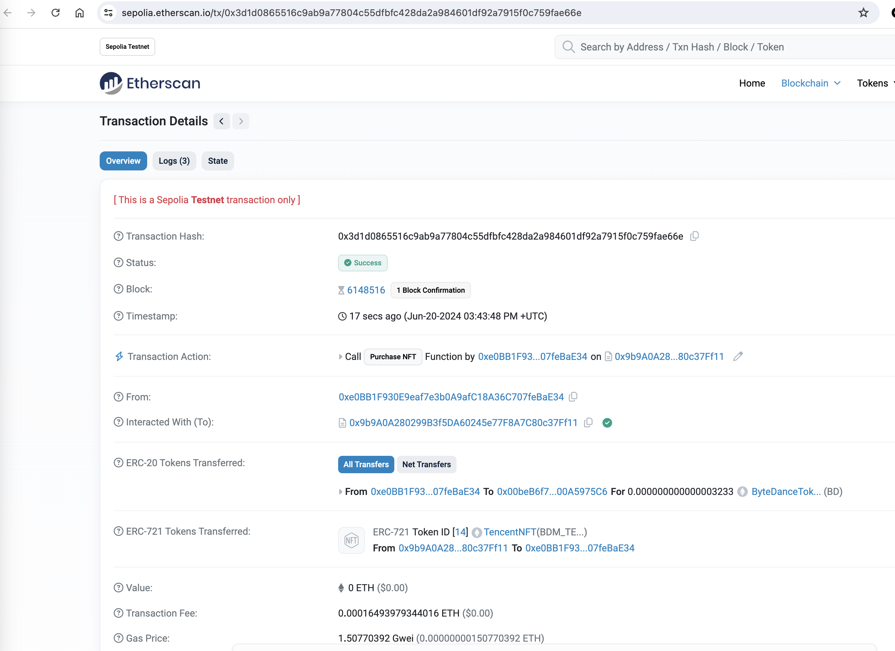
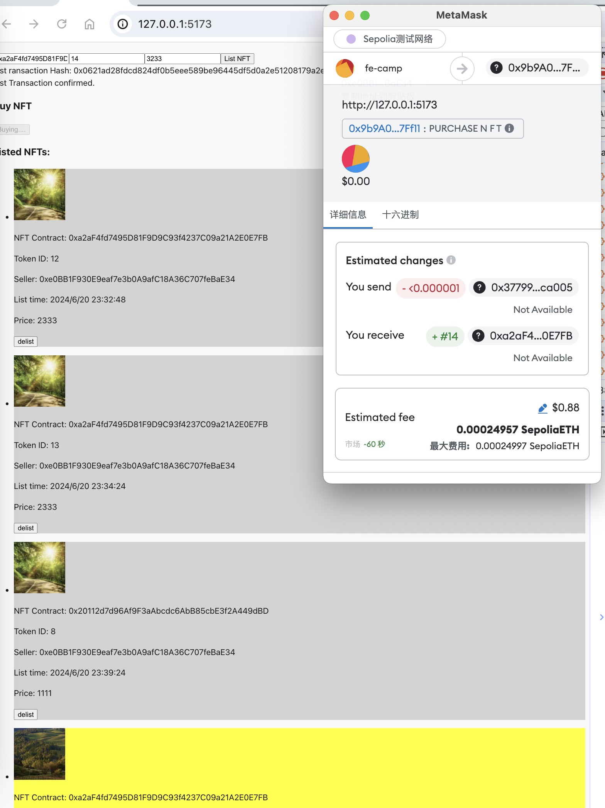

## 运行效果

## 合约地址

Token [`0x377997332FEefd076B22AEa8A920869b01Cca005`](https://sepolia.etherscan.io/address/0x377997332FEefd076B22AEa8A920869b01Cca005)

NFT1 - [`0x20112d7d96Af9F3aAbcdc6AbB85cbE3f2A449dBD`](https://sepolia.etherscan.io/address/0x20112d7d96af9f3aabcdc6abb85cbe3f2a449dbd)

NFT2 - [`0xa2aF4fd7495D81F9D9C93f4237C09a21A2E0E7FB`](https://sepolia.etherscan.io/address/0xa2aF4fd7495D81F9D9C93f4237C09a21A2E0E7FB)

NFTMarket - [`0x9b9A0A280299B3f5DA60245e77F8A7C80c37Ff11`](https://sepolia.etherscan.io/address/0x9b9A0A280299B3f5DA60245e77F8A7C80c37Ff11)

## 上架 NFT

[`0x1a9145a27ddcff6f99f19be5482bccedf1c418e6acf375fcec7db9b723976308`](https://sepolia.etherscan.io/tx/0x1a9145a27ddcff6f99f19be5482bccedf1c418e6acf375fcec7db9b723976308)

## 下架 NFT

[`0x7c4215c5ecebc9a83f8627c71d2adacf0069ba5f49b1916db93c9c8ede2a8496`](https://sepolia.etherscan.io/tx/0x7c4215c5ecebc9a83f8627c71d2adacf0069ba5f49b1916db93c9c8ede2a8496)

## 购买NFT

[`0x3d1d0865516c9ab9a77804c55dfbfc428da2a984601df92a7915f0c759fae66e`](https://sepolia.etherscan.io/tx/0x3d1d0865516c9ab9a77804c55dfbfc428da2a984601df92a7915f0c759fae66e)

