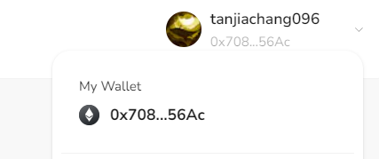

# Task2 Blockchain Basic

本任务分为简答题、分析题和选择题，以此为模板，在下方填写你的答案即可。

选择题，请在你选中的项目中，将 `[ ]` 改为 `[x]` 即可

## [单选题] 如果你莫名奇妙收到了一个 NFT，那么

- [ ] 天上掉米，我应该马上点开他的链接
- [x] 这可能是在对我进行诈骗！

## [单选题] 群里大哥给我发的网站，说能赚大米，我应该

- [ ] 赶紧冲啊，待会米被人抢了
- [x] 谨慎判断，不在不信任的网站链接钱包

## [单选题] 下列说法正确的是

- [x] 一个私钥对应一个地址
- [ ] 一个私钥对应多个地址
- [ ] 多个私钥对应一个地址
- [ ] 多个私钥对应多个地址

## [单选题] 下列哪个是以太坊虚拟机的简称

- [ ] CLR
- [x] EVM
- [ ] JVM

## [单选题] 以下哪个是以太坊上正确的地址格式？

- [ ] 1A4BHoT2sXFuHsyL6bnTcD1m6AP9C5uyT1
- [ ] TEEuMMSc6zPJD36gfjBAR2GmqT6Tu1Rcut
- [ ] 0x997fd71a4cf5d214009619808176b947aec122890a7fcee02e78e329596c94ba
- [x] 0xf39Fd6e51aad88F6F4ce6aB8827279cffFb92266

## [多选题] 有一天某个大哥说要按市场价的 80% 出油给你，有可能

- [x] 他在洗米
- [ ] 他良心发现
- [x] 要给我黒米
- [x] 给我下套呢

## [多选题] 以下哪些是以太坊的二层扩容方案？

- [ ] Lightning Network（闪电网络）
- [x] Optimsitic Rollup
- [x] Zk Rollup

## [简答题] 简述区块链的网络结构

```
区块链网络架构主要由以下几个部分组成
1. 区块链层：这是区块链技术的核心，由一串按照时间顺序排列的区块组成，每个区块都包含前一个区块的哈希值和自身的数据信息。这个网络架构保证了数据的不可篡改性和透明性。
2. 节点网络：区块链网络是由众多节点组成的网络，每个节点都保存了整个区块链的拷贝，并参与了网络中的共识机制，以保证网络的安全性和稳定性。
3. 共识机制：共识机制是区块链网络中用来确认和验证交易的有效性，并保证所有节点之间的信任关系。目前，主要的共识机制包括工作量证明（PoW）、权益证明（PoS）和实用拜占庭容错（PBFT）等。
4. 智能合约：智能合约是运行在区块链网络上的自动化执行规则，它们可以被编程并由用户上传到区块链上，以实现各种应用。
```

## [简答题] 智能合约是什么，有何作用？

```
智能合约类似于传统开发的后端服务,传统后端Api运行在服务器上,而智能合约运行在区块链上,
它可以自动执行特定的操作，例如支付、转账、投票等，并且可以确保操作的合法性和有效性。
```

## [简答题] 怎么理解大家常说的 `EVM` 这个词汇？

```
在Java中有JVM虚拟机,在区块链中有EVM虚拟机,它是以太系区块链的核心组成部分。
它是一个运行在以太系区块链上的智能合约执行引擎，负责执行智能合约的代码和数据。
```

## [分析题] 你对去中心化的理解

```
去中心化最大的特点就是权利分配,在去中心化系统中每个节点都有拥有一定的自治性和参与决策的能力。
同事去中心化增加了数据篡改的难度，提高了数据的透明度和安全性，但是也会牺牲一定的处理效率。
```

## [分析题] 比较区块链与传统数据库，你的看法？

```
传统数据库和区块链他们的本质都是存储数据，但区别是区块链是去中心化的，而传统数据库是中心化的。
区块链的数据以区块的形式链式存储在每一台节点上,并且这些数据都是不可变的。
同时因为需要网络共识，区块链处理速度相对较慢，吞吐量有限，他并不是一个高效的数据库。反而传统数据库在读写速度和处理大量并发请求方面的表现更好。
无论是区块链和传统数据库 他们的都有不同的适用场景，根据不同的场景，选择适合的数据库才是正确的。
```

## 操作题

安装一个 WEB3 钱包，创建账户后与 [openbuild.xyz](https://openbuild.xyz/profile) 进行绑定，截图后文件命名为 `./bind-wallet.jpg`.


