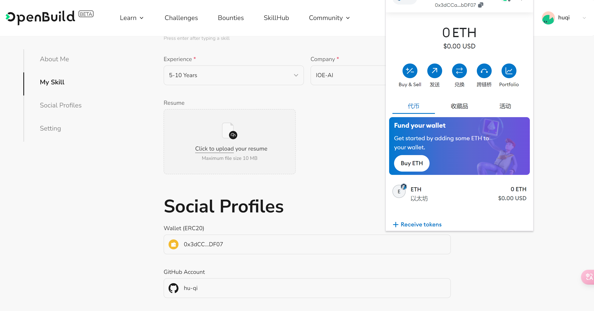

# Task2 Blockchain Basic

本任务分为简答题、分析题和选择题，以此为模板，在下方填写你的答案即可。

选择题，请在你选中的项目中，将 `[ ]` 改为 `[x]` 即可

## [单选题] 如果你莫名奇妙收到了一个 NFT，那么

- [ ] 天上掉米，我应该马上点开他的链接
- [x] 这可能是在对我进行诈骗！

## [单选题] 群里大哥给我发的网站，说能赚大米，我应该

- [ ] 赶紧冲啊，待会米被人抢了
- [x] 谨慎判断，不在不信任的网站链接钱包

## [单选题] 下列说法正确的是

- [x] 一个私钥对应一个地址
- [ ] 一个私钥对应多个地址
- [ ] 多个私钥对应一个地址
- [ ] 多个私钥对应多个地址

## [单选题] 下列哪个是以太坊虚拟机的简称

- [ ] CLR
- [x] EVM
- [ ] JVM

## [单选题] 以下哪个是以太坊上正确的地址格式？

- [ ] 1A4BHoT2sXFuHsyL6bnTcD1m6AP9C5uyT1
- [ ] TEEuMMSc6zPJD36gfjBAR2GmqT6Tu1Rcut
- [ ] 0x997fd71a4cf5d214009619808176b947aec122890a7fcee02e78e329596c94ba
- [x] 0xf39Fd6e51aad88F6F4ce6aB8827279cffFb92266

## [多选题] 有一天某个大哥说要按市场价的 80% 出油给你，有可能

- [x] 他在洗米
- [ ] 他良心发现
- [x] 要给我黒米
- [x] 给我下套呢

## [多选题] 以下哪些是以太坊的二层扩容方案？

- [ ] Lightning Network（闪电网络）
- [x] Optimsitic Rollup
- [x] Zk Rollup

## [简答题] 简述区块链的网络结构

```
区块链的网络结构就是一个由运行在全世界的若干个节点(Node)构成的链。节点与节点之间可以互相连接，相互通讯。
```

## [简答题] 智能合约是什么，有何作用？

```
智能合约是部署在区块链上的程序，可以被用户发起交易来调用。以 web2 类比的话，智能合约相当于运行在在服务器上的后端程序。
```

## [简答题] 怎么理解大家常说的 `EVM` 这个词汇？

```
`EVM`是 Ethereum Virtual Machine（以太坊虚拟机）的缩写，它是以太坊区块链的核心组成部分，扮演着执行智能合约的虚拟环境角色。EVM 的主要职责是读取、执行和维护智能合约的代码。开发者可以使用 Solidity、Vyper 等高级编程语言编写智能合约，这些合约经过编译后，转换成 EVM 字节码，从而能在 EVM 上运行。为了防止恶意攻击或无限循环的代码消耗过多资源，EVM 引入了“燃料”（Gas）的概念。每条指令的执行都需要消耗一定量的 Gas，这既是对计算资源的经济补偿，也是一种防止资源滥用的机制。
```

## [分析题] 你对去中心化的理解

```
去中心化是指区块链网络中不存在中心化的机构或个人，每个节点都是平等的，每个节点都具有相同的权利和义务。最早听到去中心化这个词是源自对体制内权力抨击的文章，自由、平等、民主，后来了解到去中心化是区块链的核心特性之一，实现了信息的分布式存储、验证和管理，不依赖于单一中心化的服务器或机构。另外，去中心化还能保护隐私。
```

## [分析题] 比较区块链与传统数据库，你的看法？

```
与传统数据库相比，区块链两个核心特性：不可篡改与去中心化。区块链通过现代密码学保证数据不可篡改，确保交易安全；去中心化通过分布式网络实现数据的存储、处理和传输，无需依赖单一中心化机构，通过共识算法保障数据一致性与可信度。
```

## 操作题

安装一个 WEB3 钱包，创建账户后与 [openbuild.xyz](https://openbuild.xyz/profile) 进行绑定，截图后文件命名为 `./bind-wallet.jpg`.

