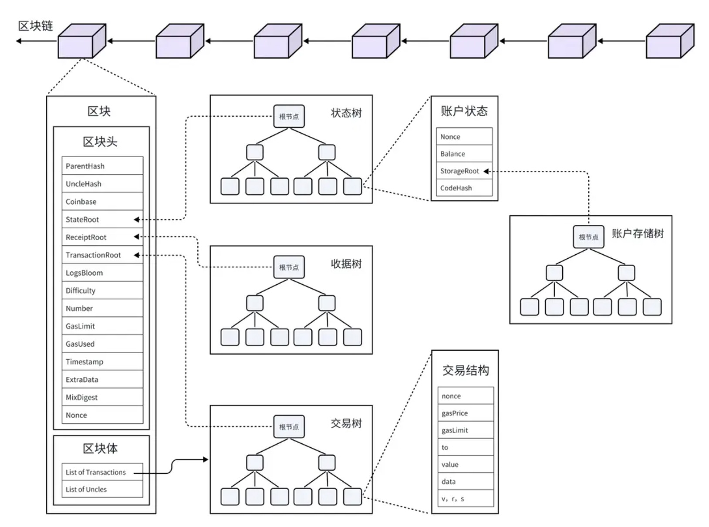

# Task2 Blockchain Basic

本任务分为简答题、分析题和选择题，以此为模板，在下方填写你的答案即可。

选择题，请在你选中的项目中，将 `[ ]` 改为 `[x]` 即可

## [单选题] 如果你莫名奇妙收到了一个 NFT，那么

- [ ] 天上掉米，我应该马上点开他的链接
- [x] 这可能是在对我进行诈骗！

## [单选题] 群里大哥给我发的网站，说能赚大米，我应该

- [ ] 赶紧冲啊，待会米被人抢了
- [x] 谨慎判断，不在不信任的网站链接钱包

## [单选题] 下列说法正确的是

- [x] 一个私钥对应一个地址
- [ ] 一个私钥对应多个地址
- [ ] 多个私钥对应一个地址
- [ ] 多个私钥对应多个地址

## [单选题] 下列哪个是以太坊虚拟机的简称

- [ ] CLR
- [x] EVM
- [ ] JVM

## [单选题] 以下哪个是以太坊上正确的地址格式？

- [ ] 1A4BHoT2sXFuHsyL6bnTcD1m6AP9C5uyT1
- [ ] TEEuMMSc6zPJD36gfjBAR2GmqT6Tu1Rcut
- [ ] 0x997fd71a4cf5d214009619808176b947aec122890a7fcee02e78e329596c94ba
- [x] 0xf39Fd6e51aad88F6F4ce6aB8827279cffFb92266

## [多选题] 有一天某个大哥说要按市场价的 80% 出油给你，有可能

- [x] 他在洗米
- [ ] 他良心发现
- [x] 要给我黒米
- [x] 给我下套呢

## [多选题] 以下哪些是以太坊的二层扩容方案？

- [ ] Lightning Network（闪电网络）
- [x] Optimsitic Rollup
- [x] Zk Rollup

## [简答题] 简述区块链的网络结构

区块链从上往下可以分为区块链、区块、交易三个层次，其中的交易数据、收据数据、状态数据和账户数据都分别存储在四棵默克尔树中。区块链是一系列数据块（即“区块”），通过特定的方式相互连接，形成的一条链。区块链中的每一个区块，都由两个部分组成：区块头（ Header ）和区块体（ Body ）。区块头里包含了一个区块的基本信息，主要包括父哈希值、时间戳、随机数、难度目标、币基等。区块体里存储了该区块中的所有交易数据，即所有交易哈希的列表。
区块链的整体结构如图：

## [简答题] 智能合约是什么，有何作用？

智能合约是运行在区块链上的一段代码，能够自动执行、控制数字资产，并根据预设条件处理信息或价值转移。它的核心作用包括：
- 自动执行: 一旦预设条件被触发，智能合约无需中介干预即可自动执行合同条款，确保交易的高效和可信。
- 降低信任成本: 通过代码的透明性和区块链的不可篡改性，智能合约增强了交易双方的信任，减少了对第三方中介机构的依赖。
- 节省成本和时间: 自动化流程简化了传统合约的繁琐过程，降低了执行成本，加快了交易速度。
- 增强安全性: 区块链上的数据加密和分布式账本特性保障了智能合约的安全执行，防止欺诈和操纵。
- 灵活性和可编程性: 智能合约支持创建多样化的业务逻辑，适用于众多行业和场景，如金融、供应链管理、投票系统等。

## [简答题] 怎么理解大家常说的 `EVM` 这个词汇？

EVM，全称以太坊虚拟机（Ethereum Virtual Machine），是是以太坊网络的核心组成部分。它是一个图灵完备的虚拟环境，允许开发者使用 Solidity、Vyper 等高级语言编写智能合约，并在以太坊区块链上执行这些合约。EVM通过以太坊网络的每个节点运行，确保了智能合约执行的一致性和不可篡改性。简而言之，EVM是支撑以太坊平台上去中心化应用（DApps）运行的虚拟机，负责处理智能合约的部署和执行任务。

## [分析题] 你对去中心化的理解

去中心化是一种网络设计思想和社会组织形式，其核心在于减少对中心化权威或单一控制点的依赖。在去中心化系统中，权力、控制、数据或资源不再集中于一个中心节点，而是分布在网络的多个节点中。这样的系统通过集体协作和共识机制运作，提高了系统的鲁棒性、透明度和抗审查性。

## [分析题] 比较区块链与传统数据库，你的看法？

区块链与传统数据库的主要区别在于以下几个方面：
1. 数据结构：区块链采用链式区块结构，每个区块包含前一区块的哈希值，形成不可篡改的时间序列链。而传统数据库通常基于表格、键值对或其他结构化形式存储数据。
2. 去中心化：区块链是分布式、去中心化的系统，数据存储在网络中多个节点，无单一控制点。传统数据库则大多采用中心化架构，数据存储于单一或集中管理的服务器上。
3. 透明度与隐私：区块链上的交易对所有网络参与者透明，但通过加密技术保护用户隐私。传统数据库的访问权限高度受限，根据用户角色分配，可能不对外公开。
4. 安全性：区块链利用加密算法和共识机制确保数据一旦写入不可更改，防篡改性强。传统数据库虽也有安全措施，但相对更容易受到中心化攻击。
5. 更新速度与成本：区块链交易确认相对较慢，且每次操作需消耗网络资源（如Gas费）。传统数据库处理速度快，适合高并发事务处理，成本结构主要基于硬件、维护和许可费用。
6. 适用场景：区块链适合需要高度透明、防篡改的场景，如数字货币、供应链追踪、身份认证等。传统数据库适用于处理大量内部数据、需要高效查询和更新的业务应用，如银行、电商、医疗信息系统等。

## 操作题

安装一个 WEB3 钱包，创建账户后与 [openbuild.xyz](https://openbuild.xyz/profile) 进行绑定，截图后文件命名为 `./bind-wallet.jpg`.

