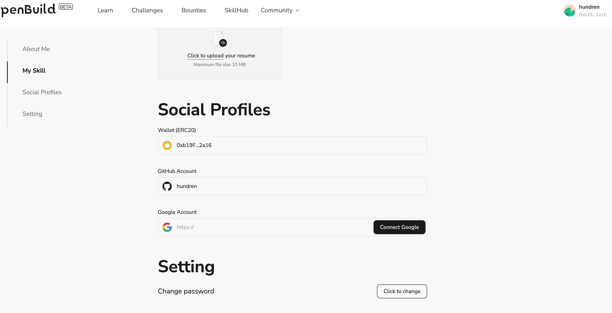

# Task2 Blockchain Basic

本任务分为简答题、分析题和选择题，以此为模板，在下方填写你的答案即可。

选择题，请在你选中的项目中，将 `[ ]` 改为 `[x]` 即可

## [单选题] 如果你莫名奇妙收到了一个 NFT，那么

- [ ] 天上掉米，我应该马上点开他的链接
- [x] 这可能是在对我进行诈骗！

## [单选题] 群里大哥给我发的网站，说能赚大米，我应该

- [ ] 赶紧冲啊，待会米被人抢了
- [x] 谨慎判断，不在不信任的网站链接钱包

## [单选题] 下列说法正确的是

- [ ] 一个私钥对应一个地址
- [x] 一个私钥对应多个地址
- [ ] 多个私钥对应一个地址
- [ ] 多个私钥对应多个地址

## [单选题] 下列哪个是以太坊虚拟机的简称

- [ ] CLR
- [x] EVM
- [ ] JVM

## [单选题] 以下哪个是以太坊上正确的地址格式？

- [ ] 1A4BHoT2sXFuHsyL6bnTcD1m6AP9C5uyT1
- [ ] TEEuMMSc6zPJD36gfjBAR2GmqT6Tu1Rcut
- [ ] 0x997fd71a4cf5d214009619808176b947aec122890a7fcee02e78e329596c94ba
- [x] 0xf39Fd6e51aad88F6F4ce6aB8827279cffFb92266

## [多选题] 有一天某个大哥说要按市场价的 80% 出油给你，有可能

- [x] 他在洗米
- [ ] 他良心发现
- [x] 要给我黒米
- [x] 给我下套呢

## [多选题] 以下哪些是以太坊的二层扩容方案？

- [ ] Lightning Network（闪电网络）
- [x] Optimsitic Rollup
- [x] Zk Rollup

## [简答题] 简述区块链的网络结构

```
通常由多个节点组成，节点之间通过点对点的连接建立网络，每个节点都存储区块链上的所有数据，并参与网络的共识机制
```

## [简答题] 智能合约是什么，有何作用？

```
智能合约是一种在区块链上运行的自动化合约，其中包含了一系列编程代码，用于定义双方在合约执行过程中遵循的规则和条件。
```

## [简答题] 怎么理解大家常说的 `EVM` 这个词汇？

```
它是一个虚拟机，用于执行以太坊智能合约的代码。
```

## [分析题] 你对去中心化的理解

```
分布式，减少集中化的依赖
```

## [分析题] 比较区块链与传统数据库，你的看法？

```
区块链：去中心化的，没有单一的数据库管理系统，数据的所有权和控制权分散在网络中的多个节点上
传统数据库：通常由一个或多个服务器组成，并且数据的所有权和控制权归数据库管理员所有。
```

## 操作题

安装一个 WEB3 钱包，创建账户后与 [openbuild.xyz](https://openbuild.xyz/profile) 进行绑定，截图后文件命名为 `./bind-wallet.png`.


