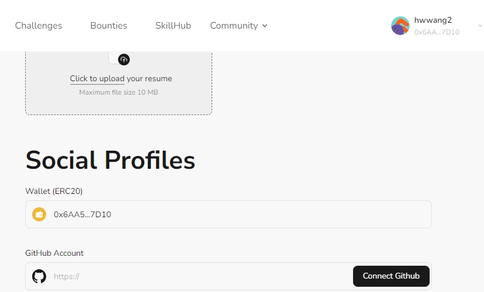

# Task2 Blockchain Basic

本任务分为简答题、分析题和选择题，以此为模板，在下方填写你的答案即可。

选择题，请在你选中的项目中，将 `[ ]` 改为 `[x]` 即可

## [单选题] 如果你莫名奇妙收到了一个 NFT，那么

- [ ] 天上掉米，我应该马上点开他的链接
- [x] 这可能是在对我进行诈骗！

## [单选题] 群里大哥给我发的网站，说能赚大米，我应该

- [ ] 赶紧冲啊，待会米被人抢了
- [x] 谨慎判断，不在不信任的网站链接钱包

## [单选题] 下列说法正确的是

- [x] 一个私钥对应一个地址
- [ ] 一个私钥对应多个地址
- [ ] 多个私钥对应一个地址
- [ ] 多个私钥对应多个地址

## [单选题] 下列哪个是以太坊虚拟机的简称

- [ ] CLR
- [x] EVM
- [ ] JVM

## [单选题] 以下哪个是以太坊上正确的地址格式？

- [ ] 1A4BHoT2sXFuHsyL6bnTcD1m6AP9C5uyT1
- [ ] TEEuMMSc6zPJD36gfjBAR2GmqT6Tu1Rcut
- [ ] 0x997fd71a4cf5d214009619808176b947aec122890a7fcee02e78e329596c94ba
- [x] 0xf39Fd6e51aad88F6F4ce6aB8827279cffFb92266

## [多选题] 有一天某个大哥说要按市场价的 80% 出油给你，有可能

- [x] 他在洗米
- [ ] 他良心发现
- [x] 要给我黒米
- [x] 给我下套呢

## [多选题] 以下哪些是以太坊的二层扩容方案？

- [ ] Lightning Network（闪电网络）
- [x] Optimsitic Rollup
- [x] Zk Rollup

## [简答题] 简述区块链的网络结构

```
区块链网络是是去中心化的,没有单一的权威管理机构，由很多节点组成的网络，每个节点都保存了整个区块链的拷贝，并参与网络中的共识机制（目前，主要的共识机制包括工作量证明PoW、权益证明PoS等），达成共识,确认交易并生成新区块，以保证网络的安全性和稳定性。
```

## [简答题] 智能合约是什么，有何作用？

```
智能合约是一种在区块链网络上运行的计算机程序,它可以自动执行合同条款,而无需人为干预（Code is the law）。智能合约是以所在区块链支持的合约语言完成具体的业务逻辑，它可以应用于金融、供应链、医疗、物联网等多个领域,帮助实现自动化和去中心化。

```

## [简答题] 怎么理解大家常说的 `EVM` 这个词汇？

```
EVM(Ethereum Virtual Machine)：以太坊虚拟机，EVM是一个基于堆栈的虚拟机,是以太坊区块链的核心组件之一，它负责执行在以太坊网络上运行的所有智能合约代码。EVM 是图灵完备的,提供了一个标准化的运行环境,使以太坊网络上的所有节点都可以以相同的方式执行智能合约。
```

## [分析题] 你对去中心化的理解

```
去中心化系统不依赖于单一的中心节点或服务器,而是由多个节点或参与者共同组成。在去中心化系统中,权力和决策权不集中于单一实体,而是由多方共同参与和控制。他更多地依赖于自动化的规则和算法,而不是人为的中央管控，不受单一实体的审查和审计,更难被任何一方所控制或审查。

同时由于区块链技术也存在“不可能三角”，无法同时达到可扩展（Scalability）、去中心化（Decentralization）、安全（Security），所以在区块链的设计上，往往会在去中心化、可扩展放在进行权衡。
```

## [分析题] 比较区块链与传统数据库，你的看法？

```
传统数据库采用表格化的结构,数据存储在集中式的服务器上，操作效率高,可支持高并发实时交易；数据库提供了方便的多表事务机制。
区块链采用分布式账本的结构,数据以链式区块的形式存储在网络节点上，区块链交易确认需要一定时间,实时性稍弱,但提供了不可篡改的可靠性。区块链的事务是基于单次区块的操作，要么成功、要么回滚。
```

## 操作题

安装一个 WEB3 钱包，创建账户后与 [openbuild.xyz](https://openbuild.xyz/profile) 进行绑定，截图后文件命名为 `./bind-wallet.jpg`.

