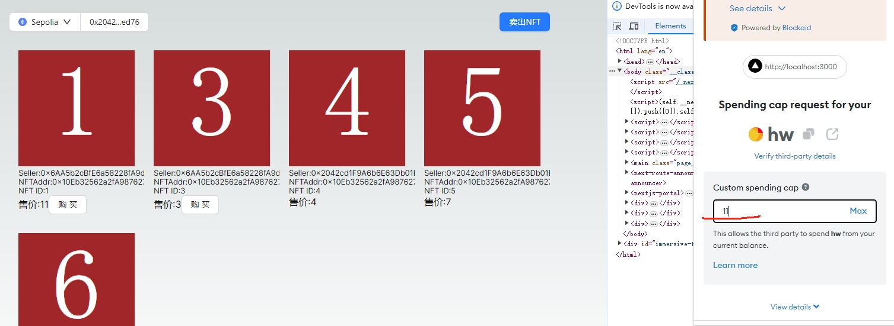

## 用到的合约地址
存放在 [config文件](./nft-market/app/config.ts)中
```
export const NFT_ADDRESS= "0x10Eb32562a2fA9876272ffB7eb6D92aB379D0729";
export const TOKEN_ADDRESS = "0xA33dbCfB40FEBCd596030672120208255A39B842";
export const MARKET_ADDRESS="0x808966445CFE57Abd6D74060EC94270930AB5363";
```

## 主要用到的框架、组件
nextjs、ant-design、antdesign-web3

页面样式没咋调，费时间

## 过程截图
nft列表，自己上架的没有购买按钮，其他人的有购买按钮


上架nft


购买nft




