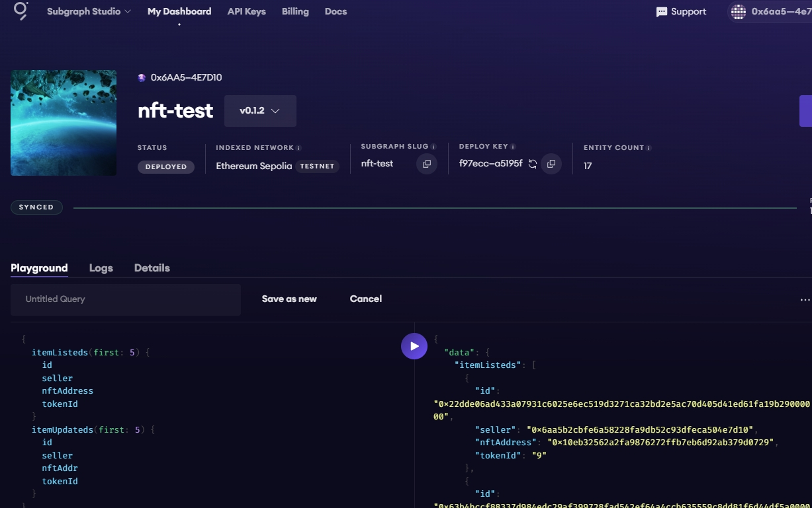
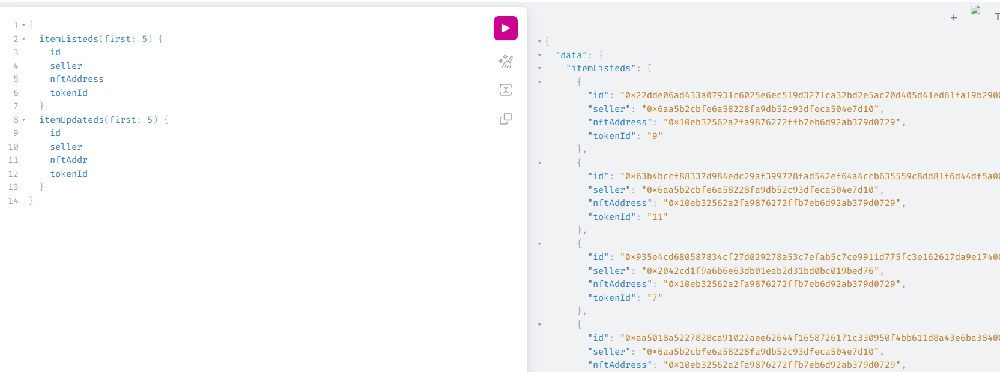

## 基本操作
```
创建api key
https://thegraph.com/studio/apikeys/ 

apikey:xxx

创建subgraph： https://thegraph.com/studio/
nft-test

安装 graph-cli
npm install -g @graphprotocol/graph-cli

创建子图
graph init --studio nft-test
按步骤提示输入合约地址 0xfd51b237f98084b15ada565717ac4775536594e0 ，合约开始的区块高度 6181456 ，合约ABI ./nftmarket.json 等信息


认证
graph auth --studio xxxx

build
cd nft-test
graph codegen && graph build

部署
graph deploy --studio nft-test

```

## 执行查询

部署完成后，会有一个查询链接 [The Graph Query](https://api.studio.thegraph.com/query/82916/nft-test/v0.1.2)

是否部署完，需要在自己的[控制台](https://thegraph.com/studio/subgraph/nft-test/)查看，等进度100%

```
{
  itemListeds(first: 5) {
    id
    seller
    nftAddress
    tokenId
  }
  itemUpdateds(first: 5) {
    id
    seller
    nftAddr
    tokenId
  }
}
```
[参考查询](https://api.studio.thegraph.com/proxy/82916/nft-test/v0.1.2/graphql?query=%7B%0A++itemListeds%28first%3A+5%29+%7B%0A++++id%0A++++seller%0A++++nftAddress%0A++++tokenId%0A++%7D%0A++itemUpdateds%28first%3A+5%29+%7B%0A++++id%0A++++seller%0A++++nftAddr%0A++++tokenId%0A++%7D%0A%7D)


## 结果

合约地址
[0xfd51b237f98084b15ada565717ac4775536594e0](https://sepolia.etherscan.io/address/0xfd51b237f98084b15ada565717ac4775536594e0)

子图的链接
https://thegraph.com/studio/subgraph/nft-test/playground



可查的[playground](https://api.studio.thegraph.com/proxy/82916/nft-test/v0.1.2/graphql?query=%7B%0A++itemListeds%28first%3A+5%29+%7B%0A++++id%0A++++seller%0A++++nftAddress%0A++++tokenId%0A++%7D%0A++itemUpdateds%28first%3A+5%29+%7B%0A++++id%0A++++seller%0A++++nftAddr%0A++++tokenId%0A++%7D%0A%7D)


