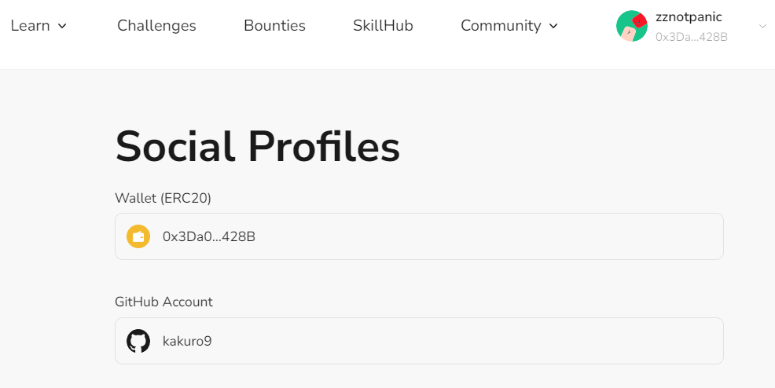

# Task2 Blockchain Basic

本任务分为简答题、分析题和选择题，以此为模板，在下方填写你的答案即可。

选择题，请在你选中的项目中，将 `[ ]` 改为 `[x]` 即可

## [单选题] 如果你莫名奇妙收到了一个 NFT，那么

- [ ] 天上掉米，我应该马上点开他的链接
- [x] 这可能是在对我进行诈骗！

## [单选题] 群里大哥给我发的网站，说能赚大米，我应该

- [ ] 赶紧冲啊，待会米被人抢了
- [x] 谨慎判断，不在不信任的网站链接钱包

## [单选题] 下列说法正确的是

- [x] 一个私钥对应一个地址
- [ ] 一个私钥对应多个地址
- [ ] 多个私钥对应一个地址
- [ ] 多个私钥对应多个地址

## [单选题] 下列哪个是以太坊虚拟机的简称

- [ ] CLR
- [x] EVM
- [ ] JVM

## [单选题] 以下哪个是以太坊上正确的地址格式？

- [ ] 1A4BHoT2sXFuHsyL6bnTcD1m6AP9C5uyT1
- [ ] TEEuMMSc6zPJD36gfjBAR2GmqT6Tu1Rcut
- [ ] 0x997fd71a4cf5d214009619808176b947aec122890a7fcee02e78e329596c94ba
- [x] 0xf39Fd6e51aad88F6F4ce6aB8827279cffFb92266

## [多选题] 有一天某个大哥说要按市场价的 80% 出油给你，有可能

- [x] 他在洗米
- [ ] 他良心发现
- [x] 要给我黒米
- [x] 给我下套呢

## [多选题] 以下哪些是以太坊的二层扩容方案？

- [ ] Lightning Network（闪电网络）
- [x] Optimsitic Rollup
- [x] Zk Rollup

## [简答题] 简述区块链的网络结构

```
区块链是分布式网络，有多个节点组成，有着去中心化、点对点的特点，节点之间通过共识机制确保新节点的加入，采用链式数据结构，通过加密技术确保不可篡改和数据安全
```

## [简答题] 智能合约是什么，有何作用？

```
智能合约简单讲是运行在链上的程序，增加了区块链的应用范围，它是自动化执行的
```

## [简答题] 怎么理解大家常说的 `EVM` 这个词汇？

```
以太坊虚拟机，是一个图灵完备的虚拟机，也就是说它可以执行任何计算，用来在以太坊网络执行智能合约，在以太坊上的每个节点上运行，确保合约一致性
```

## [分析题] 你对去中心化的理解

```
我认为去中心化的特点就是通过对权力的分散，增加系统的信任度和开放性，通过共识机制和算法减少参与者之间的信任需求，加快了点对点之间的互动流程，缺点是因为不是单一实体扩展性受限
```

## [分析题] 比较区块链与传统数据库，你的看法？

```
区块链相比传统数据库，通过密码学的技术使得每个链式数据区块包含前一个区块的哈希值，形成了一条不可篡改的链。它们的数据结构不同；

区块链有去中心化的特点，没有单一的控制点

区块链有共识机制，确保所有节点对交易和区块的认可达成一致，传统数据库不需要，因为有着单一的服务器或集群

区块链的数据是透明的，增加系统的信任度

区块链比起传统数据库更加适合高透明度、不可篡改和去信任化的场景，比如加密货币、身份验证
```

## 操作题

安装一个 WEB3 钱包，创建账户后与 [openbuild.xyz](https://openbuild.xyz/profile) 进行绑定，截图后文件命名为 `./bind-wallet.jpg`.

