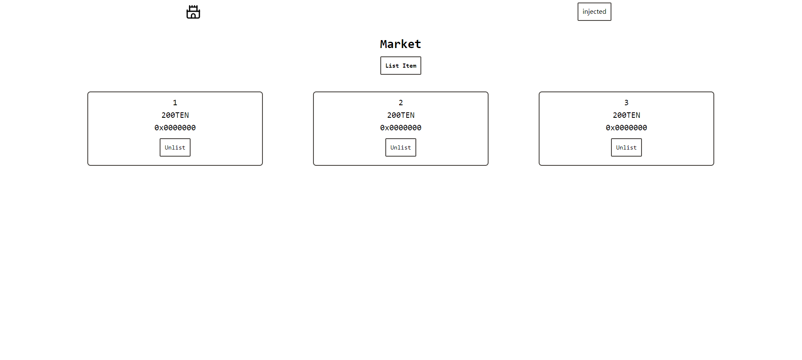

## 项目介绍

### [App](./src/App.tsx)

主要包含两个子组件 [Header][] 和 [Market][]

### [Header][]

主要用于提供链接钱包和显示登录用户的基本信息

功能性组件包括 [WalletOption][] 和 [Account][]

#### [WalletOption][]

提供钱包接入功能

#### [Account][]

显示账户的 TEN(ERC20 token) 余额, 并提供用户取消链接功能

### [Market][]

这是本项目的主体,包含用户上架 NFT 操作, 购买 NFT 操作, 以及下架 NFT 操作

## 页面截图

<!-- link -->
[Header]: ./src/component/Header.tsx
[Market]: ./src/component/Market.tsx
[Account]: ./src/component/Account.tsx
[WalletOption]: ./src/component/WalletOption.tsx