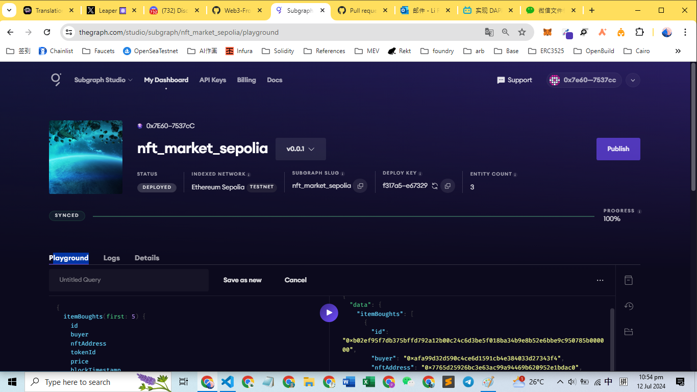

This is the homework for task 9: 为 NFTMarket 创建一个 The Graph 子图

NFTMarket 合约地址: https://sepolia.etherscan.io/address/0x68144069D252b2eCe225f1CcCE21e249aA937607

在 The Graph Sudio ( https://thegraph.com/studio/ ) 上部署的子图的链接：
https://api.studio.thegraph.com/query/45218/nft_market_sepolia/version/latest⁠

截图：
