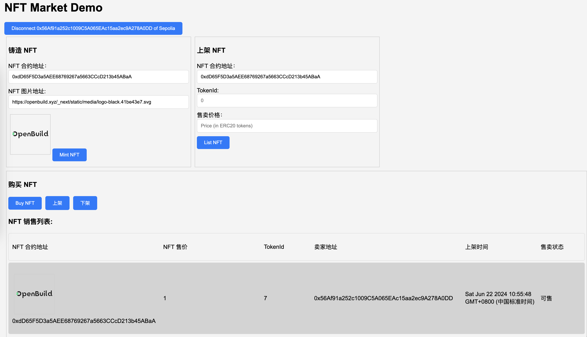

# 开发一个完整的NFTMarket的Dapp
## 任务目标
在task4基础上开发一个完整的NFTMarket-Dapp并对功能点进行测试
## 任务要求
- 合约增加一个下架NFT的功能，用户可以在上架NFT后、被别人购买前下架NFT
- 在Market界面展示出所有上架的NFT（图片、NFT信息）
- NFT信息包括（价格、上架时间、拥有者）
- 测试上架、下架、购买NFT的功能
## 提交要求
- 提交完整代码
- 提交界面的截图
- 提交测试的截图（上架后、下架后、购买NFT后买家获得NFT的三个截图）

#### 整体界面展示：

#### 上架成功展示：

#### 购买成功展示：

#### 下架成功展示：

