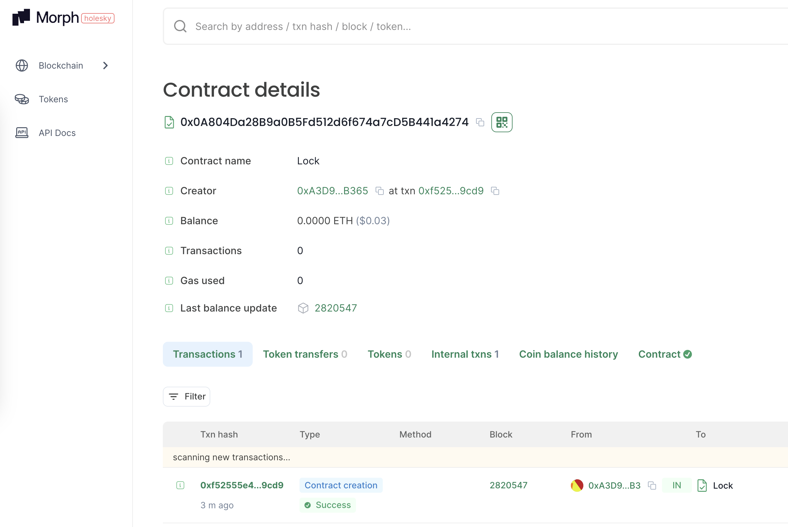

## Deploy log

```bash
$ yarn deploy:morphTestnet                                                                                   
yarn run v1.22.22
$ npx hardhat run --network morphTestnet scripts/deploy.ts
Lock with 0.00001ETH and unlock timestamp 1719543058 deployed to 0x0A804Da28B9a0B5Fd512d6f674a7cD5B441a4274
```

## Verify log

```bash
npx hardhat verify --network morphTestnet 0x0A804Da28B9a0B5Fd512d6f674a7cD5B441a4274 '0.00001'

https://explorer-holesky.morphl2.io/address/0x0A804Da28B9a0B5Fd512d6f674a7cD5B441a4274#code
```


