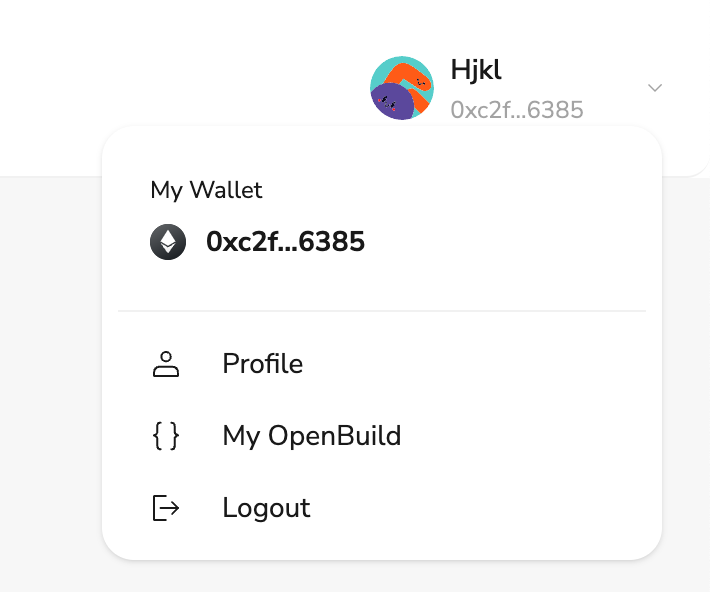

# Task2 Blockchain Basic

本任务分为简答题、分析题和选择题，以此为模板，在下方填写你的答案即可。

选择题，请在你选中的项目中，将 `[ ]` 改为 `[x]` 即可

## [单选题] 如果你莫名奇妙收到了一个 NFT，那么

- [ ] 天上掉米，我应该马上点开他的链接
- [X] 这可能是在对我进行诈骗！

## [单选题] 群里大哥给我发的网站，说能赚大米，我应该

- [ ] 赶紧冲啊，待会米被人抢了
- [X] 谨慎判断，不在不信任的网站链接钱包

## [单选题] 下列说法正确的是

- [ ] 一个私钥对应一个地址
- [X] 一个私钥对应多个地址
- [ ] 多个私钥对应一个地址
- [ ] 多个私钥对应多个地址

## [单选题] 下列哪个是以太坊虚拟机的简称

- [ ] CLR
- [X] EVM
- [ ] JVM

## [单选题] 以下哪个是以太坊上正确的地址格式？

- [ ] 1A4BHoT2sXFuHsyL6bnTcD1m6AP9C5uyT1
- [ ] TEEuMMSc6zPJD36gfjBAR2GmqT6Tu1Rcut
- [ ] 0x997fd71a4cf5d214009619808176b947aec122890a7fcee02e78e329596c94ba
- [X] 0xf39Fd6e51aad88F6F4ce6aB8827279cffFb92266

## [多选题] 有一天某个大哥说要按市场价的 80% 出油给你，有可能

- [X] 他在洗米
- [ ] 他良心发现
- [X] 要给我黒米
- [X] 给我下套呢

## [多选题] 以下哪些是以太坊的二层扩容方案？

- [X] Lightning Network（闪电网络）
- [X] Optimsitic Rollup
- [X] Zk Rollup

## [简答题] 简述区块链的网络结构

```
区块链的网络结构就像蜘蛛网一样，相交处会产生一个节点，无数个节点相互连接，形成一个网络。
```

## [简答题] 智能合约是什么，有何作用？

```
智能合约就像 web2 中的后端服务，可以运行在节点上，假如我搭建一个 web 页面，用户在这个页面的交互产生的请求就会发送到智能合约处理，智能合约会根据用户的请求进行处理，然后返回给用户。
智能合约就是 web3 应用的基石，可以搭建各种各样基于区块链特性的应用来使用户体验到区块链的独特性。
```

## [简答题] 怎么理解大家常说的 `EVM` 这个词汇？

```
EVM 相当于一个服务器，每个节点都会运行一个 EVM，这个节点的所有通行交易都会通过 EVM 进行处理。也包括智能合约的部署和调用。
```

## [分析题] 你对去中心化的理解

```
web2 是中心化的，像抖音、微信这些应用，用户在上面的数据都是存储在它们公司的服务器上的，假如这些公司断网了，那么用户的数据就会丢失。
而 web3 是去中心化的，假如有个区块链的抖音，我的视频，浏览历史，点赞记录都是存储在区块链上的，是存在区块链上的成千上万个节点上的，我的这些数据永远不会丢失，因为不可能所有节点都不可用。
```

## [分析题] 比较区块链与传统数据库，你的看法？

```
1. 区块链中每个数据都会保存前一个数据的哈希值，就像一个链条一样。而传统数据库中的数据是没有这种关系的。
2. 区块链中的数据是不可篡改的，因为篡改数据会导致哈希值的改变，而传统数据库中的数据是可以篡改的。
3. 区块链中的数据是去中心化的，而传统数据库中的数据是中心化的。
4. 区块链由于每次修改一个节点都要同步至所有节点，所以它很慢，而传统数据库是快速的。
5. 区块链中的数据是公开的，而传统数据库中的数据是私有的。
6. 区块链中的数据是不可删除的，而传统数据库中的数据是可以删除的。
```

## 操作题

安装一个 WEB3 钱包，创建账户后与 [openbuild.xyz](https://openbuild.xyz/profile) 进行绑定，截图后文件命名为 `./bind-wallet.jpg`.

