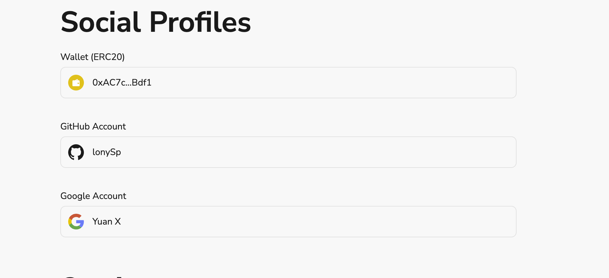

# Task2 Blockchain Basic

本任务分为简答题、分析题和选择题，以此为模板，在下方填写你的答案即可。

选择题，请在你选中的项目中，将 `[ ]` 改为 `[x]` 即可


## [单选题] 如果你莫名奇妙收到了一个 NFT，那么

- [ ] 天上掉米，我应该马上点开他的链接
- [x] 这可能是在对我进行诈骗！


## [单选题] 群里大哥给我发的网站，说能赚大米，我应该

- [ ] 赶紧冲啊，待会米被人抢了
- [x] 谨慎判断，不在不信任的网站链接钱包

## [单选题] 下列说法正确的是

- [ ] 一个私钥对应一个地址
- [ ] 一个私钥对应多个地址
- [ ] 多个私钥对应一个地址
- [ ] 多个私钥对应多个地址

 ## [单选题] 下列哪个是以太坊虚拟机的简称

- [ ] CLR
- [x] EVM
- [ ] JVM

## [单选题] 以下哪个是以太坊上正确的地址格式？

- [ ] 1A4BHoT2sXFuHsyL6bnTcD1m6AP9C5uyT1
- [ ] TEEuMMSc6zPJD36gfjBAR2GmqT6Tu1Rcut
- [ ] 0x997fd71a4cf5d214009619808176b947aec122890a7fcee02e78e329596c94ba
- [x] 0xf39Fd6e51aad88F6F4ce6aB8827279cffFb92266
      
## [多选题] 有一天某个大哥说要按市场价的 80% 出油给你，有可能

- [x] 他在洗米
- [ ] 他良心发现
- [x] 要给我黒米
- [x] 给我下套呢

## [多选题] 以下哪些是以太坊的二层扩容方案？

- [ ] Lightning Network（闪电网络）
- [x] Optimsitic Rollup
- [x] Zk Rollup

## [简答题] 简述区块链的网络结构

```
区块链的网络结构通过去中心化、点对点通信、分布式账本、共识机制和加密技术确保了数据的安全性、透明性和不可篡改性。
```


## [简答题] 智能合约是什么，有何作用？

```
智能合约是运行在区块链网络上的自执行代码，通过其自动化、透明性、不可篡改性和去中心化的特点，提高了效率、降低了成本，允许开发者在区块链平台上创建各种应用，如去中心化金融（DeFi）、游戏和社交网络等。
```


## [简答题] 怎么理解大家常说的 `EVM` 这个词汇？

```
EVM提供了一个运行智能合约的环境。智能合约是以太坊上编写的代码，通过EVM执行
```


## [分析题] 你对去中心化的理解

```
去中心化最重要的作用是解决信任问题。
```


## [分析题] 比较区块链与传统数据库，你的看法？

```
区块链：去中心化，不可篡改、数据存储在多个节点上，没有单一控制点，增强了抗审查性和容错性，性能较低，扩展性受限，处理速度慢
传统数据库：中心化，由单个实体或组织控制，易于管理，数据可插入、更新和删除，灵活性高，但容易受到篡改和攻击，高性能，易于扩展

```


## 操作题

安装一个 WEB3 钱包，创建账户后与 [openbuild.xyz](https://openbuild.xyz/profile) 进行绑定，截图后文件命名为 `./bind-wallet.jpg`.
