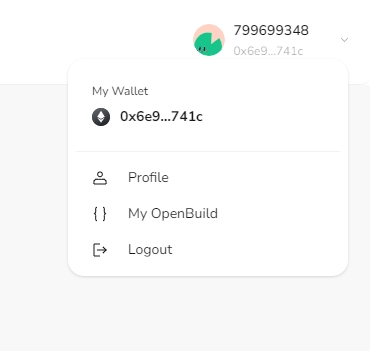

# Task2 Blockchain Basic

本任务分为简答题、分析题和选择题，以此为模板，在下方填写你的答案即可。

选择题，请在你选中的项目中，将 `[ ]` 改为 `[x]` 即可

## [单选题] 如果你莫名奇妙收到了一个 NFT，那么

- [ ] 天上掉米，我应该马上点开他的链接
- [x] 这可能是在对我进行诈骗！

## [单选题] 群里大哥给我发的网站，说能赚大米，我应该

- [ ] 赶紧冲啊，待会米被人抢了
- [x] 谨慎判断，不在不信任的网站链接钱包

## [单选题] 下列说法正确的是

- [x] 一个私钥对应一个地址
- [ ] 一个私钥对应多个地址
- [ ] 多个私钥对应一个地址
- [ ] 多个私钥对应多个地址

## [单选题] 下列哪个是以太坊虚拟机的简称

- [ ] CLR
- [x] EVM
- [ ] JVM

## [单选题] 以下哪个是以太坊上正确的地址格式？

- [ ] 1A4BHoT2sXFuHsyL6bnTcD1m6AP9C5uyT1
- [ ] TEEuMMSc6zPJD36gfjBAR2GmqT6Tu1Rcut
- [ ] 0x997fd71a4cf5d214009619808176b947aec122890a7fcee02e78e329596c94ba
- [x] 0xf39Fd6e51aad88F6F4ce6aB8827279cffFb92266

## [多选题] 有一天某个大哥说要按市场价的 80% 出油给你，有可能

- [x] 他在洗米
- [ ] 他良心发现
- [x] 要给我黒米
- [x] 给我下套呢

## [多选题] 以下哪些是以太坊的二层扩容方案？

- [ ] Lightning Network（闪电网络）
- [x] Optimsitic Rollup
- [x] Zk Rollup

## [简答题] 简述区块链的网络结构

```
区块链的网络结构通常由以下几个关键部分组成：

1. 节点（Nodes）：区块链网络由多个节点组成，每个节点都保存着区块链的完整副本。节点可以是全节点，也可以是轻节点。全节点参与交易验证和区块创建，而轻节点则只处理与自己相关的交易。

2. 区块（Blocks）：区块链由一系列区块组成，每个区块包含一组交易记录。新区块通过工作量证明（Proof of Work, PoW）或其他共识机制被添加到链上。

3. 链（Chain）：区块链是一系列按时间顺序相连的区块，形成了一个不可篡改和不可逆的链式数据结构。

4. 共识机制（Consensus Mechanism）：区块链网络中的节点通过共识机制达成一致，决定哪些交易是有效的，以及新区块的创建。常见的共识机制包括PoW、权益证明（Proof of Stake, PoS）等。

5. 分布式账本（Distributed Ledger）：区块链本质上是一个分布式账本，所有的交易记录都是公开透明的，任何人都可以验证交易历史。

6. 加密技术（Cryptography）：区块链使用加密技术来确保交易的安全性和用户隐私，包括哈希函数和公钥/私钥加密。

7. 智能合约（Smart Contracts）：在某些区块链平台（如以太坊）上，智能合约是自动执行的合同，它们存储在区块链上，可以执行复杂的交易逻辑。

8. 去中心化应用（DApps）：基于区块链的去中心化应用，它们运行在区块链的基础设施之上，利用智能合约来实现功能。

9. 矿工/验证者（Miners/Validators）：在PoW共识机制中，矿工通过解决复杂数学问题来创建新区块并获得奖励。在PoS等其他共识机制中，验证者根据他们持有的代币数量和时间来创建新区块。

10. 网络参与者（Network Participants）：包括开发者、用户、投资者等，他们共同构成了区块链生态系统。

区块链的网络结构设计为去中心化，这意味着没有单一的控制点，提高了系统的安全性和抗审查性。同时，这种结构也使得区块链能够支持多种应用，从金融服务到供应链管理等多个领域。
```

## [简答题] 智能合约是什么，有何作用？

```
智能合约是一种运行在区块链上的程序，它能够在满足预设条件时自动执行合约条款。智能合约的概念最早由密码学家Nick Szabo在1990年代提出。

智能合约的特点：
1. 自动执行：一旦部署到区块链上，智能合约的逻辑和条款就会自动执行，无需中介或第三方的介入。
2. 透明性：智能合约的代码对所有网络参与者都是可见的，确保了高度的透明度。
3. 不可篡改：部署在区块链上的智能合约一旦创建，其代码和功能就不能被更改，除非合约本身允许修改。
4. 去中心化：智能合约在区块链网络中分布式运行，不依赖于任何单一的中央服务器或实体。

智能合约的作用：
1. 降低交易成本：通过自动化执行合约条款，减少了传统合同执行过程中的中介和法律成本。
2. 提高效率：智能合约可以即时响应预设条件，加快交易和协议的执行速度。
3. 增强安全性：由于其不可篡改的特性，智能合约能够防止欺诈和违约行为。
4. 促进信任：智能合约的透明性和自动执行机制有助于建立交易双方的信任。
5. 支持复杂逻辑：智能合约能够处理复杂的交易逻辑，包括多步骤的交易流程和条件判断。
6. 创建新的商业模式：智能合约为创建去中心化自治组织（DAO）、去中心化金融（DeFi）等新型商业模式提供了技术基础。

智能合约的这些特性和作用使其在金融、供应链、投票系统、身份验证等多个领域都有广泛的应用潜力。
```

## [简答题] 怎么理解大家常说的 `EVM` 这个词汇？

```
EVM 是 "Ethereum Virtual Machine" 的缩写，中文翻译为“以太坊虚拟机”。以下是对 EVM 的理解：

1. 执行环境：EVM 是一个执行环境，为智能合约提供了运行的平台。它确保智能合约能够在以太坊区块链上安全、一致地执行。

2. 字节码执行：智能合约用各种编程语言编写（如 Solidity、Vyper 等），然后编译成 EVM 字节码。EVM 提供了一套指令集，智能合约的字节码就是这些指令的集合。

3. 状态管理：EVM 负责管理以太坊网络的状态，包括账户余额、存储数据以及智能合约的状态。

4. 去中心化：EVM 存在于以太坊网络的每个节点上，实现了去中心化的状态管理，确保了网络的一致性和抗审查性。

5. 安全性：EVM 通过严格的安全机制来防止智能合约的漏洞和攻击，例如溢出检查、Gas 限制等。

6. 图灵完备：EVM 是图灵完备的，意味着它可以执行任何可以被算法描述的计算过程。

7. 跨平台：EVM 的设计允许它在不同的区块链平台上实现，不仅限于以太坊。其他区块链项目也可以通过兼容 EVM 来支持以太坊的智能合约生态。

8. EVM 与交易：EVM 还涉及到交易的处理，包括交易的验证、执行以及交易费用（Gas）的计算。

总的来说，EVM 是以太坊智能合约和去中心化应用的基石，为以太坊生态系统提供了强大的计算能力和灵活性。
```

## [分析题] 你对去中心化的理解

```
去中心化是一种分布式的架构理念，它在多个方面具有重要意义，特别是在区块链技术和加密货币领域。以下是对去中心化概念的分析：

1. 架构层面：去中心化系统没有单一的控制中心或存储位置。数据和信息分布在整个网络中，由多个节点共同维护。

2. 信任层面：在去中心化系统中，信任不是基于对单一实体的信任，而是基于对系统本身的信任，以及对网络中多数节点遵循规则的信任。

3. 安全性：去中心化系统通常更加安全，因为它们不易受到单点故障的影响。攻击者需要同时攻击多个节点才能对系统造成影响。

4. 抗审查性：去中心化系统由于没有单一控制点，因此更难被审查或关闭。信息和交易可以在没有中心化控制的情况下自由流动。

5. 可扩展性：去中心化系统可以通过增加更多的节点来提高其处理能力和存储容量，从而实现更好的可扩展性。

6. 自治性：去中心化系统往往具有自治性，能够自我管理和自我调节，无需中央机构的干预。

7. 公平性：去中心化系统通过算法和共识机制确保所有参与者都有平等的机会参与决策过程，从而提高了系统的公平性。

8. 透明性：去中心化系统的运作通常是透明的，所有交易和数据都记录在公共账本上，任何人都可以验证。

9. 创新驱动：去中心化促进了技术和商业模式的创新，因为它允许更灵活的实验和更广泛的社区参与。

10. 社区治理：在许多去中心化系统中，社区成员可以通过投票和讨论参与到系统的治理中，影响系统的发展和决策。

去中心化并不意味着完全没有中心，而是意味着权力和控制被分散到网络的多个节点上，从而形成一个更加健壮、透明和公平的系统。然而，去中心化也带来了一些挑战，如治理复杂性、效率问题以及参与者之间的协调难题。
```

## [分析题] 比较区块链与传统数据库，你的看法？

```
区块链和传统数据库是两种不同的数据存储和管理技术，它们在多个方面有着显著的差异。以下是对区块链与传统数据库的比较分析：

1. 数据结构：
   区块链：数据以块的形式存在，每个区块包含一系列交易记录，并通过加密方式链接到前一个区块，形成链式结构。
   传统数据库：数据通常以表格形式存储，具有行和列的结构，支持更复杂的查询和关系型数据管理。

2. 访问权限：
   区块链：通常是公开访问的，任何人都可以查看交易记录，但需要相应的私钥来发起交易。
   传统数据库：访问权限通常由数据库管理员控制，可以根据需要设置不同的访问级别。

3. 数据修改：
   区块链：一旦数据被写入区块链，就几乎不可能被更改或删除，提供了高度的数据完整性和不可篡改性。
   传统数据库：数据可以被授权用户修改或删除，提供了更高的灵活性。

4. 可扩展性：
   区块链：随着数据量的增加，区块链的性能可能会受到影响，可扩展性是一个挑战。
   传统数据库：通过优化和扩展硬件资源，传统数据库可以更容易地进行水平或垂直扩展。

5. 透明度和信任：
   区块链：提供了高度的透明度，所有交易对网络参与者都是可见的，有助于建立信任。
   传统数据库：数据的可见性和信任度取决于数据库的访问控制和审计机制。

6. 去中心化：
   区块链：是去中心化的，没有单一的控制点，提高了系统的抗审查性和鲁棒性。
   传统数据库：可能是中心化的，依赖于特定的服务器或数据中心。

7. 安全性：
   区块链：通过加密和共识机制提供了较高的安全性，抵抗篡改和攻击。
   传统数据库：安全性取决于其安全措施，如防火墙、入侵检测系统等。

8. 应用场景：
   区块链：适用于需要高度安全性、透明性和不可篡改性的场景，如加密货币、供应链管理、投票系统等。
   传统数据库：适用于需要复杂查询、数据分析和报告的场景，如企业资源规划、客户关系管理等。

9. 性能：
   区块链：由于需要在网络中达成共识，可能在处理速度上不如传统数据库快。
   传统数据库：优化了读写性能，可以快速处理大量数据。

10. 成本：
    区块链：维护成本可能较高，因为需要激励矿工或验证者来维护网络安全。
    传统数据库：成本可能较低，但可能需要投资于硬件、软件和专业维护人员。

综上所述，区块链和传统数据库各有优势和局限，适用于不同的应用场景。选择合适的技术取决于具体需求，包括数据的安全性、透明性、可扩展性、性能和成本等因素。
```

## 操作题

安装一个 WEB3 钱包，创建账户后与 [openbuild.xyz](https://openbuild.xyz/profile) 进行绑定，截图后文件命名为 `./bind-wallet.jpg`.


